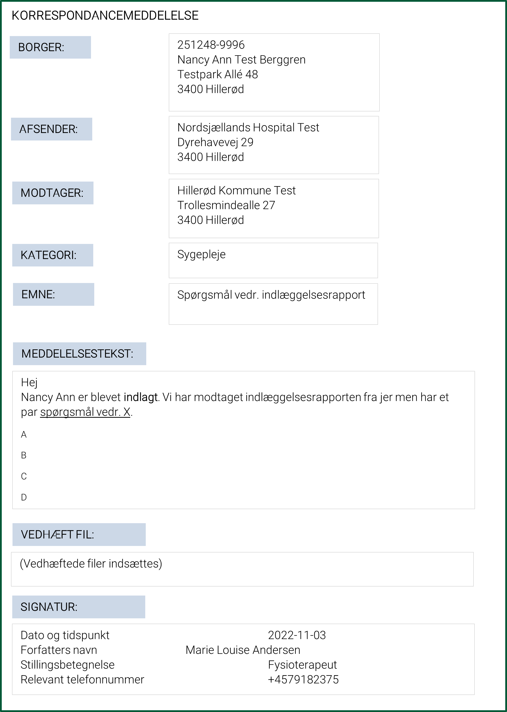

[Return](../../index.md)

# Sundhedsfaglige retningslinjer for anvendelse 

**Table of contents**
* [1 Introduktion](#1-introduktion)
* [2 Formål](#2-formål)
* [3 Baggrund](#3-baggrund)
* [4 Illustration af FHIR korrespondancemeddelelse](#4-illustration-af-fhir-korrespondancemeddelelse)
* [5 Krav og anbefalinger til FHIR Korrespondancemeddelelse](#5-krav-og-anbefalinger-til-fhir-korrespondancemeddelelse)
    * [5.1 Kategori og Emne](#51-kategori-og-emne)
    * [5.2 Formatering af meddelelsestekst](#52-formatering-af-meddelelsestekst)
    * [5.3 Prioritet-krav om afgrænset brug](#53-prioritet-krav-om-afgrænset-brug)
    * [5.4 Bilag](#54-bilag)
    * [5.5 Signatur](#55-signatur)
    * [5.6 Forsendelsesmuligheder og overblik](#56-forsendelsesmuligheder-og-overblik)
        * [5.6.1 Ved besvarelse](#561-ved-besvarelse)
        * [5.6.2 Ved videresendelse](#562ved-videresendelse)
        * [5.6.3 Overblik i brugergrænsefladen](#563-overblik-i-brugergrænsefladen)
* [6 Opsummering af krav og anbefalinger til afsender- og modtagersystemer](#6-opsummering-af-krav-og-anbefalinger-til-afsender--og-modtagersystemer)
* [7 Use Cases](#10-use-cases)
* [8 Ibrugtagning](#8-ibrugtagning)

&nbsp;

## 1 Introduktion
Dette er den tekstuelle del af dokumentationen til MedComs FHIR-standard for korrespondancemeddelelser (Engelsk:CareCommunication).  Den tekstuelle del indeholder information om formål, baggrund, en illustration af indholdet i den nye korre-spondancemeddelelse (KM) og krav og anbefalinger, herunder funktionaliteter, samt ibrugtagning. 
Målgruppen for denne tekst er it-systemleverandører og implementeringsansvarlige, som skal it-understøtte afsendelse og modtagelse af KM.
Krav og anbefalinger til indhold, herunder funktionaliteter, er udarbejdet i samarbejde med en nedsat <a href="https://www.medcom.dk/opslag/navne-og-adresser?gruppe=Arb.grp.%20FHIR-Korrespondancemeddelelse" target="_blank">national arbejdsgruppe</a>  med repræsentanter fra regioner, kommuner og praktiserende læger. Derudover har materiale med beskrivelse af indhold og funktionalitet i den nye KM været sendt i høring ved relevante MedCom-grupper samt været bredt tilgængeligt for kommentering via publicering på MedComs hjemmeside.
De tekniske specifikationer (profilen) for den nye korrespondancemeddelelsen findes via <a href="https://medcomdk.github.io/dk-medcom-carecommunication/ " target="_blank">CareCommunication</a> forsiden på Github.

MedCom FHIR korrespondancemeddelelsen skal på sigt erstatte tidligerer korrespondancemeddeleses standarder: <a href="https://svn.medcom.dk/svn/releases/Standarder/Den%20gode%20korrespondance/EDI/Dokumentation/" target="_blank">DIS91</a> og <a href="https://svn.medcom.dk/svn/releases/Standarder/Den%20gode%20korrespondance/XML/Dokumentation/" target="_blank">XDIS91</a>. 

>Note: I tilfælde af uoverensstemmelser mellem det danske og det engelske dokument, er det danske doku-ment det gældende dokument.

 <!-- samt information om en overgangsperiode med samtidig drift af korrespondancemeddelelsen <a href="https://svn.medcom.dk/svn/releases/Standarder/Den%20gode%20korrespondance/EDI/Dokumentation/" target="_blank">DIS91</a> og <a href="https://svn.medcom.dk/svn/releases/Standarder/Den%20gode%20korrespondance/XML/Dokumentation/" target="_blank">XDIS91</a> og FHIR-KM. -->

## 2 Formål
MedComs styregruppe godkendte d. 3. marts 2019, at MedCom udarbejder en ny forbedret standard for korrespondancemeddelelser i FHIR-format. 
Formålet med den nye KM er bl.a. at:
*	Understøtte digital kommunikation mellem sundhedsvæsnets parter
*	Styrke opstarten af digital kommunikation mellem det sociale-, psykiatriske- og somatiske område  
*	Give mulighed for at vedhæfte og udveksle digitale filer mellem forskellige aktører
*	Understøtte automatisk fordeling ved modtagelse via brug af fælles nationale kategorier (=overordnede overskrifter)
*	Respektere regionale samarbejdsaftaler med kommuner og praksislæger ved at bevare muligheden for at angive aftalte emneord (=supplerende overskrifter)

&nbsp;

## 3 Baggrund 
Korrespondancemeddelelsen <a href="https://svn.medcom.dk/svn/releases/Standarder/Den%20gode%20korrespondance/EDI/Dokumentation/" target="_blank">DIS91</a>/<a href="https://svn.medcom.dk/svn/releases/Standarder/Den%20gode%20korrespondance/XML/Dokumentation/" target="_blank">XDIS91</a>  bruges af mange af sundhedsvæsnets parter. Standarden er implementeret i mere end 70 it-systemer, og der udveksles årligt ca. 5 mio. korrespondancemeddelelser. Det er i dag mellem de praktiserende læger og hjemmesygeplejen i kommunerne, at der udveksles flest korrespondancemeddelelser. Korrespondancemeddelelsen bruges dog også i stigende grad indenfor social- og misbrugsområdet samt i forbindelse med anvendelse af telemedicinske løsninger
Der er gennem flere år indkommet ønsker til forbedringer og ændringer i korrespondancemeddelelsen <a href="https://svn.medcom.dk/svn/releases/Standarder/Den%20gode%20korrespondance/EDI/Dokumentation/" target="_blank">DIS91</a>/<a href="https://svn.medcom.dk/svn/releases/Standarder/Den%20gode%20korrespondance/XML/Dokumentation/" target="_blank">XDIS91</a> fra flere forskellige faggrupper. 

Det er bl.a. blevet efterspurgt:
* at der gennemføres tekniske forbedringer i form af selvstændigt felt til overskrift/kategorisering
* at det bliver muligt at indlejre filer i kommunikationen mellem bl.a. kommuner, hospitaler og praktise-rende læger
* at der bruges unikke ID’er i meddelelsen, så den aktuelle meddelelse kan kædes sammen med de forudgående meddelelser i en tråd 
* at brug af ”prioritet” overvejes, herunder fælles anvendelsesregler for brug af prioritet

&nbsp;

I 2018 nedsatte MedCom <a href="https://www.medcom.dk/projekter/psykiatri-og-socialomraadet/arbejdsgruppe-for-psykiatri-og-socialomraadet" target="_blank">Arbejdsgruppe for psykiatri- og socialområdett</a> med henblik på at følge, og understøtte, udviklingen på social- og sundhedsområdet. Arbejdsgruppen efter-spørger mulighed for at kunne udveksle filer digitalt via korrespondancemeddelelsen, herunder bl.a. koordi-nationsplaner/indsatsplaner, behandlingsplaner samt kliniske dokumenter, billeder eller skemaer til team-møder.
På baggrund af ovenstående efterspørgsel og behov, bliver den nye korrespondancemeddelelse udarbejdet

## 4 Illustration af FHIR-Korrespondancemeddelelse
<a href="#Fig1">Figur 1</a> er en illustrationaf indholdet i den nye KM. Illustrationen er et eksempel og indeholder ikke alle data, som er i standarden, og afspejler ikke det enkelte systems brugergrænseflade

<figure>

<figcaption text-align = "center"><b>Figur 1: Eksempel på indhold i FHIR korrespondencemeddelelse </b></figcaption>
</figure>

&nbsp;

## 5 Krav og anbefalinger til FHIR-Korrespondancemeddelelse
Den nye KM <b>skal</b> indeholde information om:
* Borger/patient som henvendelsen vedrører
* Afsender
* Modtager
* Kategori (fortæller på et overordnet niveau, hvad indholdet i den nye KM drejer sig om)
    * Kategorien skal altid være synlig for både  afsender og modtager
* Meddelelsestekst
* Forfatter (herunder bl.a. dato og tidspunkt, afsenders navn, stillingbetegnelse og overordnet telefonnummer)
* Tekniske data på meddelelsen (herunder bl.a. ID)

&nbsp;

Den nye <b>kan</b> (=frivilligt) indeholde:
* Emne (supplerer den valgte kategori med et emneord, som fortæller i detaljer, hvad indholdet i den nye KM drejer sig om) 
* Vedhæftede filer

&nbsp;

### 5.1 Kategori og Emne
Kategori består af en national fastlagt liste med aftalte kategorier, som afsender vælger kategori ud fra. Kategorilisten muliggør, at modtager automatisk kan fordele indkomne KM, fx til det relevante kommunale område. Det er et krav, at kategorien vises for brugeren, men muligheden for automatisk fordeling ved modtagelse efter de nationale kategorier i den nye KM er ikke en del af MedComs test og certificering.
<a href="https://medcomfhir.dk/ig/terminology/CodeSystem-medcom-careCommunication-categoryCodes.html" target="_blank"> Klik her for at læse de aftalte nationale kategorier findes.</a> 

I emnefeltet har brugeren mulighed for at supplere den valgte kategori med et emneord. Emnefeltet udfyl-des enten med de regionalt aftalte emneord eller selvskrevet fritekst. Det er valgt at bibeholde emnefeltet netop for at kunne understøtte de eksisterende samarbejdsaftaler med de regionalt aftalte emneord. Der er ikke krav til, eller forventning om, at systemerne kan fordele efter emneord. 

For at understøtte brugeren mest muligt anbefales følgende:
* Regionalt aftalte emneord mappes til de nationalt aftalte kategorier, hvor de pågældende emneord relateres til de relevante kategorier
* I de brugssituationer, hvor der er regionalt aftalte emneord:
    * Brugeren præsenteres for de regionalt aftalte emneord, som de kender, og ved valg af emneord, påsætter systemet automatisk den pågældende relevante kategori (som er valgt ved forudgå-ende mapning mellem kategori og emneord). Brugeren slipper derved for at skulle tage stilling til kategori.
    * Kategorien skal altid være synlig, både for afsender og modtager – også ved regionalt aftalte emneord. Kategorien kan dog, for at understøtte brugeren, gøres mindre synlig i brugergrænse-fladen, fx ved at ’fade ud’, hvis der er regionalt aftalte emneord. 

* I de brugssituationer, hvor der ikke er regionalt aftalte emneord:
    * Brugeren vælger kategori og har herefter mulighed for at supplere med selvskrevet emneord som fritekst i emnefeltet.

&nbsp;

MedCom stiller en terminologiserver til rådighed, som bl.a. udstiller de nationale kategorier og tilladte filty-per, som kan vedhæftes den nye KM. Governance, herunder bl.a. adgang, opdatering og vedligeholdelse, for såvel terminologiserveren som listen over de nationalt aftalte kategorier, håndteres og fastlægges i Med-Com-regi. Governance for terminologier og serveren findes via forsiden for <a href="https://medcomdk.github.io/MedCom-FHIR-Communication/" target="_blank">Governance for MedCom FHIR Messaging</a>

### 5.2	Formatering af meddelelsestekst
I den nye KM er det muligt at formatere meddelelsesteksten. Formateringen af meddelelsesteksten følger XHTML. MedCom definerer et subset af XHTML, som systemerne som minimum skal understøtte. For brugeren skal det derfor være muligt at benytte formatering i meddelelsesteksten i overensstemmelse med det definerede subset.

### 5.3 Prioritet-krav om afgrænset brug
Det bliver muligt at markere en KM med prioritet. Alle systemer testes for, at de kan modtage og vise prio-ritet. I forhold til anvendelse og afsendelse af prioritet, testes alle systemer for, at prioritet kun er synlig og mulig at bruge ved valg af den nationale kategori ”Vedr. henvisning”. Kravet fremgår af use case og tilhø-rende testprotokol. Dette er besluttet med baggrund i, at behovet for at anvende prioritet er rejst i regi af projektet vedr. forbedring af henvisninger, herunder revidering af henvisningsflowet. Anvendelsen af prioritet skal tilpasses løbende ift. udvikling i overenskomster og på baggrund af nationale krav fra Sundhedsmini-steriet, Sundhedsstyrelsen og Sundhedsdatastyrelsen.

### 5.4 Bilag
Det er muligt at vedhæfte filer, som indlejres i den nye KM. 
<a href="https://medcomfhir.dk/ig/terminology/ValueSet-medcom-core-attachmentMimeTypes.html" target="_blank">Klik her for at finde de tilladte filtyper, som kan vedhæftes den nye KM.</a>  
Liste over de tilladte filtyper udstilles også på terminologiserveren. 
Det er besluttet, at der ikke må medsendes video i den nye KM grundet størrelsen. Det anbefales, at video-er deles via en national delingsservice. 
Der vil ikke være begrænsning på, hvor mange bilag der kan medsendes i den nye KM men i stedet be-grænsning på størrelsen på hele meddelelsen, inklusive bilag. 50 MB er den maksimale størrelse på hele meddelelsen – inklusive bilag, som sendes over VANS. Alle bilag tildeles desuden et unikt ID. 
MedCom tjekker, som en del af test og certificering, at bilag modtages og indlæses på teknisk niveau, mens krav til understøttelse af arbejdsgange samt brugervenlighed skal varetages lokalt i et samarbejde mellem kunde og it-leverandør.
Afsender, som vælger at oprette, afsende, besvare eller videresende en korrespondancemeddelelse, er ansvarlig for meddelelsens indhold, herunder vedhæftede filer. Forfatter på den vedhæftede fil er den fag-person, som oprindeligt har udarbejdet filen, og derfor er ansvarlig for det faglige indhold. Når man, som afsender, vælger at medsende en fil, er man også ansvarlig for, at filens indhold er relevant for det aktuelle behandlingsforløb.

### 5.5 Signatur
Signatur skal altid udfyldes, medsendes af afsender og vises af modtager. Formålet med ’signatur’ er at tydeliggøre, hvem forfatteren af den afsendte KM er. Derfor er det et krav, at signatur udfyldes med bl.a. dato og tidspunkt, forfatters navn, stillingsbetegnelse og relevant telefonnummer. Stillingsbetegnelse kan hentes fra en liste, som er sammensat af udtræk fra autorisationsregistret og SKS personaleklassifikation.  
<a href="https://medcomfhir.dk/ig/terminology/ValueSet/medcom-core-PractitionerRoles.html" target="_blank">Klik her for at læse liste over stillingsbetegnelser.</a>   

MedCom anbefaler, at telefonnummer udfyldes med relevant telefonnummer, såsom telefonnummer på afdelingen, afsnittet, enheden som afsender er tilknyttet eller fx relevant vagttelefonnummer. Signatur bør så vidt muligt autoudfyldes af systemet. I tilfælde af elementer som ikke kan autoudfyldes af systemet, skal disse kunne tilføjes manuelt af brugeren, fx relevant telefonnummer.

### 5.6 Forsendelsesmuligheder og overblik 
I den nye KM anvendes unikke ID’er til at kæde den aktuelle meddelelse sammen med de forudgående meddelelser i en tråd. 
Det er muligt at besvare og videresende en modtaget KM. 
Både ved besvarelse og videresendelse af en korrespondancemeddelelse indsættes den samme kategori og det samme emne automatisk af systemet. Brugeren kan vælge at ændre det til en anden kategori og et andet emne.  

#### 5.6.1 Ved besvarelse
Ved besvarelse indsættes afsender af den modtagne korrespondancemeddelelse automatisk som modtager. Det er muligt at besvare en tidligere modtaget MedCom-meddelelse med den nye korrespondancemeddelelse. Ved besvarelse indsættes afsender af den modtagne korrespondancemeddelelse automatisk som modtager (med SOR-kode og EAN-nummer). Referencer til den forudgående meddelelse skal indgå i besvarelsen, da disse informationer bruges til at kæde meddelelserne sammen.De ovenstående hændelserne for besvarelse af en korrespondancemeddelelse er visualiseret i en aktivitetsdiagram  i <a href="#Fig2" target="_blank">Figur 2.</a>

<figure>

<figcaption text-align="center"><b>Figur 2: Aktivitetsdiagram for besvarelse af den nye korrespondancemeddelelse  </b> </figcaption>
</figure>
  

#### 5.6.2.Ved videresendelse
Det er op til brugerne at vurderer, hvornår det er relevant at videresende en modtaget FHIR-KM. Brugerne er derfor ansvarlige for videresendelsen og relevansen ift. det aktuelle behandlingsforløb.
Det er muligt at tilføje en årsag til videresendelsen. Årsagen kan (optionelt) angives i et særskilt felt, når man vælger at videresende en FHIR-KM.
Hvis man vælger at besvare en videresendt FHIR-KM, vælger man selv, hvem man vil besvare tilbage til, fx den oprindelige afsender eller anden forudgående part i korrespondancetråden.

De ovenstående hændelserne for videresendelse af en korrespondancemeddelelse er visualiseret i en aktivitetsdiagram  i <a href="#Fig3" target="_blank">Figur 3.</a>

<figure>

<figcaption text-align="center"><b>Figur 3: Aktivitetsdiagram for videresendelse af den nye korrespondancemeddelelse  </b> </figcaption>
</figure>
  

#### 5.6.3 Overblik i brugergrænsefladen
I alle MedComs FHIR-meddelelser er der minimum én Provenance ressource inkluderet af typen Med-ComMessagingProvenance. En Provenance ressource beskriver aktiviteten i den aktuelle meddelelse, fx at der er tale om en ny meddelelse, en besvaret meddelelse eller en videresendt meddelelse. I tilfælde af at der er flere Provenance ressourcer inkluderet, kan disse bruges til at skabe et overblik over aktiviteter i kommunikationshistorikken på brugergrænsefladen. Det betyder, at systemet i brugergrænsefladen dels vil kunne vise, om en modtaget korrespondancemeddelelse er en ny KM, en besvaret KM eller en videresendt KM samt dels vil kunne vise indholdet af den besvarede eller videresendte meddelelse, da systemet enten har meddelelsen lokalt ved besvarelse, eller den er inkluderet i korrespondancemeddelelsen ved videresen-delse. Visningen af de forudgående korrespondancemeddelelser kan lade sig gøre grundet referencer i de medsendte Provenance ressourcer. MedCom <b>anbefaler</b>, at systemerne benytter sig af de beskrevne tekni-ske muligheder for at informere brugeren om meddelelsen er ny, besvaret eller videresendt i brugergrænse-fladen og ved behov vise den samlede historik.  

## 6 Opsummering af krav og anbefalinger til afsender- og modtagersystemer 
I <a href="#Tab1">T table 1</a> opsummeres krav og anbefalinger til afsender- og modtagersystemer på baggrund af den tekstuelle del af dokumentationen. For tekniske detaljer henvises til de tekniske specifikationer, som findes <a href="https://medcomdk.github.io/dk-medcom-carecommunication/" target="_blank">via forsiden for den nye korrespondancemeddelelse</a> . For information samt krav og anbefalinger vedr. besvarelse og videresende, herunder muligheder for at skabe overblik i brugergrænsefladen, [se afsnit 5.6](#56-forsendelsesmuligheder-og-overblik) samt underafsnit. 

<table class="tg" id="Tab1">
<caption style="color:#2c415c; font-weight:bold; text-align:center"> Tabel 1: Opsumering af krav og anbefalinger til afsender- og modtagersystemer </caption>
<thead>
  <tr>
    <th class="tg-c4ko">        </th>
    <th class="tg-c4ko">    Krav til afsendersystem   </th>
    <th class="tg-c4ko">    Anbefalinger til afsendersystem   </th>
    <th class="tg-c4ko">    Krav til modtagersystem   </th>
    <th class="tg-c4ko">    Anbefalinger til modtager-system   </th>
  </tr>
</thead>
<tbody>
  <tr>
    <td class="tg-tysj">    National      kategori   </td>
    <td class="tg-tysj">    Det er et krav til systemet, at bruger kan vælge og   påsætte en national kategori til meddelelsen, og den valgte kategori er   synlig for afsender.           Det er et krav, at kategori skal påsættes,   inden meddelelsen kan afsendes.   </td>
    <td class="tg-tysj">        </td>
    <td class="tg-tysj">    Det er et krav, at alle systemer skal kunne modtage og vise den valgte kategori på meddelelsen.               </td>
    <td class="tg-tysj">    Det anbefales at gøre brug af muligheden for automatisk fordeling, ved   modtagelse, efter de nationale kategorier. Det er ikke en del af MedComs test   og certificering.      .          </td>
  </tr>
  <tr>
    <td class="tg-tysj">    Emneord   </td>
    <td class="tg-tysj">    Det er et   krav til systemet, at bruger kan vælge (optionelt) at indsætte emneord til en   meddelelse, og at det valgte emneord er synligt for afsender.           Emnefeltet kan   enten udfyldes med selvskrevet fritekst eller de regionalt aftalte emneord.                </td>
    <td class="tg-tysj">    Det anbefales, at     regionalt aftalte emneord mappes op   til de nationalt aftalte kategorier, hvor de pågældende emneord relateres til   de relevante kategorier. Det anbefales, at brugeren præsenteres for de   regionalt aftalte emneord, som de kender, og ved valg af emneord, påsætter   systemet automatisk den pågældende relevante kategori (som er valgt ved   forudgående mapning mellem kategori og emneord).  Således slipper brugeren for at skulle tage   stilling til kategori ved regionalt aftalte emneord.      Det er ikke en del af MedComs test og certificering.    </td>
    <td class="tg-tysj">    Det er et krav, at alle systemer kan modtage og vise det valgte emneord.   </td>
    <td class="tg-tysj">        </td>
  </tr>
  <tr>
    <td class="tg-tysj">    Prioritet   </td>
    <td class="tg-tysj">    Det er et krav til systemet, at prioritet kun er synlig og mulig at anvende ved valg af den nationale   kategori ”Vedr. henvisning”.   </td>
    <td class="tg-tysj">        </td>
    <td class="tg-tysj">    Det er et krav, at alle systemer kan modtage og vise prioritet.   </td>
    <td class="tg-tysj">        </td>
  </tr>
  <tr>
    <td class="tg-tysj">    Formatering   </td>
    <td class="tg-tysj">    Det er et krav til systemet, at afsender kan vælge at formatere   meddelelsesteksten i overensstemmelse med det vedtagne formateringstegnsæt.                </td>
    <td class="tg-tysj">        </td>
    <td class="tg-tysj">    Det er et krav, at alle systemer kan modtage og vise formateret tekst   i meddelelsesfeltet i overensstemmelse med det vedtagne formateringstegnsæt.   </td>
    <td class="tg-tysj">        </td>
  </tr>
  <tr>
    <td class="tg-tysj">    Vedhæftede filer   </td>
    <td class="tg-tysj">    Det er et krav til systemet, at bruger kan vælge at vedhæfte tilladte filtyper.      Det er et krav til systemet at notificere   brugeren, hvis meddelelsen, inklusiv vedhæftede filer, overstiger den tilladte størrelse.            </td>
    <td class="tg-tysj">        </td>
    <td class="tg-tysj">    Det er et krav, at alle systemer kan modtage og indlæse vedhæftede filer.   </td>
    <td class="tg-tysj">        </td>
  </tr>
  <tr>
    <td class="tg-tysj">    Signatur   </td>
    <td class="tg-tysj">    Det er et krav til systemet at udfylde og medsende signatur med bl.a.   forfatters navn, stillingsbetegnelse og relevant telefonnummer.      I tilfælde af elementer som ikke kan autoudfyldes af systemet, skal   dette kunne tilføjes manuelt af brugeren, fx telefonnummer.    </td>
    <td class="tg-tysj">    Det anbefales, at telefonnummer udfyldes med relevant telefonnummer,   så som telefonnummer på afdelingen, afsnittet, enheden eller fx relevant   vagttelefonnummer.   </td>
    <td class="tg-tysj">    Det er et krav, at alle systemer kan modtage og viseforfatters   signatur med dertilhørende informationer.   </td>
    <td class="tg-tysj">        </td>
  </tr>
</tbody>
</table>

## 10 Use Cases
Til brug for den tekniske implementering af den nye KM findes use case beskrivelser, som demonstrerer indhold og funktionalitet i den nye korrespondancemeddelelse, herunder krav og anbefalinger til afsender- og modtagersystemer. <a href="https://medcomdk.github.io/dk-medcom-carecommunication/#12-use-cases" target="_blank">Klik her for at finde Use cases </a> 

## 8 Ibrugtegning
Inden ibrugtagning skal meddelelsestypen for den nye korrespondancemeddelelse ajourføres i Sundheds-væsnets Organisationsregister (SOR) for den enkelte aktør, således at der er valide data om, hvem der har implementeret og anvender den nye KM, og derved hvem der kan afsende og modtage den nye KM.

<!-- FHIR-KM skal på sigt erstatte MedCom-standarden korrespondancemeddelelse DIS91/XDIS91, som bliver udfaset. 
<i>Der forventes en gradvis implementering af FHIR-KM, da det vil være komplekst at skifte samtidigt i de ca. 70 it-systemer, som i dag anvender korrespondancemeddelelse <a href="https://svn.medcom.dk/svn/releases/Standarder/Den%20gode%20korrespondance/EDI/Dokumentation/" target="_blank">DIS91</a>/<a href="https://svn.medcom.dk/svn/releases/Standarder/Den%20gode%20korrespondance/XML/Dokumentation/" target="_blank">XDIS91</a>. Det tilstræbes dog, at overgangsperioden skal være så kort som mulig og for de store aktører og anvendere af korrespondancemeddelelsen, så som regioner, kommuner og lægepraksis, arbejdes der hen mod en fælles dato/periode for overgang til FHIR-KM. Mulige services, så som portalløsning eller central konvertering, for de mindre systemer/faggrupper undersøges.</i> 
(Oplæg skal behandles i MedComs styregruppe)

Det bliver de parter, som har behov for de nye funktioner, som vedhæftning af bilag og struktureret brug af kategori, som driver implementering og udbredelse af FHIR-KM. 
Der skal indgås sundheds- og samarbejdsaftaler om at tage FHIR-KM i brug. Ligeledes skal denne nye meddelelsestype også ajourføres i Sundhedsvæsnets Organisationsregister (SOR) for den enkelte aktør, således der er valide data om, hvem der har implementeret og anvender FHIR-KM – og derved hvem der kan modtage og afsende FHIR-KM. Forudsætningen for at brugen af SOR-data kan fungere i praksis som et hjælperedskab til korrekt adressering, er fælles aftaler for opdatering og anvendelse.  -->

