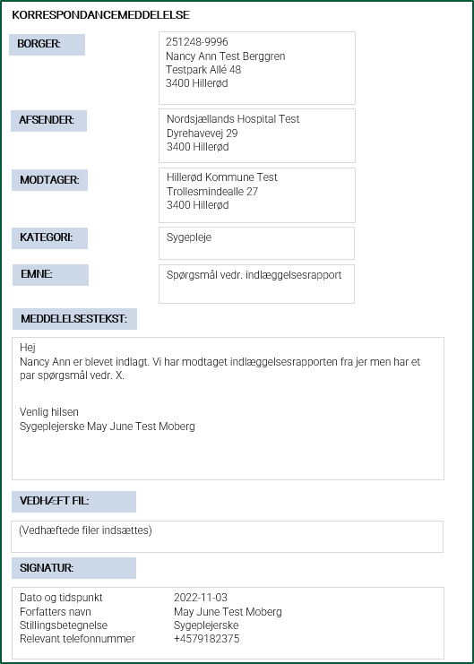

[Return](../../index.md)

# Sundhedsfaglige retningslinjer for anvendelse | Clinical guidelines for application

**Indholdsfortegnelse | Table of Contents**
* [1 Introduktion / Introduction](#1-introduktion)
* [2 Formål / Purpose](#-formaal)
* [3 Illustration af Korrespondancemeddelelsen / Illustration of CareCommunication](#3-illustration-af-korrespondancemeddelelsen)
* [4 Krav og anbefalinger til Korrespondancemeddelelsen / Requirements and Recommendations for CareCommunication](#4-krav-og-anbefalinger-til-korrespondancemeddelelsen)
    * [4.1 Kategori og emne / Category and Topic](#41-kategori-og-emne)
    * [4.2 Meddelelsessegment / Message Segment](#42-meddelelsessegment)
      * [4.2.1 Meddelelsestekst / Message Text](#421-meddelelsestekst)
        * [4.2.1.1 Kopierede eller vedhæftede journalnotater / Copied or Attached Medical Notes](#4211-kopierede-eller-vedhæftede-journalnotater)
      * [4.2.2 Signatur / Signature](#422-signatur)
    * [4.3 Prioritet, krav om afgrænset brug / Priority, Requirements for Limited Use](#43-prioritet-krav-om-afgrænset-brug)
    * [4.4 Vedhæftede filer / Attached Files](#44-vedhæftede-filer)
    * [4.5 Historisk overblik i brugergrænsefladen / Historical Overview in the User Interface](#45-historisk-overblik-i-brugergrænsefladen)
      * [4.5.1 Håndtering af historiske data ved SOR-koder / Handling of historical data with SOR-codes](#451-håndtering-af-historiske-data-ved-sor-koder)
    * [4.6 Forsendelsesmuligheder / Sending Options](#46-forsendelsesmuligheder)
        * [4.6.1 Besvarelse / Replying](#461-besvarelse)
        * [4.6.2 Videresendelse / Forwarding](#462-videresendelse)
* [5 Opsummering af krav og anbefalinger til afsender- og modtagersystemer / Summary of Requirements and Recommendations for Sending and Receiving Systems](#5-opsummering-af-krav-og-anbefalinger-til-afsender--og-modtagersystemer)
* [6 Use Cases](#6-use-cases)
* [7 Ibrugtagning i SOR/SOR-EDI / Implementation in SOR/SOR-EDI](#7-ibrugtagning-i-sorsor-edi)

&nbsp;

## 1 Introduktion | Introduction
Dette er den tekstuelle del af dokumentationen til MedComs FHIR-standard for Korrespondancemeddelelse (på engelsk CareCommunication). Den tekstuelle del indeholder information om formål, baggrund, en illustration af indholdet i korrespondancemeddelelsen, krav og anbefalinger samt ibrugtagning ift. SOR-EDI. Målgruppen for denne tekst er it-systemleverandører og implementeringsansvarlige, som skal it-understøtte afsendelse og modtagelse af Korrespondancemeddelelsen. 

Krav og anbefalinger til indhold, herunder funktionaliteter, er udarbejdet i samarbejde med en <a href="https://www.medcom.dk/opslag/navne-og-adresser?gruppe=Arb.grp.%20FHIR-Korrespondancemeddelelse" target="_blank">national arbejdsgruppe</a> med repræsentanter fra regioner, kommuner og praktiserende læger. Derudover har indholdet på denne side været sendt i høring ved relevante MedCom-grupper samt været bredt tilgængeligt for kommentering via publicering på MedComs hjemmeside.
De tekniske specifikationer for Korrespondancemeddelelsen findes via forsiden for MedComs samlede dokumentation for Korrespondancemeddelelsen, MedCom anvender onlineværktøjet GitHub til visning. <a href="https://medcomdk.github.io/dk-medcom-carecommunication/ " target="_blank">Klik her for at læse de tekniske specifikationer for Korrespondancemeddelelsen.</a> 
>Note: I tilfælde af uoverensstemmelser i beskrivelsen af de sundhedsfaglige retningslinjer for anvendelse på dansk og engelsk er det den danske beskrivelse af de sundhedsfaglige retningslinjer for anvendelse, der er gældende.

&nbsp;

This is the textual part of the documentation for MedCom’s FHIR standard ‘CareCommunication’ (da: Korrespondancemeddelelse). This documentation provides information about the clinical guidelines for CareCommunication, including the purpose and background for CareCommunication, an illustration of the structure of CareCommunication, requirements and recommendations, and offers guidance on implementation regarding SOR-EDI.

The intended audience of this text is IT system vendors and implementation managers responsible for supporting the sending and receiving of CareCommunication. Requirements and recommendations for the content of CareCommunication, including functionality, have been developed in collaboration with a<a href="https://www.medcom.dk/opslag/navne-og-adresser?gruppe=Arb.grp.%20FHIR-Korrespondancemeddelelse" target="_blank">national working group</a> consisting of representatives from regions, municipalities, and general practitioners. Additionally, the content on this page has been reviewed by relevant MedCom groups and has been publicly available for comments via publication on MedCom’s website. The technical specifications for CareCommunication can be accessed through the main page of MedCom’s documentation site for CareCommunication. MedCom uses the online tool GitHub for displaying these specifications.<a href="https://medcomdk.github.io/dk-medcom-carecommunication/ " target="_blank">Click here to read the technical specifications for CareCommunication.</a> 

>Note: Should any discrepancies arise between the Danish and English versions of the clinical guidelines, the Danish version shall be considered authoritative.

&nbsp;

## 2 Formål | Purpose {#formaal}
Formålet med Korrespondancemeddelelsen er at understøtte den digitale kommunikation mellem sundhedsvæsenets parter, herunder bl.a. også psykiatri- og socialområdet, hvor initiativ til ny version af Korrespondancemeddelelsen er forankret. Korrespondancemeddelelsen anvendes til sikker digital kommunikation af personhenførbare oplysninger og anvendes typisk til ad hoc kommunikation. Korrespondancemeddelelsen skal dog kun bruges på de områder, hvor der i forvejen ikke findes tilgængelige strukturerede MedCom standarder. Korrespondancemeddelelsen skal ikke anvendes ved sager af akut karakter. Formålet med Korrespondancemeddelelsen er bl.a. at: 
* Give mulighed for at vedhæfte og udveksle digitale filer.
* Understøtte automatisk fordeling ved modtagelse via brug af fælles nationale kategorier (=overordnede overskrifter).
* Respektere regionale samarbejdsaftaler med kommuner og praksislæger ved at bevare muligheden for at angive aftalte emneord (=supplerende overskrifter).
* Tydeliggøre afsenderen af Korrespondancemeddelelsen med påkrævet signatur.
* Anvende teknisk indhold, således at der i brugergrænsefladen arbejdes med en tydelig kommunikationshistorik og aktivitet (fx om en meddelelse er ny, besvaret eller videresendt).

&nbsp;

The purpose of CareCommunication is to support digital communication among all parties in the healthcare sector, including the psychiatric and social-care domains, where the initiative for the new version of the standard originates. CareCommunication supports secure digital exchange of person-identifiable information and is typically used for ad hoc communication. However, it should only be used in areas where no dedicated existing structured MedCom standards already exist. CareCommunication shall not be used for urgent cases. The purpose of CareCommunication is, among other things, to: 
<ul>
  <li>Provide the ability to attach and exchange digital files. </li>
  <li>Support automatic distribution upon receipt by using national categories (i.e., general headings). </li>
  <li>Support regional cooperation agreements with municipalities and general practitioners by maintaining the option to add a predefined topic (i.e., supplementary headings). </li>
  <li>Make the sender of the CareCommunication explicit with a mandatory signature. </li>
  <li>Use technical content to ensure a clear communication history and activity tracking in the user interface (e.g., whether a message is new, replied to, or forwarded).</li> 
</ul>

## 3 Illustration af Korrespondancemeddelelsen | Illustration of CareCommunication
<a href="#Fig1">Figur 1</a> er en illustration af indholdet i Korrespondancemeddelelsen. Illustrationen er et eksempel og indeholder ikke alle datafelter, som er i standarden og afspejler ikke det enkelte systems brugergrænseflade.
<a href="#Fig1">Figure 1</a>is an illustration of the content of a CareCommunication. The illustration is an example and does not include all data fields defined in the standard, nor does it reflect the user interface of any specific system.

<figure>

<figcaption text-align = "center"><b>Figur 1: Eksempel på indhold i Korrespondancemeddelelsen | Figure 1: Example of content in CareCommunication</b></figcaption>
</figure>

## 4 Krav og anbefalinger til Korrespondancemeddelelsen | Requirements and Recommendations for CareCommunication
Korrespondancemeddelelsen <u>skal</u> indeholde information om:
*	Borger/patient som henvendelsen vedrører
*	Afsender
*	Modtager
*	Kategori (fortæller på et overordnet niveau, hvad indholdet i Korrespondancemeddelelsen drejer sig om)
*	Meddelelsessegment (indeholdende meddelelsestekst og signatur)
*	Signatur skal indeholde dato og tidspunkt, forfatters navn, stillingsbetegnelse og relevant telefonnummer
*	Tekniske data om meddelelsen (herunder bl.a. ID’er og referencer til forudgående meddelelser. <a href="https://medcomdk.github.io/dk-medcom-carecommunication/assets/documents/Intro-Technical-Spec-ENG.html" target="_blank">Klik her for at se den tekniske dokumentation for yderligere information.</a>)

&nbsp;

Korrespondancemeddelelsen <u>kan</u> (=frivilligt) indeholde:
* Specifik afsender, hvis relevant (fx specifik udskrivningskoordinator eller læge på sygehus) 
*	Specifik modtager, hvis relevant (fx specifik sagsbehandler eller socialrådgiver i kommunen) 
*	Emne (supplerer den valgte kategori med et emneord, som fortæller i detaljer, hvad indholdet i Korrespondancemeddelelsen drejer sig om. Liste med emner er ofte defineret via regionale sundhedsaftaler)
*	Vedhæftede filer (knyttes til et meddelelsessegment)
*	Prioritet (Obs. Kan kun påsættes ved valg af den nationale kategori ”Vedr. henvisning”) 

&nbsp;

The CareCommunication <u>must</u> (=mandatory) contain:
<ul>
  <li>The citizen/patient the communication concerns. </li>
  <li>Sender.</li>
  <li>Recipient.</li>
  <li>Category (indicating on a general level what the content of the CareCommunication relates to).</li>
  <li>Message segment (containing the message text and signature of the sender).</li>
  <li>Signature, which must include the date and time, the author's name, job title, and relevant phone number. </li>
  <li>Technical data related to the message (including e.g. identifiers and references to previous messages. <a href="https://medcomdk.github.io/dk-medcom-carecommunication/assets/documents/Intro-Technical-Spec-ENG.html" target="_blank">Click here to see the technical documentation for further details.</a>)</li>
</ul>

&nbsp;

The CareCommunication <u>may</u> (=optional) contain:
<ul>
  <li>Specific sender, if relevant (e.g., a designated discharge coordinator or hospital physician).</li>
  <li>Specific recipient, if relevant (e.g., a specific caseworker or social worker in the municipality).</li>
  <li>Topic (supplements the selected category with a topic that provides more detailed information about the content of the CareCommunication. The list of topics is often defined through regional cooperation agreements).</li>
  <li>Attached files (linked to a message segment).</li>
  <li>Priority (can only be assigned when selecting the national category "Regarding referral").</li>
</ul>

&nbsp;

### 4.1 Kategori og emne | Category and Topic
Afsender vælger en kategori fra en nationalt fastlagt liste bestående af aftalte kategorier. Kategorilisten muliggør, at modtager automatisk kan fordele indkomne korrespondancemeddelelser, fx til det relevante kommunale område. Det er et krav, at kategorien vises for brugeren, men muligheden for automatisk fordeling ved modtagelse efter de nationale kategorier i Korrespondancemeddelelsen er ikke en del af MedComs test og certificering.
<a href="https://medcomfhir.dk/ig/terminology/CodeSystem-medcom-careCommunication-categoryCodes.html" target="_blank"> Klik her for at læse de aftalte nationale kategorier.</a> 

Der er oprettet en kategori ”Andet” i de tilfælde, hvor de øvrige kategorier på listen ikke vurderes tilstrækkeligt dækkende for indholdet i Korrespondancemeddelelsen. Ved valg af kategorien ”Andet” er det et krav, at afsender medsender et emne. MedCom anbefaler, at afsender så vidt muligt undlader at anvende kategorien ”Andet”, undtagen i de tilfælde hvor det er absolut nødvendigt. 

I emnefeltet har brugeren mulighed for at supplere den valgte kategori med et emne. Emnefeltet udfyldes enten med de regionalt aftalte emneord, defineret i de regionale samarbejdsaftaler, eller som selvskreven fritekst. Det er valgt at bibeholde emnefeltet netop for at kunne understøtte de eksisterende samarbejdsaftaler med de regionalt aftalte emneord. Der er ikke krav til, eller forventning om, at systemerne automatisk kan fordele efter emneord. 

For at understøtte brugeren mest muligt <u>anbefales følgende</u>:
*	Regionalt aftalte emneord mappes til de nationalt aftalte kategorier, hvor de pågældende emneord relateres til de relevante kategorier. 
*	I de brugssituationer, hvor der er regionalt aftalte emneord:
    *	Brugeren præsenteres for de regionalt aftalte emneord, som de kender, og ved valg af emneord, påsætter systemet automatisk den pågældende relevante kategori (som er valgt ved forudgående mapning mellem kategori og emneord). Brugeren slipper derved for at skulle tage stilling til kategori.
    *	Kategorien skal altid være synlig, både for afsender og modtager – også ved regionalt aftalte emneord. Kategorien kan dog, for at understøtte brugeren, gøres mindre synlig i brugergrænsefladen, fx ved at ’fade ud’, hvis der er regionalt aftalte emneord.
*	I de brugssituationer, hvor der ikke er regionalt aftalte emneord:
    *	Brugeren vælger kategori og har herefter mulighed for at supplere med selvskrevet emneord som fritekst i emnefeltet.

&nbsp;

MedCom stiller en terminologiserver til rådighed, som bl.a. udstiller de nationale kategorier og tilladte filtyper, som kan vedhæftes Korrespondancemeddelelsen. Governance, omfattende regler og retningslinjer, herunder bl.a. adgang, opdatering og vedligeholdelse, for såvel terminologiserveren som listen over de nationalt aftalte kategorier, håndteres og fastlægges i MedCom-regi. Governance for terminologier og serveren findes via forsiden for Governance for MedCom FHIR Messaging.
<a href="https://medcomdk.github.io/MedCom-FHIR-Communication/" target="_blank">Klik her for at læse Governance for MedCom FHIR Messaging.</a>

&nbsp;

A category is selected by the sender from the nationally defined list of agreed-upon categories. The category list makes it possible for the recipient to auto-route incoming CareCommunication, e.g. to the correct municipal department. It is mandatory that the chosen category is shown to the user (both the sender and receiver), but the automatic routing feature itself is not part of MedCom’s test and certification scope. <a href="https://medcomfhir.dk/ig/terminology/CodeSystem-medcom-careCommunication-categoryCodes.html" target="_blank"> Click here to see the national categories</a> 
The category "Other" is intended for situations where none of the listed categories adequately describe the content of the CareCommunication. If the category “Other” is selected, the sender must add a topic to the message. MedCom recommends avoiding the use of the category "Other" unless it is considered necessary. 

The topic text field lets the user add a topic that clarifies the chosen category. The topic text field can contain either regionally agreed upon topics, defined in regional cooperation agreements, or be a short free text written by the user.  The topic text field has been retained specifically to support the regional agreements. There is no requirement or expectation that systems can automatically distribute messages based on topics. 

To support users in the best possible way, the following is recommended: 
<ul>
  <li>Regionally agreed upon topics are mapped to the nationally agreed upon categories, so each topic is linked to the relevant category.</li>
  <li>When regionally agreed upon topics are available:</li>
  <ul>
      <li>The user is presented with the familiar, regionally agreed upon topics. When a topic is selected, the system automatically applies the corresponding category (defined by the prior mapping between topics and categories), sparing the user from choosing a category manually.</li>
      <li>The category shall always be visible to both sender and recipient when using regionally agreed upon topics. To support usability, the category may be displayed less prominently in the interface (e.g., faded out) when a regionally agreed upon topic is selected.</li>
    </ul>
  <li>When no regionally agreed upon topics are available:</li>
  <ul>
      <li>The user may then add a self-written topic as free text in the topic text field. </li>
  </ul>
</ul>
MedCom provides a terminology server that, among other things, hosts the national categories and the permitted file types for attachments in the CareCommunication. Governance covering rules and guidelines regarding access, updates, and maintenance of both the terminology server and the list of nationally agreed upon categories is managed and defined by MedCom. Governance regarding the terminologies and the server is available on the Governance for MedCom FHIR Messaging Landing page. <a href="https://medcomdk.github.io/MedCom-FHIR-Communication/" target="_blank">Click here to read Governance for MedCom FHIR Messaging.</a>

&nbsp;

### 4.2 Meddelelsessegment | Message Segment
Et meddelelsessegment består af Korrespondancemeddelelsens meddelelsestekst og afsenders signatur. I de tilfælde, hvor der vedhæftes en fil til Korrespondancemeddelelsen, vil vedhæftningen knyttes til et nyt meddelelsessegment. Der er en identifier på hvert meddelelsessegment, som også skal medsendes og modtages af systemerne. I den forbindelse er der krav om, at meddelelsessegmenter indeholdt meddelelsestekst, altid skal medsendes i kommunikationen, fx ved besvarelse.

A message segment comprises the message text in the CareCommunication together with the sender’s signature. When a file is attached to the CareCommunication, the attachment will be linked to a new message segment. Each message segment carries its own identifier, which must be included when sending and receiving messages. Message segments containing message text must always be included in the communication, for example, when a reply is sent. 

&nbsp;

#### 4.2.1	Meddelelsestekst | Message Text
Meddelelsestekst-feltet er et fritekstfelt, hvori afsender skriver sin tekst. Det er obligatorisk for afsender at skrive fritekst i meddelelsens tekstfelt.  
Det er et krav til afsendersystemet, at understøtte muligheden for linjeskift i meddelelsens fritekstfelt. Det er et krav til modtagersystemet, at understøtte og vise linjeskift i meddelelsens fritekstfelt. Læs mere i <a href="https://medcomdk.github.io/MedCom-FHIR-Communication/assets/documents/governance-for-careCommunication.html" target="_blank">Governance for CareCommunication</a>.

The message text is a free-text field where the sender writes their text.  The sender must enter free text in this field. The sender system must support the insertion of line breaks in the free text. The recipient system must preserve and display line breaks in the free text. Read more in <a href="https://medcomdk.github.io/MedCom-FHIR-Communication/assets/documents/governance-for-careCommunication.html" target="_blank">Governance for CareCommunication</a>.

&nbsp;

##### 4.2.1.1 Kopierede eller vedhæftede journalnotater | Copied or Attached Medical Notes
Hvis afsender kopierer og indsætter kortere journalnotater i meddelelsesteksten, anbefaler MedCom, at navn på forfatter, samt tidspunkt for oprettelse, af journalnotatet påskrives og medsendes i meddelelsens tekstfelt. Hvis afsender ønsker at medsende længere journalnotater, f.eks. mere end 1.000 tegn (svarende til en halv side), anbefaler MedCom, at disse medsendes som vedhæftede filer.[Se afsnit 4.4 Vedhæftede filer]. 

If the sender copies and pastes brief medical notes into the message free-text field, MedCom recommends including the author’s name and the creation timestamp of the medical note in the message free-text field. When the sender wishes to include longer medical notes e.g., more than 1,000 characters (approximately half a page), MedCom recommends attaching them as files. [See section 4.4 Attached files].

&nbsp;

#### 4.2.2 Signatur | Signature
Signaturen skal altid udfyldes, medsendes af afsender og vises af modtager. Formålet med signaturen er at tydeliggøre, hvem forfatteren af den afsendte Korrespondancemeddelelse er. Derfor er det et krav, at signatur udfyldes med bl.a. dato og tidspunkt, forfatterens navn, stillingsbetegnelse og relevant telefonnummer. Det anbefales at anvende de stillingsbetegnelser, som slutbrugeren er vant til at anvende i fagsystemet. Hvis systemet ikke har indlagt stillingsbetegnelser, skal afsenderen tilføje en jobtitel som fritekst eller benytte MedComs liste over stillingsbetegnelser, som er sammensat af udtræk fra autorisationsregistret og Sundhedsvæsenets Klassifikationssystem (SKS). 
<a href="https://medcomfhir.dk/ig/terminology/ValueSet-medcom-core-PractitionerRoles.html" target="_blank">Klik her for at læse listen over stillingsbetegnelser.</a>   
MedCom <u>anbefaler</u>, at telefonnummer udfyldes med relevant telefonnummer, såsom telefonnummeret på afdelingen, afsnittet eller enheden, som afsenderen er tilknyttet, eller fx et relevant vagttelefonnummer. Signaturen består af struktureret data og er ikke en del af tekststrengen, som kendt fra (X)DIS91. Signatur bør så vidt muligt autoudfyldes af systemet. I tilfælde af elementer, som ikke kan autoudfyldes af systemet, skal disse kunne tilføjes manuelt af brugeren, fx relevant telefonnummer.

The signature must always be filled out and sent as well as displayed by the recipient. The purpose of the signature is to clearly indicate the author of the CareCommunication. Therefore, the signature must include date and time, the author's name, job title and relevant phone number. MedCom recommends using job titles that end-users are accustomed to in the clinical system. If the system does not have predefined job titles, the user must add a self-written job title or choose from  MedCom’s list of job titles based on data from the Danish authorization register and Healthcare Classification System (DA: Sundhedsvæsenets Klassifikationssystem (SKS)). 
<a href="https://medcomfhir.dk/ig/terminology/ValueSet-medcom-core-PractitionerRoles.html" target="_blank">Click here to see the list of job titles. </a>  

MedCom also <u>recommends</u> entering a relevant phone number, such as the phone number of the department, unit, or a relevant on-call number. The signature consists of structured data and is not part of the text string as known from (X)DIS91. The system should auto-fill the signature as much as possible. Any elements that cannot be auto-filled by the system must be manually filled out by the user, such as the relevant phone number.

&nbsp;

### 4.3 Prioritet, krav om afgrænset brug | Priority, Requirements for Limited Use
Det bliver muligt at markere en Korrespondancemeddelelse med prioritet, men med afgrænset brug i praksis. Alle systemer testes for, at de kan modtage og vise prioritet. I forhold til anvendelse og afsendelse af prioritet, testes alle systemer for, at prioritet kun er synlig og mulig at bruge ved valg af den nationale kategori ”Vedr. henvisning”. Kravet fremgår af use case og tilhørende testprotokol. Dette er besluttet på baggrund af, at behovet for at anvende prioritet er rejst i regi af et nationalt projekt om forbedring af henvisninger, herunder revision af henvisningsflowet. Anvendelsen af prioritet skal tilpasses løbende ift. udvikling i overenskomster og på baggrund af nationale krav fra Sundhedsministeriet, Sundhedsstyrelsen og Sundhedsdatastyrelsen. 

It will be possible to mark a CareCommunication with priority, but with restricted use in practice. All systems are tested to ensure that they can receive and display priority. When applying and sending priority, every system will be tested to ensure that priority is only visible and selectable when the national category 'Regarding referral' is chosen. This requirement is specified in the use cases and corresponding test protocol. 
This decision is based on the need to use priority, which has emerged as part of a national project aimed at improving referrals, including revising the referral workflow. The use of priority must be continuously adapted to developments in agreements and to national requirements from the Ministry of Health, the Danish Health Authority, and the Danish Health Data Authority. 

&nbsp;

### 4.4 Vedhæftede filer | Attached Files
Det er muligt at vedhæfte filer, som indlejres i Korrespondancemeddelelsen. Når der er vedhæftet en fil til en Korrespondancemeddelelse, er det et krav, at det tydeligt vises i brugergrænsefladen. En vedhæftet fil kan både være en fil med en filtype, fx pdf, eller et link. De tilladte filtyper, som kan vedhæftes Korrespondancemeddelelsen, ses beskrevet i Implementation Guide for terminologi samt udstilles på terminologiserveren.  
<a href="https://medcomfhir.dk/ig/terminology/ValueSet-medcom-core-attachmentMimeTypes.html" target="_blank">Klik her for at finde de tilladte filtyper, som kan vedhæftes i Korrespondancemeddelelsen.</a>  
Det er besluttet, at der ikke må medsendes video i en Korrespondancemeddelelse grundet størrelsen. Det anbefales, at videoer deles via en forventet kommende national delingsservice. Der vil ikke være begrænsning på, hvor mange vedhæftede filer der kan medsendes i en Korrespondancemeddelelse, men i stedet begrænses størrelsen på hele meddelelsen, dvs. inklusiv vedhæftede filer og VANS-kuverten. Den maksimale størrelse på hele meddelelsen, inklusive vedhæftede filer og VANS-kuverten, som sendes over VANS, er 100 MB. Alle vedhæftede filer tildeles en unik identifier
  
Afsender, som vælger at afsende, besvare eller videresende en Korrespondancemeddelelse, er ansvarlig for meddelelsens indhold, herunder vedhæftede filer. Forfatter på den vedhæftede fil er den fagperson, som oprindeligt har udarbejdet filen, og derfor er ansvarlig for det faglige indhold. MedCom anbefaler, at navn, samt tidspunkt for oprettelse, af den vedhæftede fil påskrives og medsendes. Systemfunktionalitet, der understøtter automatisk påsat navn på forfatter, samt tidspunkt for oprettelse, er optionel, og hvis denne funktionalitet ikke findes, anbefales det, at systemet understøtter, at afsender manuelt kan påskrive disse informationer enten i den vedhæftede fil, eller som struktureret information i meddelelsessegmentet med den vedhæftede fil. Når man, som afsender, vælger at medsende en fil, er man også ansvarlig for, at filens indhold er relevant for det aktuelle behandlingsforløb. Som en del af test og certificering tjekker MedCom, at identifier på vedhæftede filer indlæses og gemmes. Dette med henblik på at systemet ved modtagelse af en besvarelse kan genfinde og vise tidligere vedhæftede filer for brugeren. Krav til understøttelse af arbejdsgange samt brugervenlighed skal varetages lokalt i et samarbejde mellem kunde og it-leverandør.

&nbsp;

It is possible to attach files that are embedded within the CareCommunication. When a file is attached to a CareCommunication, it must be clearly displayed in the user interface. An attachment can either be a file of a specific type, such as a PDF, or a link. The allowed file types that may be attached to a CareCommunication are described in the Implementation Guide for terminology and are available on the terminology server.  
<a href="https://medcomfhir.dk/ig/terminology/ValueSet-medcom-core-attachmentMimeTypes.html" target="_blank"> Click here to find the allowed file types that can be attached to a CareCommunication. </a>  
Video files must not be sent in a CareCommunication due to their size. It is recommended that videos are shared via an anticipated future national sharing service. There will be no limit to the number of attachments that can be included in a CareCommunication; however, the total message size, including attachments and the VANS-envelope, will be restricted. The maximum size of the entire message, including attachments and the VANS envelope, that can be sent via VANS is 100 MB. All attached files are assigned a unique identifier.

The sender, who chooses to send, reply, or forward a CareCommunication, is responsible for the content, including attachments. The author of the attachment is the healthcare professional who originally created the file and is therefore accountable for its clinical content. MedCom recommends that the author’s name and the creation timestamp are included with the attachment. System functionality that supports the automatic inclusion of the author’s name and creation timestamp is optional. If this functionality is not available, the system should allow the sender to manually add this information either within the attached file itself or as structured information in the message segment containing the attachment. 

By attaching a file, the sender is also responsible for ensuring that its content is relevant to the current course of treatment.  During testing and certification, MedCom verifies that the identifiers of attached files are imported and stored to ensure that, upon receiving a reply, the system can retrieve and display previously attached files for the user. The requirements for workflow support and user-friendliness must be managed locally in collaboration between the customer and the IT vendor. 

&nbsp;

### 4.5 Historisk overblik i brugergrænsefladen | Historical Overview in the User Interface
Systemerne skal benytte sig af muligheden for at give det bedst mulige overblik over en meddelelsesaktivitet (fx om meddelelsen er en ny modtaget meddelelse, en besvarelse eller en videresendelse) samt synliggøre kommunikationshistorikken i brugergrænsefladen. 

Som en del af Korrespondancemeddelelsen medsendes en kommunikations-identifier samt referencer mellem meddelelsessegmenter og de tekniske elementer i provenance. Disse tekniske referencer medsendes med henblik på at kunne håndtere og koble meddelelser i en meddelelsestråd på samme måde på tværs af afsender og modtager, og således understøtte, at korrespondancemeddelelser dels placeres i rette tråd (via kommunikations-identifieren) og dels placeres i korrekt rækkefølge (via referencer mellem provenance og meddelelsessegment). 

Kommunikations-identifieren oprettes og indsættes af afsendersystemet ved oprettelse af en meddelelse. Der er én kommunikations-identifier per meddelelsestråd. Formålet med kommunikations-identifieren er at koble de sammenhørende korrespondancemeddelelser i én meddelelsestråd, således at meddelelserne vises i samme tråd, både hos afsender og modtager.  
Reference mellem provenance og meddelelsessegment skal både indgå i forhold til den aktuelle meddelelse, som sendes, men også i forhold til eventuelle forudgående meddelelser. Formålet med referencerne er at koble rækkefølgen af korrespondancemeddelelser, og at systemerne således ved, hvilke meddelelsessegmenter der er blevet tilføjet i en meddelelse.

MedCom har udarbejdet regler for håndtering og kobling af meddelelsestråde via kommunikations-identifier samt referencer mellem provenance og meddelelsessegmenter. Reglerne beskriver håndtering og kobling af de mulige kommunikationsflows, herunder besvarelser og videresendelser samt håndtering af parallelle meddelelser (grundet samtidighed).<a href="https://medcomdk.github.io/MedCom-FHIR-Communication/assets/documents/governance-for-careCommunication.html" target="_blank">Klik her for at læse reglerne for håndtering af de mulige kommunikationsflows.</a> Reglerne indgår også i testprotokollerne med henblik på at sikre ensartet implementering og anvendelse

I MedComPatientCore er det tilladt, at en person har flere identifiers – fx to erstatnings-CPR-numre eller et almindeligt CPR-nummer sammen med et erstatnings-CPR. Derfor anbefaler MedCom, at kommunikationsidentifieren også anvendes til at holde tråden i kommunikationen, hvis der tilføjes et CPR-nummer, som ikke i forvejen er kendt. Dette vil bevare historikken i en kommunikationstråd med samme kommunikationsidentifier, selvom der sker ændringer i en borgers CPR-numre.

&nbsp;

Systems must leverage the ability to provide the best possible overview of message activity (e.g., whether a message is a newly received message, a reply, or a forwarded message) and to display the communication history in the user interface. 

A communication identifier as well as references between resources and technical elements in Provenance, are included in a CareCommunication. The communication identifier is unique to the thread ensuring that all related messages are grouped together in the same conversation on both the sender’s and the recipient’s side. This supports the correct placement of CareCommunication within the appropriate thread (via the communication identifier) and in the correct sequence (via references between provenance and message segments).  

The communication identifier is created and applied by the sending system when creating a message. There is one communication identifier per message thread. The purpose of the communication identifier is to link related CareCommunication within a single message thread so that messages appear in the same thread for both sender and recipient. 

The references, which point from Provenance to both the current and any earlier message segments, preserve the correct chronological order and let the system determine which segments were added when.  

MedCom has published detailed rules for managing and linking message threads via the communication identifier and references between provenance and message segments. These rules describe the handling and linking of possible communication flows, including replies and forwards, as well as the management of parallel messages (due to concurrency). <a href="https://medcomdk.github.io/MedCom-FHIR-Communication/assets/documents/governance-for-careCommunication.html" target="_blank"> Click here to read the rules for handling possible communication flows. </a> The rules are also included in the test protocols to ensure uniform implementation and usage.

In MedComPatientCore, a person may have multiple identifiers—for example, two replacement CPR numbers or a regular CPR number together with a replacement CPR. Therefore, MedCom recommends also using the communication identifier to maintain the message thread if a CPR number is added that is not already known. This will preserve the history within a communication thread that shares the same communication identifier, even if a citizen’s CPR numbers change.

&nbsp;

#### 4.5.1 Håndtering af historiske data ved SOR-koder | Handling of historical data with SOR-codes
En given SOR-kode kan, over tid, have forskellige data knyttet til sig (fx navn og lokationsnummer). Når en meddelelse sendes, skal de oplysninger, der er knyttet til den pågældende SOR-kode, fastholdes og forblive uændrede. Det betyder, at data ikke må opdateres til de aktuelle oplysninger i SOR, da det ville ændre den oprindelige kontekst for meddelelsen. 
I praksis vil et skift af både SOR-kode og lokationsnummer medføre, at der startes en ny meddelelsestråd. I det scenarie, hvor det kun er SOR-koden, som ændres, vil en ny meddelelsestråd ligeledes blive oprettet.

A given SOR-code may, over time, have different data associated with it (e.g., name and EAN/GLN-number). When a message is sent, the information linked to the specific SOR-code must be preserved and remain unchanged. This means that historical data must not be updated to reflect the current information in SOR, as that would change the message’s original context. 
In practice, a change of both the SOR-code and the EAN/GLN-number will result in the initiation of a new message thread.  In cases where it is only the SOR-code that changes, a new message thread will be created.  

&nbsp;

### 4.6 Forsendelsesmuligheder | Sending Options
Afsender skal kunne sende en ny Korrespondancemeddelelse samt besvare en Korrespondancemeddelelse. Afsender bør (funktionaliteten er ikke påkrævet) kunne videresende en modtaget Korrespondancemeddelelse. MedCom anbefaler, at systemet understøtter funktionaliteten videresendelse. Det er et krav, at alle modtagersystemer skal kunne modtage og vise, om meddelelsen er en ny, besvaret eller videresendt Korrespondancemeddelelse. 
Både ved besvarelse og videresendelse af en Korrespondancemeddelelse indsættes den samme kategori og det samme emne automatisk af systemet. Brugeren skal kunne vælge at ændre det til en anden kategori og et andet emne. Referencer til det/de forudgående, eller videresendte, meddelelsessegment(er) skal indgå.

Afsenderen bør kunne tilføje en specifik afsender eller modtager til meddelelsen. Funktionalitet til at understøtte dette, er optionel. Tilføjelse af en specifik afsender kan benyttes i tilfælde, hvor afsenderen af meddelelsen sender informationer til modtager på vegne af en anden med behandlingsrelation til patienten og dermed ønsker at angive den/det specifikke person/team. En specifik afsender kan eksempelvis være et plejeteam, en hjemmeplejegruppe i kommunen eller en praktiserende læge. 
Specifik afsender er ikke en del af signaturen, da signaturen refererer til afsenderen af meddelelsen, og derfor bør afsenderoplysninger og specifik afsender ikke pr. automatik være ens. 
Det er et krav, at alle modtagersystemer skal kunne modtage og vise specifik afsender og specifik modtager, hvis dette er udfyldt og medsendt i meddelelsen. Hvis en korrespondancemeddelelse modtages med en specifik afsender, skal systemet automatisk sætte denne som specifik modtager ved besvarelse. MedCom anbefaler, at brugeren kan fjerne den specifikke modtager, hvis det ikke er relevant at videreføre. Det er ikke et krav, at der kan tilføjes en ny specifik modtager. 

&nbsp;

The sender must be able to send a new CareCommunication and reply to a CareCommunication. The sender should (though this functionality is not mandatory) be able to forward a received CareCommunication. MedCom recommends that the system support the forwarding functionality. 
All receiving systems must recognize and display for the user whether an incoming message is new, a reply, or a forward. 
When a message is replied to or forwarded, the system must automatically insert the same category and topic as in the original message, while still allowing the user to change them if necessary. References to preceding or forwarded message segment(s) must always accompany the message. 

The sender should be able to add a specific sender or recipient to the message. Functionality to support this is optional. Adding a specific sender to the message can be used in cases where the sender of the message sends information to the receiver on behalf of someone else and thus wants to specify a specific person or team. For example, a specific sender can be a care team, a home care group in the municipality, or a general practitioner. Specific sender is not part of the signature, as the signature refers to the sender of the message, and therefore sender of the message and specific sender will be different. 
It is a requirement that all receiver systems must be able to receive and display the specific sender and specific recipient. If a CareCommunication with a specific sender is received, the system must automatically set the specific sender as the specific recipient when replying. MedCom recommends, that the user is able to remove the specific recipient if it is not considered relevant to reply. It is not a requirement that a new specific recipient can be added. 

&nbsp;

#### 4.6.1 Besvarelse | Replying
Det er et krav at kunne <b>afsende</b> en besvarelse til:

* en ny modtaget Korrespondancemeddelelse
* den senest modtagne besvarelse i en kommunikationstråd
* en videresendt Korrespondancemeddelelse

Afsender bør (funktionaliteten er ikke påkrævet) kunne besvare egen senest afsendte Korrespondancemeddelelse i en meddelelsestråd. Denne mulighed vil støtte slutbrugeren i at fortsætte kommunikationen i samme tråd uden at skulle vente på svar fra modtageren, da det ikke er tilladt at besvare en tidligere modtaget Korrespondancemeddelelse i en meddelelsestråd. Således vil funktionaliteten med besvarelse af egen senest afsendte Korrespondancemeddelelse gøre det muligt for afsenderen at fortsætte meddelelsestråden. Det er ikke tilladt, og må ikke være muligt, at besvare en tidligere modtaget Korrespondancemeddelelse. 

Det er et krav at kunne modtage og vise førnævnte besvarelsesscenarier inklusive forudgående meddelelser, herunder meddelelsessegmenter og nye vedhæftede filer. Hvis der modtages en CareCommunication med specifik afsender, er det et krav, at systemet indsætter den specifikke afsender som specifik modtager af besvarelsen, jf. afsnit 4.6.

Ved besvarelse indsættes afsender af den modtagne Korrespondancemeddelelse automatisk som modtager af besvarelsen (med SOR-kode og EAN-nummer). Afsender udfylder det nye meddelelsestekst-felt med selvskrevet tekst. Derudover påsættes også signatur, i samme meddelelsessegment, på afsender af besvarelsen. En besvarelse af en Korrespondancemeddelelse består således altid af minimum to meddelelsessegmenter, dvs. det tidligere modtaget meddelelsessegment og det nye, som afsender udfylder og medsender i besvarelsen. Hvis der er vedhæftet nye filer til besvarelsen, knyttes disse til meddelelsessegmentet. Hvis afsender har vedhæftet filer i den oprindelige Korrespondancemeddelelse, skal de vedhæftede filer fra afsender ikke medsendes igen ved besvarelse. I stedet tjekker MedCom, som en del af test og certificering, at systemerne indlæser og gemmer identifieren på de vedhæftede filer. Dette er med henblik på at systemet ved modtagelse af en besvarelse kan genfinde og vise tidligere vedhæftede filer for brugeren. De ovenstående hændelserne for besvarelse af en Korrespondancemeddelelse er visualiseret i et aktivitetsdiagram i<a href="#Fig2">Figur 2</a>. 
Det er også muligt at besvare en tidligere modtaget EDIFACT, OIOXML eller FHIR MedCom-meddelelse med Korrespondancemeddelelsen. Ved besvarelse af en tidligere modtaget EDIFACT, OIOXML eller FHIR MedCom-meddelelse anvendes den medsendte identifier fra den modtagne meddelelse og medsendes i Korrespondancemeddelelsen. Således er det muligt, via identifier, at koble en relevant tråd af meddelelser sammen. Det kan eksempelvis ske ved, at man besvarer en modtaget henvisning med en Korrespondancemeddelelse, hvor forløbs-identifieren anvendes og medsendes i besvarelsen. Teknisk betyder det, at der ved besvarelse indsættes et nyt meddelelsessegment, bestående af et nyt meddelelsestekst-felt og signatur.

&nbsp;

It is a requirement to be able to <b>send</b> a reply to:
<ul>
  <li>A newly received CareCommunication. </li>
  <li>The most recently received reply in a communication thread.  </li>
  <li>A forwarded CareCommunication.  </li>
</ul>

The sender should (though this functionality is not mandatory) be able to reply to their own most recently sent CareCommunication in a communication thread. This option will make it possible for the end user to continue the communication in the same thread without having to wait for a response from the recipient, as replying to a previously received CareCommunication within a thread is not allowed. Therefore, the functionality for replying to one's own most recently sent message allows the sender to continue the thread. 

As mentioned in the above, it is not permitted, nor should it be possible, to reply to a previously received CareCommunication. Systems must be able to receive and display every scenario of replies described above, including all earlier messages, their message segments, and any new attachments that accompany the reply. If a received CareCommunication contains a specific sender, it is a requirement to the system to insert the specific sender as the specific receiver in the reply, see section 4.6. When replying, the sender of the received CareCommunication is automatically added as the recipient of the reply (with the SOR code and EAN number). The sender fills out the new message free text field with their own written text. Additionally, the signature of the sender of the reply is added in the same message segment. A reply to a CareCommunication always consists of at least two message segments: the previously received message segment and the new one, which the sender fills out and sends as part of the reply. If new files are attached to the reply, these are linked to the message segment. If the sender attaches files to the original CareCommunication, these attached files should not be sent again when replying. Instead, MedCom validates, as part of testing and certification, that systems load and store the identifier of the attached files. This ensures that the system can retrieve and display previously attached files for the user when a reply is received. The above-mentioned events for replying to a CareCommunication are illustrated in an activity diagram in<a href="#Fig2">Figure 2</a>. It is also possible to respond to a previously received EDIFACT, OIOXML, or FHIR MedCom message with a CareCommunication. When replying to a previously received EDIFACT, OIOXML, or FHIR MedCom message, the identifier provided with the received message is included in the CareCommunication. This allows the relevant thread of messages to be connected via the identifier. For example, this can happen when replying to a received referral with a CareCommunication, where the case identifier is used and included in the reply. Technically, this means that a new message segment is added when replying, consisting of a new free text field and a signature. 

&nbsp;

<figure>

<figcaption text-align="center"><b>Figur 2: Aktivitetsdiagram for besvarelse af en modtaget Korrespondancemeddelelse | Figure 2: Shows activity Diagram for Replying to a Received CareCommunication</b> </figcaption>
</figure>
  

<b>Parallelle besvarelser | Parallel Replies</b> 
I de få tilfælde hvor samme Korrespondancemeddelelse besvares på samme tid af afsender og modtager, vil både afsender- og modtagersystemet modtage såkaldte parallelle korrespondancemeddelelser. Det er et krav, at begge systemer indlæser meddelelserne i den tilhørende meddelelsestråd, selvom det ikke er den seneste meddelelse i tråden. Begge parallelt afsendte meddelelser skal således placeres i samme meddelelsestråd med samme kommunikations identifier. 
Det er et krav, at brugeren skal kunne fortsætte kommunikationen i meddelelsestråden enten ved besvarelse eller modtagelse af en ny meddelelse, selvom der optræder parallelle korrespondancemeddelelser. 
Det er vigtigt at synliggøre, hvilke oplysninger slutbrugeren har været bekendt med på afsendelsestidspunktet, når parallelle meddelelser placeres i samme tråd. Derfor er det et krav, at systemerne inkluderer en synlig reference mellem korrespondancemeddelelserne i tråden, således at brugerne tydeligt kan se, hvad de pågældende korrespondancemeddelelser er et svar på samt synliggøre sammenhængen mellem de øvrige korrespondancemeddelelser i meddelelsestråden. Det er op til leverandøren at sikre en visning, der understøtter brugeren bedst muligt.  

Regler for håndtering af parallelle meddelelser, og visning i brugergrænsefladen, er beskrevet i governance for den nye Korrespondancemeddelelse.
<a href="https://medcomdk.github.io/MedCom-FHIR-Communication/assets/documents/governance-for-careCommunication.html" target="_blank">Klik her for at læse reglerne for håndtering af de mulige kommunikationsflows.</a>

&nbsp;

In rare cases where the same CareCommunication is replied to simultaneously by both the sender and the recipient, both the sender’s and the recipient’s systems will receive what are known as parallel CareCommunications. It is a requirement that both systems load the messages into the corresponding message thread, even if it is not the latest message in the thread. Both parallel messages must be placed in the same message thread with the same communication identifier. It is a requirement that users can continue communication in the message thread, either by replying or receiving a new message, even when parallel CareCommunications occur. It is important to make clear which information the end user was aware of at the time of sending, when parallel messages are placed in the same thread. Therefore, it is a requirement that systems include a visible reference between CareCommunication in the thread, so users can clearly see what each message is a response to and understand the context of the other messages in the thread. The vendor is responsible for ensuring that the display supports the user in the best possible way. Users must be able to continue communication in the message thread, even if parallel CareCommunication appear. The rules for handling parallel messages and their display in the user interface are described in the governance of the new CareCommunication.<a href="https://medcomdk.github.io/MedCom-FHIR-Communication/assets/documents/governance-for-careCommunication.html" target="_blank">Click here for the governance rules on handling communication flows.</a>

&nbsp;

#### 4.6.2. Videresendelse | Forwarding
Afsender bør kunne videresende en Korrespondancemeddelelse (funktionaliteten er ikke påkrævet). Det er op til afsender, hvornår det vurderes relevant at <b>videresende</b> en modtaget Korrespondancemeddelelse, såfremt systemet stiller denne mulighed til rådighed, som anbefalet af MedCom. 

Alle systemer skal kunne <b>modtage</b> en videresendelse. Modtager skal kun kunne besvare den videresendte meddelelse, dvs. at modtageren ikke kan besvare en eller flere af de forudgående meddelelsessegmenter inkluderet i den modtagne videresendelse. 
Afsender er ansvarlig for videresendelsen og relevansen ift. det aktuelle behandlingsforløb. Hvis systemet har funktionalitet, som kan videresende Korrespondancemeddelelse, skal afsender kunne videresende hele meddelelsestråden, som kan bestå af en eller flere meddelelser og vedhæftede filer. Funktionaliteten til at kunne udvælge hvilke dele af meddelelsestråden, man som afsender ønsker at videresende, er ikke påkrævet i systemerne men optionel. Hvis systemet ikke understøtter, at afsender ved videresendelse kan udvælge hvilke dele af meddelelsestråden og vedhæftede filer, der skal medsendes - og afsender ved, at der er dele i meddelelsestråden, som modtageren ikke må modtage/se - skal afsender sende en ny Korrespondancemeddelelse i stedet for at videresende hele meddelelsestråden. Det anbefales, at afsender påskriver navn på den oprindelige forfatter af meddelelsen, som videresendes, i den nyoprettede Korrespondancemeddelelse.

MedCom anbefaler, at afsender beskriver årsagen til videresendelsen i meddelelsesteksten. Ved videresendelse vælger afsender, hvem modtageren er. Teknisk betyder det, at der ved videresendelse indsættes et nyt meddelelsessegment, bestående af et nyt meddelelsestekst-felt og signatur. Afsender udfylder det nye meddelelsestekst-felt med selvskrevet tekst, hvori det også anbefales at angive årsagen til videresendelsen. Derudover påsættes også signatur, i samme meddelelsessegment, på afsender af videresendelsen. En videresendelse består således altid af minimum to meddelelsessegmenter – det tidligere modtagne meddelelsessegment og det nye, som afsender udfylder og medsender ved videresendelsen. Hvis der er vedhæftet filer til videresendelsen, knyttes disse til et nyt meddelelsessegment. De ovenstående hændelser for videresendelse af en Korrespondancemeddelelse er visualiseret i et aktivitetsdiagram i<a href="#Fig3">Figur 3</a> og er beskrevet i
<a href="https://medcomdk.github.io/MedCom-FHIR-Communication/assets/documents/governance-for-careCommunication.html" target="_blank">governance for den nye Korrespondancemeddelelse</a>. Hvis en bruger har videresendt en meddelelse, skal brugeren kunne fortsætte kommunikationen i den originale meddelelsestråd.

&nbsp;

The sender should be able to forward a CareCommunication (this functionality is not mandatory). It is up to the sender to determine when it is appropriate to forward a received CareCommunication, if the system provides this option, as recommended by MedCom.  

All systems must be able to receive a forwarded message. The recipient should only be able to reply to the forwarded message; they cannot reply to one or more of the prior message segments included in the received forwarded message. 
The sender is responsible for the forwarded message and its relevance to the current treatment process. If the system has functionality to forward a CareCommunication, the sender must be able to forward the entire message thread, which may include one or more messages and attached files. The functionality to select which parts of the message thread the sender wants to forward is not required but optional. If the system does not support selecting parts of the message thread and attachments to forward, and the sender is aware that there are parts of the thread that the recipient should not see, the sender must send a new CareCommunication instead of forwarding the entire thread. MedCom recommends that the sender includes the name of the original author of the message being forwarded in the newly created CareCommunication. 
MedCom also recommends that the sender describe the reason for forwarding the message in the message text. When forwarding, the sender selects who the recipient is. Technically, this means that when forwarding, a new message segment is inserted, consisting of a new message free text field and signature. The sender fills out the new message free text field with their own written text, where it is also recommended to specify the reason for the forward. The signature of the sender of the forward is added in the same message segment. 
A forward always consists of at least two message segments: the previously received message segment and the new one, which the sender fills out and sends with the forward. If there are attached files to the forward, these are linked to a new message segment. 
The events described above for forwarding a CareCommunication are visualized in an activity diagram in <a href="#Fig3">Figure 3</a> and are described in <a href="https://medcomdk.github.io/MedCom-FHIR-Communication/assets/documents/governance-for-careCommunication.html" target="_blank">governance for the new CareCommunication</a>. If a user has forwarded a message, they must be able to continue communication in the original message thread, e.g. by replying.  

&nbsp;
 

<figure>

<figcaption text-align="center"><b>Figur 3: Aktivitetsdiagram for videresendelse af en modtaget Korrespondancemeddelelse | Figure 3: Activity Diagram for Forwarding a Received CareCommunication</b> </figcaption>
</figure>
  

## 5 Opsummering af krav og anbefalinger til afsender- og modtagersystemer | Summary of Requirements and Recommendations for Sending and Receiving Systems
I <a href="#Tab1">tabel 1</a> opsummeres krav og anbefalinger til afsender- og modtagersystemer på baggrund af den tekstuelle del af dokumentationen. For tekniske detaljer henvises til de tekniske specifikationer, som findes via forsiden for Korrespondancemeddelelse i GitHub.  <a href="https://medcomdk.github.io/dk-medcom-carecommunication/" target="_blank">Klik her for at læse de tekniske specifikationer for Korrespondancemeddelelsen på GitHub</a>. 

&nbsp;

<a href="#Tab1">table 1</a> summarizes the requirements and recommendations for sender and receiver systems based on the textual documentation above. For technical details, please refer to the  <a href="https://medcomdk.github.io/dk-medcom-carecommunication/" target="_blank">technical specifications available on the CareCommunication GitHub page.</a>.   

<table class="tg">
<caption style="color:#002134; font-weight:bold; text-align:center"> Tabel 1: Opsummering af krav og anbefalinger til afsender- og modtagersystemer </caption>
<thead>
  <tr>
    <th class="tg-7bnw">        </th>
    <th class="tg-7bnw">    Krav til afsendersystem  | Requirements for Sender System</th>
    <th class="tg-7bnw">    Anbefalinger til afsendersystem  |  Recommendations for Sender System</th>
    <th class="tg-7bnw">    Krav til modtagersystem  | Requirements for Receiver System</th>
    <th class="tg-7bnw">    Anbefalinger til modtagersystem  | Recommendations for Receiver System</th>
  </tr>
</thead>
<tbody>
  <tr>
    <td class="tg-0pky">National kategori  National Category </td>
    <td class="tg-0pky">Det er et krav til systemet, at bruger kan vælge og påsætte en national kategori til meddelelsen, og den valgte kategori er synlig for afsender.  Det er et krav, at kategori skal påsættes, inden meddelelsen kan afsendes.      It is required that the user can select and apply a national category to the message, and the chosen category must be visible to the sender. The category must be applied before the message can be send.   </td>
    <td class="tg-0pky">&nbsp;&nbsp;&nbsp; &nbsp;&nbsp;&nbsp;&nbsp;</td>
    <td class="tg-0pky">&nbsp;&nbsp;&nbsp;Det er et krav, at alle systemer skal kunne modtage og vise den valgte kategori på meddelelsen.  It is required that all systems must receive and display the chosen category for the user.    &nbsp;&nbsp;&nbsp;   &nbsp;&nbsp;&nbsp; &nbsp;&nbsp;&nbsp;&nbsp;</td>
    <td class="tg-0pky"> Det anbefales at gøre brug af muligheden for automatisk fordeling, ved modtagelse, efter de nationale kategorier. Det er ikke en del af MedComs test og certificering.    It is recommended to use the option for automatic distribution upon receipt based on national categories. This is not part of MedCom’s testing and certification.    </td>
  </tr>
  <tr>
    <td class="tg-0pky">Emneord    Topic  </td>
    <td class="tg-0pky">Det er et  krav til systemet, at bruger kan vælge (optionelt) at indsætte emneord til en meddelelse, og at det valgte emneord er synligt for afsender.  Emnefeltet kan  enten udfyldes med selvskrevet fritekst eller de regionalt aftalte emneord.   It is a requirement for the system that users can choose (optional) to add a topic to a message, and that the chosen topic is visible to the sender.   The topic text field can be filled with either free text or regionally agreed upon topics. </td>
    <td class="tg-0pky">Det anbefales, at regionalt aftalte emneord mappes op til de nationalt aftalte kategorier, hvor de pågældende emneord relateres til de relevante kategorier.  Det anbefales, at brugeren præsenteres for de regionalt aftalte emneord, som de kender, og ved valg af emneord, påsætter systemet automatisk den pågældende relevante kategori (som er valgt ved forudgående mapning mellem kategori og emneord). Således slipper brugeren for at skulle tage  stilling til kategori ved regionalt aftalte emneord.  Det er ikke en del af MedComs test og certificering.     It is recommended that regionally agreed upon topics are mapped to the national categories, where the relevant topics relate to the relevant categories. It is recommended that users are presented with the regionally agreed upon topics, and when selecting a topic, the system automatically applies the relevant category (through prior mapping between category and topic). Thus, the user avoids manually choosing a category when using regionally agreed upon topics.   This is not part of MedCom’s test and certification. </td>
    <td class="tg-0pky">&nbsp;&nbsp;&nbsp; Det er et krav, at alle systemer kan modtage og vise det valgte emneord.  It is a requirement that all systems can receive and display the message topic for the user. &nbsp;&nbsp;&nbsp;</td>
    <td class="tg-0pky">&nbsp;&nbsp;&nbsp; &nbsp;&nbsp;&nbsp;&nbsp;</td>
  </tr>
  <tr>
    <td class="tg-0pky">Prioritet      Priority </td>
    <td class="tg-0pky">Det er et krav til systemet, at prioritet kun er synlig og mulig at anvende ved valg af den nationale kategori ”Vedr. henvisning”.   It is a requirement for the system that priority is only visible and usable when the national category “Regarding referral” is selected.   </td>
    <td class="tg-0pky">&nbsp;&nbsp;&nbsp; &nbsp;&nbsp;&nbsp;&nbsp;</td>
    <td class="tg-0pky">&nbsp;&nbsp;&nbsp; Det er et krav, at alle systemer kan modtage og vise prioritet.   It is a requirement that all systems can receive and display priority for the user.  &nbsp;&nbsp;&nbsp;</td>
    <td class="tg-0pky">&nbsp;&nbsp;&nbsp; &nbsp;&nbsp;&nbsp;&nbsp;</td>
  </tr>
    <tr>
    <td class="tg-0pky">Specifik afsender/modtager   Specific Sender/Receiver </td>
    <td class="tg-0pky"></td>
    <td class="tg-0pky">Afsenderen bør kunne tilføje en specifik afsender eller modtager til meddelelsen. Funktionalitet til at understøtte dette, er optionel.    The sender should be able to add a specific sender or recipient to the message. Functionality to support this is optional.   </td>
    <td class="tg-0pky"> Det er et krav, at alle modtagersystemer skal kunne modtage og vise specifik afsender og specifik modtager, hvis dette er udfyldt og medsendt i meddelelsen. Hvis en korrespondancemeddelelse modtages med en specifik afsender, skal systemet automatisk sætte denne som specifik modtager ved besvarelse. Brugeren bør kunne fjerne den specifikke modtager, hvis det ikke er relevant at videreføre.   It is a requirement that all receiver systems must be able to receive and display the specific sender and specific recipient. If a CareCommunication with a specific sender is received, the system must automatically set the specific sender as the specific recipient when replying. The user should be able to remove the specific recipient if it is not considered relevant to reply.   </td>
    <td class="tg-0pky"></td>
  </tr>
  <tr>
    <td class="tg-0pky">Meddelelsestekst   Message Text  </td>
    <td class="tg-0pky">Det er et krav til systemet, at afsender skal skrive meddelelsestekst før meddelelsen kan afsendes.   It is a requirement for the system that the sender must enter message text before the message can be sent.  </td>
    <td class="tg-0pky"></td>
    <td class="tg-0pky"> Det er et krav, at alle systemer kan modtage og vise tekst i meddelelsens tekstfelt.   It is a requirement that all systems can receive and display text in the message free text field for the user.     </td>
    <td class="tg-0pky"></td>
  </tr>
  <tr>
    <td class="tg-0pky">Vedhæftede filer  Attached Files </td>
    <td class="tg-0pky">Det er et krav til systemet, at bruger kan vælge at vedhæfte tilladte filtyper. Det er et krav til systemet, at alle vedhæftede filer tilføjes en identifier.  It is a requirement for the system that the user can attach allowed file types. It is a requirement for the system that all attached files are assigned an identifier.   </td>
    <td class="tg-0pky"> Det anbefales, at afsender påskriver navn på forfatter, samt tidspunkt for oprettelse, af den vedhæftede fil, hvis systemet ikke automatisk påsætter forfatter på den vedhæftede fil.   It is recommended that the sender includes the author's name and creation timestamp of the attached file(s), if the system does not automatically assign the author of the attached file(s).   </td>
    <td class="tg-0pky">DDet er et krav, at alle systemer kan modtage og vise vedhæftede filer. Som en del af test og certificering tjekker MedCom, at identifier på vedhæftede filer indlæses og gemmes. Dette med henblik på at systemet ved modtagelse af en besvarelse kan genfinde og vise tidligere vedhæftede filer for brugeren. Det er et krav, at det tydeligt vises i brugergrænsefladen, når der er vedhæftet en fil i Korrespondancemeddelelsen.   It is a requirement that all systems can receive and display attached files. As part of testing and certification, MedCom verifies that Identifiers for attached files are loaded and stored, allowing the system to retrieve and display previously attached files upon receiving a reply. It is a requirement that attachments are clearly displayed in the user interface when included in a CareCommunication.    </td>
    <td class="tg-0pky">&nbsp;&nbsp;&nbsp; &nbsp;&nbsp;&nbsp;&nbsp;</td>
  </tr>
  <tr>
    <td class="tg-0pky">Signatur  Signature  </td>
    <td class="tg-0pky">Det er et krav at signaturen bestående af bl.a. forfatters navn, stillingsbetegnelse og relevant telefonnummer udfyldes og medsendes.   It is a requirement that the signature, consisting of e.g. the author’s name, job title, and relevant phone number, is completed and included. 
  </td>
    <td class="tg-0pky">Det anbefales, at systemet autoudfylder informationerne. I tilfælde af elementer, som ikke kan autoudfyldes af systemet, skal dette kunne tilføjes manuelt af afsenderen, fx telefonnummer  Derudover anbefales det, at telefonnummer udfyldes med relevant telefonnummer, så som telefonnummer på afdelingen, afsnittet, enheden eller fx relevant vagttelefonnummer   It is recommended that the system auto-fills the information. In cases where elements cannot be auto-filled by the system, these must be able to be added manually by the sender, e.g. phone number.  Furthermore, it is recommended that the phone number is filled in with a relevant phone number, such as the department, unit, or relevant on-call number.    </td>
    <td class="tg-0pky">Det er et krav, at alle systemer kan modtage og vise forfatters signatur med dertilhørende informationer.   It is a requirement that all systems receive and display the author's signature with associated information for the user.   </td>
    <td class="tg-0pky">&nbsp;&nbsp;&nbsp; &nbsp;&nbsp;&nbsp;&nbsp;</td>
  </tr>
  <tr>
    <td class="tg-0pky">Kommunikations identifier  Communication Identifier </td>
    <td class="tg-0pky"><b>Ny</b> Det er et krav til afsendersystemet automatisk at påsætte en kommunikations identifier ved oprettelse af en ny Korrespondancemeddelelse. <b>Besvarelse</b> Det er et krav til afsendersystemet automatisk at bruge samme kommunikations identifier i besvarelsen som i den modtaget meddelelse. <b>Videresendelse</b> Det er et krav til afsendersystemet automatisk at påsætte en ny kommunikations identifier ved oprettelse af en videresendelse.  <b>New</b> It is a requirement for the system to automatically apply a communication identifier when creating a new CareCommunication.  <b>Reply</b> It is a requirement for the system to automatically assign the same communication identifier from the received message to the reply.  <b>Forwarding</b> It is a requirement for the system to automatically apply a new communication identifier when creating a forward. </td>
    <td class="tg-0pky"></td>
    <td class="tg-0pky">Det er et krav til modtagersystemet automatisk at placere modtagne sammenhørende korrespondancemeddelelser i samme meddelelsestråd pba. meddelelsernes kommunikations identifier.  It is a requirement for the system to automatically place related received CareCommunication in the same message thread, based on the messages' communication identifier.   </td>
    <td class="tg-0pky"></td>
  </tr>
    <tr>
    <td class="tg-0pky">Referencer mellem provenance og meddelelsessegmenter  References between Provenance and Message Segments </td>
    <td class="tg-0pky"><b>Ny</b> Det er et krav til afsendersystemet automatisk at medsende referencer mellem meddelelsessegmenter og provenance. <b>Besvarelse/videresendelse</b> Det er et krav til afsendersystemet automatisk at medsende referencer mellem meddelelsessegmenter og provenance i den aktuelle meddelelse samt historik (indeholdende forudgående provenances) til besvarelsen/videresendelsen.  <b>New</b> It is a requirement for the system to automatically include references between message segments and provenance. <b>Reply/Forwarding</b> It is a requirement for the system to automatically include references between message segments and provenance in the current message and history (including preceding provenances) for the reply/forward. </td>
    <td class="tg-0pky"></td>
    <td class="tg-0pky">Det er et krav til modtagersystemet automatisk at håndtere og koble de tekniske referencer med henblik på at placere modtagne meddelelser i korrekt rækkefølge i en meddelelsestråd.     It is a requirement for the system to automatically link the technical references correctly to place received messages in order within same message thread. </td>
    <td class="tg-0pky"></td>
  </tr>
  <tr>
    <td class="tg-0lax">Besvarelse   Replying </td>
    <td class="tg-0lax">Det er et krav til systemet, at afsender kan besvare en ny modtaget Korrespondancemeddelelse, en videresendt Korrespondancemeddelelse og den senest modtaget besvarelse af en Korrespondancemeddelelse i en meddelelsestråd.  Det er et krav til systemet automatisk at indsætte referencer til de forudgående meddelelser fra samme meddelelsestråd, herundermeddelelsessegmenter dvs. meddelelsestekst og signatur og eventuelle nye vedhæftede filer, til besvarelsen.  It is a requirement for the system that the sender can reply to a received CareCommunication, a forwarded CareCommunication, and the most recently received reply in a message thread. It is a requirement for the system to automatically insert references to previous messages within the same message thread, including message segments (message text and signature) and any new attachments for the reply.   </td>
    <td class="tg-0lax">Afsender bør kunne besvare egen senest afsendte Korrespondancemeddelelse i en meddelelsestråd.   The sender should be able to reply to their own most recently sent CareCommunication in a message thread. </td>
    <td class="tg-0lax">Det er et krav, at modtagersystemet skal kunne modtage og vise, at meddelelsen er en besvarelse.  Det er et krav, at alle systemer kan modtage og vise en besvarelse inklusiv forudgående meddelelser, herunder meddelelsessegmenter og vedhæftede filer.  Det er et krav, at det tydeligt vises i brugergrænsefladen, når der er vedhæftet en fil i den besvarede Korrespondancemeddelelse.   It is a requirement for the system to display in the user interface that a message is a reply and to show the reply including previous messages, message segments, and attachments. Attachments in replies must be clearly displayed in the user interface.   </td>
    <td class="tg-0lax"></td>
  </tr>
  <tr>
    <td class="tg-0lax">Videresendelse  Forwarding  </td>
    <td class="tg-0lax">Hvis systemet understøtter funktionaliteten for videresendelse af en Korrespondancemeddelelse, er det et krav til systemet automatisk at indsætte referencer til de forudgående meddelelser fra samme meddelelsestråd samt meddelelsessegmenter, dvs. meddelelsestekst, signatur og eventuelle vedhæftede filer, til videresendelsen.  If the system supports functionality for forwarding a CareCommunication, it is a requirement for the system to automatically insert references to previous messages within the same message thread, including message segments (message text, signature, and attachments) for forwarding.   </td>
    <td class="tg-0lax">Det anbefales, at systemet understøtter, at afsender kan videresende en modtaget Korrespondancemeddelelse.  It is recommended that the system supports forwarding a received CareCommunication.   </td>
    <td class="tg-0lax">Det er et krav, at modtagersystemet skal kunne modtage og vise, at meddelelsen er en videresendt Korrespondancemeddelelse.  Der er et krav, at alle systemer kan modtage og vise en modtaget videresendelse inklusiv referencer til de forudgående meddelelser samt meddelelsessegmenter.  Det er et krav, at det tydeligt vises i brugergrænsefladen, når der er vedhæftet en fil i den videresendte Korrespondancemeddelelse.  Det er et krav, at modtager ikke kan besvare forudgående meddelelsessegmenter inkluderet i videresendelsen men kun kan besvare den seneste meddelelse, som er videresendelsen.  It is a requirement for the system to display that a message is a forwarded CareCommunication in the user interface.   It is a requirement that all systems can receive and display a forwarded message, including references to preceding messages as well as message segments.   It is a requirement that the user interface clearly indicates when a file is attached to the forwarded CareCommunication.   It is a requirement that the recipient cannot reply to previous message segments included in the forwarded message but can only reply to the latest message, which is the forwarded message.   </td>
    <td class="tg-0lax"></td>
  </tr>
  <tr>
    <td class="tg-0lax">Årsagen til videresendelse  Reasons for forwarding  </td>
    <td class="tg-0lax"></td>
    <td class="tg-0lax">Det anbefales, at afsender beskriver årsagen til vidersendelsen i meddelelsens tekstfelt.  It is recommended that the sender describes the reason for forwarding in the message free-text field.    </td>
    <td class="tg-0lax"></td>
    <td class="tg-0lax"></td>
  </tr>
  <tr>
    <td class="tg-0lax">Størrelse på meddelelsen inklusiv vedhæftede filer   Size of message including attachments </td>
    <td class="tg-0lax">Det er et krav til systemet at notificere afsender, hvis meddelelsen, inklusiv vedhæftede filer og VANS-kuverten, overstiger den tilladte størrelse på 100 MB.  It is a requirement for the system to notify the sender if the message, including attachments and VANS-envelope, exceeds the allowed size of 100 MB.   </td>
    <td class="tg-0lax"></td>
    <td class="tg-0lax"></td>
    <td class="tg-0lax"></td>
  </tr>
</tbody>
</table>

## 6 Use Cases
Til brug for den tekniske implementering af Korrespondancemeddelelsen findes use case beskrivelser, som demonstrerer indhold og funktionalitet i Korrespondancemeddelelsen, herunder krav og anbefalinger til afsender- og modtagersystemer. <a href="https://medcomdk.github.io/dk-medcom-carecommunication/#12-use-cases" target="_blank">Klik her for at finde use cases. </a> 

&nbsp;

 For the technical implementation of the CareCommunication, use case descriptions are provided to illustrate the content and functionality of the CareCommunication, including requirements and recommendations for sender and receiver systems. <a href="https://medcomdk.github.io/dk-medcom-carecommunication/#12-use-cases" target="_blank">Click here to find Use Cases.</a> 

## 7 Ibrugtagning i SOR/SOR-EDI | Implementation in SOR/SOR-EDI
Inden ibrugtagning skal meddelelsestypen for Korrespondancemeddelelse ajourføres i SOR-EDI for den enkelte aktør, så der er valide data om, hvem der har implementeret og anvender Korrespondancemeddelelsen, og derved hvem der kan afsende og modtage Korrespondancemeddelelsen.

&nbsp;

Before implementation, the message type for CareCommunication must be updated in SOR-EDI for each actor to ensure valid data regarding who has implemented and is using the CareCommunication, and thereby who can send and receive the CareCommunication. 