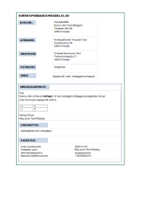
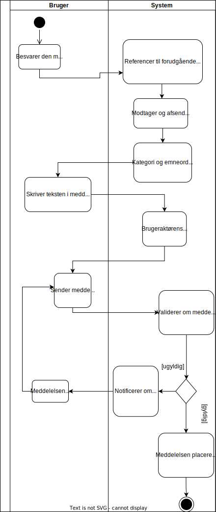
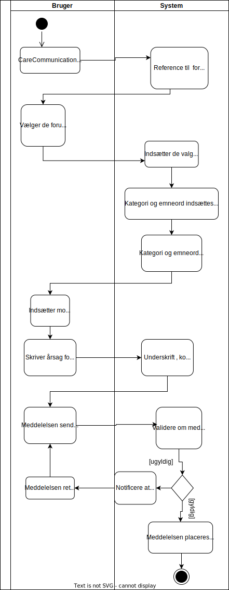

[Return](../../index.md)

# Sundhedsfaglige retningslinjer for anvendelse 

**Table of contents**
* [1 Introduktion](#1-introduktion)
* [2 Formål](#formaal)
* [3 Illustration af FHIR korrespondancemeddelelse](#3-illustration-af-korrespondancemeddelelsen)
* [4 Krav og anbefalinger til FHIR Korrespondancemeddelelse](#4-krav-og-anbefalinger-til-korrespondancemeddelelsen)
    * [4.1 Kategori og Emne](#41-kategori-og-emne)
    * [4.2 Meddelelsessegment](#42-meddelelsessegment)
      * [4.2.1 Meddelesestekst](#421-meddelelsestekst-feltet)
        * [4.2.1.1 Kopierede eller vedhæftede journalnotater](#journalnotater)
      * [4.2.2 Signatur](#422-signatur)
    * [4.3 Prioritet, krav om afgrænset brug](#43-prioritet,-krav-om-afgrænset-brug)
    * [4.4 Vedhæftede filer](#bilag)
    * [4.5 Forsendelsesmuligheder og overblik](#45-forsendelsesmuligheder-og-overblik)
        * [4.5.1 Besvarelse](#451-besvarelse)
        * [4.5.2 Videresendelse](#452-videresendelse)
        * [4.5.3 Annullering og rettelse](#453-annullering-og-rettelse)
          * [4.5.3.1 Annullering](#4531-annullering)
          * [4.5.3.2 Rettelse](#4532-rettelse)
    * [4.6 Overblik i brugergrænsefladen](#46-overblik-i-brugergrænsefladen)
* [5 Opsummering af krav og anbefalinger til afsender- og modtagersystemer](#6-opsummering-af-krav-og-anbefalinger-til-afsender--og-modtagersystemer)
* [6 Use Cases](#6-use-cases)
* [7 Ibrugtagning i SOR/SOR-EDI](#ibrugtagning)

&nbsp;

## 1 Introduktion
Dette er den tekstuelle del af dokumentationen til MedComs FHIR-standard for korrespondancemeddelelser (på engelsk CareCommunication). Den tekstuelle del indeholder information om formål, baggrund, en illustration af indholdet i korrespondancemeddelelsen, krav og anbefalinger samt ibrugtagning ift. SOR-EDI.
Målgruppen for denne tekst er it-systemleverandører og implementeringsansvarlige, som skal it-understøtte afsendelse og modtagelse af korrespondancemeddelelsen. 

Krav og anbefalinger til indhold, herunder funktionaliteter, er udarbejdet i samarbejde med en <a href="https://www.medcom.dk/opslag/navne-og-adresser?gruppe=Arb.grp.%20FHIR-Korrespondancemeddelelse" target="_blank">national arbejdsgruppe</a> med repræsentanter fra regioner, kommuner og praktiserende læger. Derudover har indholdet på denne side været sendt i høring ved relevante MedCom-grupper samt været bredt tilgængeligt for kommentering via publicering på MedComs hjemmeside.
De tekniske specifikationer for korrespondancemeddelelse findes via forsiden for MedComs samlede dokumentation for korrespondancemeddelelse, MedCom anvender online værktøjet GitHub til visning. <a href="https://medcomdk.github.io/dk-medcom-carecommunication/ " target="_blank">Klik her for at læse de tekniske specifikationer for korrespondancemeddelelsen.</a> 
>Note: I tilfælde af uoverensstemmelser i beskrivelsen af de sundhedsfaglige retningslinjer for anvendelse på dansk og engelsk er det den danske beskrivelse af de sundhedsfaglige retningslinjer for anvendelse, der er gældende.

## 2 Formål {#formaal}
Formålet med korrespondancemeddelelsen er at understøtte den digitale kommunikation mellem sundhedsvæsnets parter, herunder bl.a. også psykiatri- og socialområdet, hvor initiativ til ny version af korrespondancemeddelelsen er forankret. Korrespondancemeddelelsen anvendes til sikker digital kommunikation af personhenførbare oplysninger og anvendes typisk til ad hoc kommunikation. Korrespondancemeddelelsen skal dog kun bruges på de områder, hvor der i forvejen ikke findes tilgængelige strukturerede MedCom standarder. Korrespondancemeddelelsen skal ikke anvendes ved sager af akut karakter.
Formålet med korrespondancemeddelelsen er bl.a. at:
*	Give mulighed for at vedhæfte og udveksle digitale filer
*	Give mulighed for formatering af meddelelsesteksten (forudsætter lokale krav til egen systemleverandør)
*	Understøtte automatisk fordeling ved modtagelse via brug af fælles nationale kategorier (=overordnede overskrifter)
*	Respektere regionale samarbejdsaftaler med kommuner og praksislæger ved at bevare muligheden for at angive aftalte emneord (=supplerende overskrifter)
*	Tydeliggøre afsender af korrespondancemeddelelsen med påkrævet signatur
*	Anvende teknisk indhold, således at der i brugergrænsefladen arbejdes med en tydelig kommunikationshistorik og aktivitet (fx om en meddelelse er besvaret, videresendt, rettet eller annulleret)

&nbsp;

## 3 Illustration af korrespondancemeddelelsen
<a href="#Fig1">Figur 1</a> er en illustration af indholdet i en korrespondancemeddelelse. Illustrationen er et eksempel og indeholder ikke alle datafelter, som er i standarden og afspejler ikke det enkelte systems brugergrænseflade. Den viste tekstformatering af meddelelsesteksten, i <a href="#Fig1">Figur 1</a>, er optionel for systemerne at understøtte.

<figure>

<figcaption text-align = "center"><b>Figur 1: Eksempel på indhold i korrespondancemeddelelsen </b></figcaption>
</figure>

&nbsp;

## 4 Krav og anbefalinger til korrespondancemeddelelsen
Korrespondancemeddelelsen <u>skal</u> indeholde information om:
*	Borger/patient som henvendelsen vedrører
*	Afsender
*	Modtager
*	Kategori (fortæller på et overordnet niveau, hvad indholdet i korrespondancemeddelelsen drejer sig om)
*	Meddelelsessegment (indeholdende meddelelsestekst og signatur)
*	Signatur skal indeholde dato og tidspunkt, forfatters navn, stillingbetegnelse og relevant telefonnummer
*	Tekniske data på meddelelsen (herunder bl.a. ID’er og referencer til forudgående meddelelser. <a href="https://medcomdk.github.io/dk-medcom-carecommunication/assets/documents/Intro-Technical-Spec-ENG.html" target="_blank">Klik her for at se den tekniske dokumentation for yderligere information.</a>)

&nbsp;

Korrespondancemeddelelsen <u>kan</u> (=frivilligt) indeholde:
* Specifik afsender hvis relevant (fx specifik udskrivningskoordinator eller læge på sygehuse) 
*	Specifik modtager hvis relevant (fx specifik sagsbehandler eller socialrådgiver i kommunen) 
*	Emne (supplerer den valgte kategori med et emneord, som fortæller i detaljer, hvad indholdet i korrespondancemeddelelsen drejer sig om. Liste med emner er ofte defineret via regionale sundhedsaftaler)
*	Formatering af meddelelsesteksten (herunder bl.a. brug af formatering som <b>fed</b>, <u>understregning</u>, <em>kursiv</em> og tabeller i teksten)
*	Vedhæftede filer (knyttes til et meddelelsessegment)
*	Prioritet (Obs. Kan kun påsættes ved valg af den nationale kategori ”Vedr. henvisning”) 

&nbsp;

### 4.1 Kategori og Emne
Kategori består af en national fastlagt liste med aftalte kategorier, som afsender vælger kategori ud fra. Kategorilisten muliggør, at modtager automatisk kan fordele indkomne korrespondancemeddelelser, fx til det relevante kommunale område. Det er et krav, at kategorien vises for brugeren, men muligheden for automatisk fordeling ved modtagelse efter de nationale kategorier i korrespondancemeddelelsen er ikke en del af MedComs test og certificering.
<a href="https://medcomfhir.dk/ig/terminology/CodeSystem-medcom-careCommunication-categoryCodes.html" target="_blank"> Klik her for at læse de aftalte nationale kategorier.</a> 

Der er oprettet en kategori ”Andet” i de tilfælde, hvor de øvrige kategorier på listen ikke vurderes tilstrækkeligt dækkende for indholdet i korrespondancemeddelelsen. Ved valg af kategorien ”Andet” er det et krav, at afsender medsender et emne. MedCom anbefaler, at afsender så vidt muligt undlader at anvende kategorien ”Andet”, undtaget i de tilfælde hvor det er absolut nødvendigt.

I emnefeltet har brugeren mulighed for at supplere den valgte kategori med et emne. Emnefeltet udfyldes enten med de regionalt aftalte emneord, defineret i de regionale samarbejdsaftaler, eller som selvskrevet fritekst. Det er valgt at bibeholde emnefeltet netop for at kunne understøtte de eksisterende samarbejdsaftaler med de regionalt aftalte emneord. Der er ikke krav til, eller forventning om, at systemerne automatisk kan fordele efter emneord. 

For at understøtte brugeren mest muligt <u>anbefales følgende</u>:
*	Regionalt aftalte emneord mappes til de nationalt aftalte kategorier, hvor de pågældende emneord relateres til de relevante kategorier
*	I de brugssituationer, hvor der er regionalt aftalte emneord:
    *	Brugeren præsenteres for de regionalt aftalte emneord, som de kender, og ved valg af emneord, påsætter systemet automatisk den pågældende relevante kategori (som er valgt ved forudgående mapning mellem kategori og emneord). Brugeren slipper derved for at skulle tage stilling til kategori.
    *	Kategorien skal altid være synlig, både for afsender og modtager – også ved regionalt aftalte emneord. Kategorien kan dog, for at understøtte brugeren, gøres mindre synlig i brugergrænsefladen, fx ved at ’fade ud’, hvis der er regionalt aftalte emneord. 

&nbsp;

*	I de brugssituationer, hvor der ikke er regionalt aftalte emneord:
    *	Brugeren vælger kategori og har herefter mulighed for at supplere med selvskrevet emneord som fritekst i emnefeltet. 

&nbsp;

MedCom stiller en terminologiserver til rådighed, som bl.a. udstiller de nationale kategorier og tilladte filtyper, som kan vedhæftes korrespondancemeddelelsen. Governance, omfattende regler og retningslinjer, herunder bl.a. adgang, opdatering og vedligeholdelse, for såvel terminologiserveren som listen over de nationalt aftalte kategorier, håndteres og fastlægges i MedCom-regi. Governance for terminologier og serveren findes via forsiden for Governance for MedCom FHIR Messaging. 
<a href="https://medcomdk.github.io/MedCom-FHIR-Communication/" target="_blank">Klik her for at læse Governance for MedCom FHIR Messaging.</a>

### 4.2 Meddelelsessegment
Et meddelelsessegment består af korrespondancemeddelelsens meddelelsestekst og afsenders signatur. I de tilfælde hvor der vedhæftes en fil til korrespondancemeddelelsen, vil vedhæftningen knyttes til et nyt meddelelsessegment. Der er ID på hvert meddelelsessegment, som også skal medsendes og modtages af systemerne. I den forbindelse er der krav om, at meddelelsessegmenter indeholdt meddelelsestekst, altid skal medsendes i kommunikationen, fx ved besvarelse.

#### 4.2.1	Meddelelsestekst-feltet
Meddelelsestekst-feltet er et fritekstfelt, hvori afsender skriver sin tekst. Det er obligatorisk for afsender at skrive fritekst i meddelelsens tekstfelt. 
MedCom anbefaler, at afsender- og modtagersystemer understøtter formatering, herunder bl.a. <b>fed</b>, <u>understregning</u>, <em>kursiv</em> og tabeller i teksten. Dvs. at afsender har mulighed for at formatere sin meddelelsestekst, og modtager kan se eventuel formatering i meddelelsesfeltet. Formateringen af meddelelsesteksten følger XHTML. MedCom definerer et subset af XHTML, som systemerne kan vælge at understøtte.
  <a href="https://medcomdk.github.io/dk-medcom-core/assets/documents/MedComCore-Styling_the_XHTML.html" target="_blank">Klik her for at læse MedCom's definition af  XHTML subset.</a>   

##### 4.2.1.1 Kopierede eller vedhæftede journalnotater {#journalnotater}
Hvis afsender kopierer og indsætter kortere journalnotater i meddelelsesteksten, anbefaler MedCom, at navn på forfatter, samt tidspunkt for oprettelse, af journalnotatet påskrives og medsendes i meddelelsens tekstfelt. Hvis afsender ønsker at medsende længere journalnotater, f.eks. mere end 1000 tegn (svarende til en halv side), anbefaler MedCom, at disse medsendes som vedhæftede filer. [Se afsnit 4.4 Vedhæftede filer](#bilag). 

#### 4.2.2 Signatur
Signatur skal altid udfyldes, medsendes af afsender og vises af modtager. Formålet med ’signatur’ er at tydeliggøre, hvem forfatteren af den afsendte korrespondancemeddelelse er. Derfor er det et krav, at signatur udfyldes med bl.a. dato og tidspunkt, forfatters navn, stillingsbetegnelse og relevant telefonnummer. MedCom stiller en liste over stillingsbetegnelser til rådighed, som er sammensat af udtræk fra autorisationsregistret og SKS personaleklassifikation.  
<a href="https://medcomfhir.dk/ig/terminology/ValueSet-medcom-core-PractitionerRoles.html" target="_blank">Klik her for at læse liste over stillingsbetegnelser.</a>   
MedCom <u>anbefaler</u>, at telefonnummer udfyldes med relevant telefonnummer, såsom telefonnummer på afdelingen, afsnittet, enheden som afsender er tilknyttet eller fx relevant vagttelefonnummer. Signatur bør så vidt muligt autoudfyldes af systemet. I tilfælde af elementer som ikke kan autoudfyldes af systemet, skal disse kunne tilføjes manuelt af brugeren, fx relevant telefonnummer.

### 4.3 Prioritet, krav om afgrænset brug
Det bliver muligt at markere en korrespondancemeddelelse med prioritet men med afgrænset brug i praksis. Alle systemer testes for, at de kan modtage og vise prioritet. I forhold til anvendelse og afsendelse af prioritet, testes alle systemer for, at prioritet kun er synlig og mulig at bruge ved valg af den nationale kategori ”Vedr. henvisning”. Kravet fremgår af use case og tilhørende testprotokol. Dette er besluttet med baggrund i, at behovet for at anvende prioritet er rejst i regi af et nationalt projekt vedr. forbedring af henvisninger, herunder revidering af henvisningsflowet. Anvendelsen af prioritet skal tilpasses løbende ift. udvikling i overenskomster og på baggrund af nationale krav fra Sundhedsministeriet, Sundhedsstyrelsen og Sundhedsdatastyrelsen. 

### 4.4 Vedhæftede filer {#bilag}
Det er muligt at vedhæfte filer, som indlejres i korrespondancemeddelelsen. Når der er vedhæftet en fil til en korrespondancemeddelelse, er det et krav, at det tydeligt vises i brugergrænsefladen. En vedhæftet fil kan både være en fil med en filtype, fx pdf, eller et link. De tilladte filtyper, som kan vedhæftes korrespondancemeddelelsen, ses beskrevet i Implementation Guide for terminologi samt udstilles på terminologiserveren.  
<a href="https://medcomfhir.dk/ig/terminology/ValueSet-medcom-core-attachmentMimeTypes.html" target="_blank">Klik her for at finde de tilladte filtyper, som kan vedhæftes i korrespondancemeddelelsen.</a>  
Det er besluttet, at der ikke må medsendes video i en korrespondancemeddelelse grundet størrelsen. Det anbefales, at videoer deles via en forventet kommende national delingsservice. 
Der vil ikke være begrænsning på, hvor mange vedhæftede filer der kan medsendes i en korrespondancemeddelelse, men i stedet begrænses størrelsen på hele meddelelsen, inklusiv vedhæftede filer. 100 MB er den maksimale størrelse på hele meddelelsen – inklusiv vedhæftede filer, som sendes over VANS. Alle vedhæftede filer tildeles et unikt ID.
  
Afsender, som vælger at afsende, besvare eller videresende en korrespondancemeddelelse, er ansvarlig for meddelelsens indhold, herunder vedhæftede filer. Forfatter på den vedhæftede fil er den fagperson, som oprindeligt har udarbejdet filen, og derfor er ansvarlig for det faglige indhold. MedCom anbefaler, at navn, samt tidspunkt for oprettelse, af den vedhæftede fil påskrives og medsendes. Systemfunktionalitet, der understøtter automatisk påsat navn på forfatter, samt tidspunkt for oprettelse, er optionel, og hvis denne funktionalitet ikke findes, anbefales afsender manuelt at påskrive disse informationer enten i den vedhæftede fil, eller som struktureret information i meddelelsessegmentet med den vedhæftede fil.  Når man, som afsender, vælger at medsende en fil, er man også ansvarlig for, at filens indhold er relevant for det aktuelle behandlingsforløb.
Som en del af test og certificering tjekker MedCom, at ID på vedhæftede filer indlæses og gemmes. Dette med henblik på at systemet ved modtagelse af en besvarelse kan genfinde og vise tidligere vedhæftede filer for brugeren. Krav til understøttelse af arbejdsgange samt brugervenlighed skal varetages lokalt i et samarbejde mellem kunde og it-leverandør.

### 4.5 Forsendelsesmuligheder 
Det er muligt at besvare, videresende, rette og annullere en modtaget korrespondancemeddelelse. MedCom anbefaler, at systemet giver mulighed for at afsender kan videresende en korrespondancemeddelelse samt rette og annullere en modtaget korrespondancemeddelelse men stiller ikke krav herom. Det er dog et krav, at alle modtagersystemet kan modtage både en videresendelse, en rettelse og en annullering. Det er også et krav, at systemet både kan afsende en besvaret korrespondancemeddelelse og modtage en besvarelse.  
Både ved besvarelse og videresendelse af en korrespondancemeddelelse indsættes den samme kategori og det samme emne automatisk af systemet. Brugeren kan vælge at ændre det til en anden kategori og et andet emne.  Referencer til den forudgående, eller videresendte, meddelelse skal indgå, da disse tekniske informationer bl.a. anvendes til at kæde meddelelserne sammen, hvormed de giver mulighed for at skabe kommunikationshistorik i brugergrænsefladen. 

MedCom har udarbejdet regler for håndtering af kommunikationsflows, hvor der indgår besvarelser, videresendelser, annulleringer og rettelser, herunder også håndtering af parallelle meddelelser (grundet samtidighed). <a href="https://medcomdk.github.io/MedCom-FHIR-Communication/assets/documents/governance-for-careCommunication.html" target="_blank">Klik her for at læse reglerne for håndtering af flows med besvarelser, videresendelser, annulleringer og rettelser</a>. Reglerne indgår også i testprotokollerne med henblik på at sikre ensartet implementering og anvendelse. 

#### 4.5.1 Besvarelse
Det er et krav at kunne afsende en besvarelse til en korrespondancemeddelelse og modtage og vise en besvarelse inklusiv forudgående meddelelser, herunder meddelelsessegmenter og nye vedhæftede filer. Ved besvarelse indsættes afsender af den modtagne korrespondancemeddelelse automatisk som modtager af besvarelsen (med SOR-kode og EAN-nummer). 
Afsender udfylder det nye meddelelsestekst-felt med selvskrevet tekst. Derudover påsættes også signatur, i samme meddelelsessegment, på afsender af besvarelsen. En besvarelse af en korrespondancemeddelelse består således altid af minimum to meddelelsessegmenter – det tidligere modtaget meddelelsessegment og det nye som afsender udfylder og medsender ved besvarelsen. Hvis der er vedhæftet nye filer til besvarelsen, knyttes disse til meddelelsessegmentet. Hvis afsender har vedhæftet filer i den oprindelige korrespondancemeddelelse, skal de vedhæftede filer fra afsender ikke medsendes igen ved besvarelse. I stedet tjekker MedCom, som en del af test og certificering, at systemerne indlæser og gemmer ID på de vedhæftede filer. Dette med henblik på at systemet ved modtagelse af en besvarelse kan genfinde og vise tidligere vedhæftede filer for brugeren. De ovenstående hændelserne for besvarelse af en korrespondancemeddelelse er visualiseret i et aktivitetsdiagram i <a href="#Fig2">Figur 2</a>.
Det er også muligt at besvare en tidligere modtaget EDIFACT, OIOXML eller FHIR MedCom-meddelelse med korrespondancemeddelelsen. Ved besvarelse af en tidligere modtaget EDIFACT, OIOXML eller FHIR MedCom-meddelelse anvendes det medsendte ID fra den modtagne meddelelse og medsendes i korrespondancemeddelelsen. Således er det muligt, via ID, at koble et relevant flow af meddelelser sammen. Det kan eksempelvis ske ved, at man besvarer en modtaget henvisning med en korrespondancemeddelelse, hvor forløbs-ID’et anvendes og medsendes i besvarelsen. 
Teknisk betyder det, at der ved besvarelse indsættes et nyt meddelelsessegment, bestående af et nyt meddelelsestekst-felt og signatur.
Der skal ikke kunne sendes en besvarelse på en modtaget annullering.  

<figure>

<figcaption text-align="center"><b>Figur 2: Aktivitetsdiagram for besvarelse af en modtaget korrespondancemeddelelse</b> </figcaption>
</figure>
  

#### 4.5.2. Videresendelse
Det er op til afsender, hvornår det vurderes relevant at videresende en modtaget korrespondancemeddelelse, såfremt systemet stiller denne mulighed til rådighed, som anbefalet af MedCom. Alle systemer skal dog kunne modtage en videresendelse. Afsender er ansvarlig for videresendelsen og relevansen ift. det aktuelle behandlingsforløb. Hvis systemet har funktionalitet som kan videresende korrespondancemeddelelse, skal afsender kunne videresende hele meddelelsestråden, som kan bestå af en eller flere meddelelser og vedhæftede filer. Funktionaliteten til at kunne plukke og vælge hvilke dele af meddelelsestråden, man som afsender ønsker at videresende, er ikke påkrævet i systemerne men optionel. 
Hvis systemet ikke understøtter, at afsender ved videresendelse kan plukke og vælge hvilke dele af meddelelsestråden og vedhæftede filer, der skal medsendes - og afsender ved, at der er dele i meddelelsestråden, som modtager ikke må modtage/se - skal afsender sende en ny korrespondancemeddelelse i stedet for at videresende hele meddelelsestråden i den modtagne korrespondancemeddelelse. Det anbefales, at brugeraktør påskriver navn på den oprindelige forfatter af meddelelsen, som videresendes, i den nyoprettede korrespondancemeddelelse.

MedCom anbefaler, at afsender beskriver årsagen til videresendelsen i meddelelsesteksten.
Ved videresendelse vælger afsender, hvem modtageren er. 
Teknisk betyder det, at der ved videresendelse indsættes et nyt meddelelsessegment, bestående af et nyt meddelelsestekst-felt og signatur. Afsender udfylder det nye meddelelsestekst-felt med selvskrevet tekst, hvori det også anbefales at angive årsagen til videresendelsen. Derudover påsættes også signatur, i samme meddelelsessegment, på afsender af videresendelsen. En videresendelse består således altid af minimum to meddelelsessegmenter – det tidligere modtaget meddelelsessegment og det nye som afsender udfylder og medsender ved videresendelsen. Hvis der er vedhæftet filer til videresendelsen, knyttes disse til et nyt meddelelsessegment.
De ovenstående hændelserne for videresendelse af en korrespondancemeddelelse er visualiseret i et aktivitetsdiagram  i <a href="#Fig3">Figur 3.</a>
Der skal ikke kunne sendes en videresendelse af hverken en rettelse eller af en annullering. Hvis brugeren har behov for at informere en anden part - som brugeren har videresendt en korrespondancemeddelelse til - om en modtaget rettelse, så skal brugeren enten selv sende en rettelse eller sende en ny korrespondancemeddelelse (afhængig af om systemet understøtter at kunne sende rettelser, som er en optionel funktionalitet men stærkt anbefalet).  

<figure>

<figcaption text-align="center"><b>Figur 3: Aktivitetsdiagram for videresendelse af en modtaget korrespondancemeddelelse</b> </figcaption>
</figure>
  

#### 4.5.3 Annullering og rettelse 
MedCom anbefaler, at systemet kan afsende rettelser og annulleringer men stiller ikke krav herom. Der er krav om, at alle systemer kan modtage både rettelser og annulleringer, og synliggøre i brugergrænsefladen at en given korrespondancemeddelelse er rettet eller annulleret. Når der sendes eller modtages en annullering eller rettelse, vil korrespondancetråden ’stoppe’, hvilket betyder, at der ikke længere kan kommunikeres videre på denne tråd. Det er valgt for at sikre, at fejl og/eller mangler ikke bæres videre i kommunikationen. Hvis brugerne fortsat ønsker at kommunikere, skal en ny korrespondancetråd opstartes. 

##### 4.5.3.1 Annullering
En annullering af meddelelsen skal sendes, hvis meddelelsen er sendt på forkert cpr-nummer, til forkert modtager eller ved vedhæftet fil med indhold på forkert cpr-nummer. 
En annullering af en afsendt korrespondancemeddelelse vil rent teknisk både indeholde årsagen til, at meddelelsen er annulleret, og en reference til den korrespondancemeddelelse der skal annulleres.  
MedCom stiller nogle foruddefinerede tekster med årsag til annullering til rådighed, som systemerne anbefales at bruge og indsætte ved annullering. <a href="https://medcomfhir.dk/ig/terminology/CodeSystem-medcom-messaging-cancellation-reason.html" target="_blank">Klik her for at læse de foruddefinerede tekster med årsager til annullering</a>. Hvis systemet ikke anvender de foruddefinerede tekster med årsag til annullering fra MedComs liste, anbefales det, at systemet selv definerer og påsætter årsager til annullering. Alternativt skal bruger selv påskrive en årsag til annulleringen.  
Det skal synliggøres i brugergrænsefladen, for både afsender og modtager, at en given korrespondancemeddelelse er annulleret.  
Ved annullering medsendes information om, hvilken specifik korrespondancemeddelelse der annulleres, men hele korrespondancetråden skal fremgå som annulleret.  
Hvis der modtages en annullering til en korrespondancemeddelelse, som afsender allerede har videresendt, er det afsender af videresendelsen, som er ansvarlig for at informere modtager om annulleringen. Det kan gøres ved enten at annullere videresendelsen eller at informere modtager på anden vis (hvis systemfunktionaliteten ikke understøtter at kunne afsende annulleringer).   

##### 4.5.3.2 Rettelse
En rettelse skal sendes i tilfælde af, at afsender ønsker at rette i teksten i meddelelsesfeltet, rette kategori og/eller emneord, rette indholdet i en vedhæftet fil, rette forfatteroplysninger, telefonnummer eller episodeOfCare-identifier.  
En rettelse til en afsendt korrespondancemeddelelse vil rent teknisk både indeholde rettelserne og en reference til den korrespondancemeddelelse, der skal rettes. 
Det skal synliggøres i brugergrænsefladen, for både afsender og modtager, at en given korrespondancemeddelelse er rettet.  
Ved rettelse medsendes information om, hvilken specifik korrespondancemeddelelse der rettes, men hele korrespondancetråden skal fremgå som rettet.  
Hvis der modtages en rettelse til en korrespondancemeddelelse, som afsender har videresendt, er det afsender af videresendelsen, som er ansvarlig for at informere modtager om rettelsen. Det kan gøres ved enten at rette videresendelsen eller at informere modtager på anden vis (hvis systemfunktionaliteten ikke understøtter at kunne afsende rettelser). 

 

### 4.6 Historisk overblik i brugergrænsefladen
Gældende for alle MedComs FHIR-meddelelser, herunder også korrespondancemeddelelsen, er, at der er mulighed for at arbejde med det tekniske indhold i brugergrænsefladen. MedCom anbefaler, at systemerne synliggør kommunikationshistorikken i brugergrænsefladen. Der er krav om, at forudgående meddelelsessegmenter medsendes. MedCom <u>anbefaler</u>, at systemerne benytter sig af muligheden for at give det bedst mulige overblik over en meddelelses status (fx om meddelelsen er en ny modtaget meddelelse, en besvarelse eller en videresendelse). Hvis der er sendt, eller modtaget, en annullering eller rettelse er der krav om, at meddelelsens status er synlig i brugergrænsefladen.       
  

## 5 Opsummering af krav og anbefalinger til afsender- og modtagersystemer 
I <a href="#Tab1">tabel 1</a> opsummeres krav og anbefalinger til afsender- og modtagersystemer på baggrund af den tekstuelle del af dokumentationen. For tekniske detaljer henvises til de tekniske specifikationer, som findes via forsiden for korrespondancemeddelelse i GitHub.  <a href="https://medcomdk.github.io/dk-medcom-carecommunication/" target="_blank">Klik her for at læse de tekniske specifikationer på forsiden af korrespondancemeddelelsen i GitHub</a>. 

<table class="tg">
<caption style="color:#2c415c; font-weight:bold; text-align:center"> Tabel 1: Opsummering af krav og anbefalinger til afsender- og modtagersystemer </caption>
<thead>
  <tr>
    <th class="tg-7bnw">        </th>
    <th class="tg-7bnw">    Krav til afsendersystem   </th>
    <th class="tg-7bnw">    Anbefalinger til afsendersystem   </th>
    <th class="tg-7bnw">    Krav til modtagersystem   </th>
    <th class="tg-7bnw">    Anbefalinger til modtager-system   </th>
  </tr>
</thead>
<tbody>
  <tr>
    <td class="tg-0pky">National      kategori   </td>
    <td class="tg-0pky">Det er et krav til systemet, at bruger kan vælge og  påsætte en national kategori til meddelelsen, og den valgte kategori er   synlig for afsender.  Det er et krav, at kategori skal påsættes, inden meddelelsen kan afsendes.    </td>
    <td class="tg-0pky">&nbsp;&nbsp;&nbsp; &nbsp;&nbsp;&nbsp;&nbsp;</td>
    <td class="tg-0pky">&nbsp;&nbsp;&nbsp; Det er et krav, at alle systemer skal kunne modtage og vise den valgte kategori på meddelelsen. &nbsp;&nbsp;&nbsp;   &nbsp;&nbsp;&nbsp; &nbsp;&nbsp;&nbsp;&nbsp;</td>
    <td class="tg-0pky">    Det anbefales at gøre brug af muligheden for automatisk fordeling, ved modtagelse, efter de nationale kategorier. Det er ikke en del af MedComs test og certificering.      </td>
  </tr>
  <tr>
    <td class="tg-0pky">Emneord   </td>
    <td class="tg-0pky">Det er et  krav til systemet, at bruger kan vælge (optionelt) at indsætte emneord til en meddelelse, og at det valgte emneord er synligt for afsender.  Emnefeltet kan  enten udfyldes med selvskrevet fritekst eller de regionalt aftalte emneord.      </td>
    <td class="tg-0pky">Det anbefales, at regionalt aftalte emneord mappes op til de nationalt aftalte kategorier, hvor de pågældende emneord relateres til de relevante kategorier.  Det anbefales, at brugeren præsenteres for de regionalt aftalte emneord, som de kender, og ved valg af emneord, påsætter systemet automatisk den pågældende relevante kategori (som er valgt ved forudgående mapning mellem kategori og emneord).   Således slipper brugeren for at skulle tage  stilling til kategori ved regionalt aftalte emneord.      Det er ikke en del af MedComs test og certificering.    </td>
    <td class="tg-0pky">&nbsp;&nbsp;&nbsp; Det er et krav, at alle systemer kan modtage og vise det valgte emneord.&nbsp;&nbsp;&nbsp;</td>
    <td class="tg-0pky">&nbsp;&nbsp;&nbsp; &nbsp;&nbsp;&nbsp;&nbsp;</td>
  </tr>
  <tr>
    <td class="tg-0pky">Prioritet   </td>
    <td class="tg-0pky">Det er et krav til systemet, at prioritet kun er synlig og mulig at anvende ved valg af den nationale  kategori ”Vedr. henvisning”.   </td>
    <td class="tg-0pky">&nbsp;&nbsp;&nbsp; &nbsp;&nbsp;&nbsp;&nbsp;</td>
    <td class="tg-0pky">&nbsp;&nbsp;&nbsp; Det er et krav, at alle systemer kan modtage og vise prioritet.&nbsp;&nbsp;&nbsp;</td>
    <td class="tg-0pky">&nbsp;&nbsp;&nbsp; &nbsp;&nbsp;&nbsp;&nbsp;</td>
  </tr>
  <tr>
    <td class="tg-0pky">Meddelelsestekst</td>
    <td class="tg-0pky">Det er et krav til systemet, at afsender skal skrive meddelelsestekst før meddelelsen kan afsendes.</td>
    <td class="tg-0pky"></td>
    <td class="tg-0pky"> Det er et krav, at alle systemer kan modtage og vise tekst i meddelelsens tekstfelt.    </td>
    <td class="tg-0pky"></td>
  </tr>
  <tr>
    <td class="tg-0pky"> Formatering   </td>
    <td class="tg-0pky"></td>
    <td class="tg-0pky"> Det anbefales, at afsender kan vælge at formatere meddelelsesteksten i overensstemmelse med MedComs subset af XHMTL.      </td>
    <td class="tg-0pky">  </td>
    <td class="tg-0pky"> Det anbefales at, alle systemer kan modtage og vise formateret tekst i meddelelsesfeltet i overensstemmelse med MedComs subset af XHTML. </td>
  </tr>
  <tr>
    <td class="tg-0pky">Vedhæftede filer   </td>
    <td class="tg-0pky">    Det er et krav til systemet, at bruger kan vælge at vedhæfte tilladte filtyper.  Det er et krav til systemet at alle vedhæftede filer tilføjes et ID.</td>
    <td class="tg-0pky"> Det anbefales, at afsender påskriver navn på forfatter, samt tidspunkt for oprettelse, af den vedhæftede fil, hvis systemet ikke automatisk påsætter forfatter på den vedhæftede fil.</td>
    <td class="tg-0pky">Det er et krav, at alle systemer kan modtage og vise vedhæftede filer. Som en del af test og certificering tjekker MedCom, at ID på vedhæftede filer indlæses og gemmes. Dette med henblik på at systemet ved modtagelse af en besvarelse kan genfinde og vise tidligere vedhæftede filer for brugeren.  Det er et krav, at det tydeligt vises i brugergrænsefladen, når der er vedhæftet en fil i korrespondancemeddelelsen.   </td>
    <td class="tg-0pky">&nbsp;&nbsp;&nbsp; &nbsp;&nbsp;&nbsp;&nbsp;</td>
  </tr>
  <tr>
    <td class="tg-0pky">Signatur   </td>
    <td class="tg-0pky">Det er et krav til systemet at udfylde og medsende signatur med bl.a. forfatters navn, stillingsbetegnelse og relevant telefonnummer.   I tilfælde af elementer, som ikke kan autoudfyldes af systemet, skal  dette kunne tilføjes manuelt af afsenderen, fx telefonnummer.    </td>
    <td class="tg-0pky">Det anbefales, at telefonnummer udfyldes med relevant telefonnummer, så som telefonnummer på afdelingen, afsnittet, enheden eller fx relevant vagttelefonnummer.   </td>
    <td class="tg-0pky">Det er et krav, at alle systemer kan modtage og vise forfatters signatur med dertilhørende informationer.   </td>
    <td class="tg-0pky">&nbsp;&nbsp;&nbsp; &nbsp;&nbsp;&nbsp;&nbsp;</td>
  </tr>
  <tr>
    <td class="tg-0lax">Besvarelse</td>
    <td class="tg-0lax">Det er et krav til systemet, at afsender kan vælge at besvare en modtaget korrespondancemeddelelse.  Det er et krav til systemet, at automatisk indsætte referencer til de forudgående meddelelser fra samme kommunikationsflow, herunder  meddelelsessegmenter dvs. meddelelsestekst og signatur og eventuelle nye vedhæftede filer, til besvarelsen.   Det er et krav til systemet, at afsender har mulighed for at besvare en tidligere modtaget MedCom meddelelse med korrespondancemeddelelsen. </td>
    <td class="tg-0lax">Det anbefales, at systemet benytter sig af de tekniske muligheder for at skabe kommunikationshistorik i brugergrænsefladen, og derved give afsender det bedst mulige overblik.</td>
    <td class="tg-0lax">Det er et krav, at alle systemer kan modtage og vise en besvarelse inklusiv forudgående meddelelser, herunder meddelelsessegmenter og vedhæftede filer.&nbsp;&nbsp;     Det er et krav, at det tydeligt vises i  brugergrænsefladen, når der er vedhæftet en fil i den besvarede korrespondancemeddelelse.               </td>
    <td class="tg-0lax">Det anbefales, at tydeliggøre, at meddelelsen er en besvarelse for modtager i brugergrænsefladen.   Det anbefales, systemet benytter sig de tekniske muligheder for at skabe kommunikationshistorik i brugergrænsefladen,  og derved give modtager det bedst mulige overblik.</td>
  </tr>
  <tr>
    <td class="tg-0lax">Videresendelse</td>
    <td class="tg-0lax">Hvis systemet understøtter funktionalitet som kan videresende en korrespondancemeddelelse, er det et krav til systemet, at systemet automatisk indsætter referencer til de forudgående meddelelser fra samme kommunikationsflow  samt meddelelsessegmenter, dvs. meddelelsestekst, signatur og eventuelle vedhæftede filer, til videresendelsen. </td>
    <td class="tg-0lax">Det anbefales, at afsender kan vælge at videresende en modtaget korrespondancemeddelelse.  Det anbefales, at systemet benytter sig af de tekniske muligheder for at skabe kommunikationshistorik i brugergrænsefladen, og derved give afsender det bedst mulige overblik</td>
    <td class="tg-0lax">Der er et krav, at alle systemer kan modtage og vise en modtaget videresendt korrespondancemeddelelse inklusiv referencer til de  forudgående meddelelser samt meddelelsessegmenter.   Det er et krav, at det tydeligt vises i brugergrænsefladen, når der er vedhæftet en fil i den videresendte korrespondancemeddelelse. </td>
    <td class="tg-0lax">Det anbefales at tydeliggøre, at meddelelsen er en videresendelse for modtager i brugergrænsefladen.   Det anbefales, at systemet benytter sig af de tekniske muligheder for at skabe kommunikationshistorik i brugergrænsefladen,  og derved give modtager det bedst mulige overblik. </td>
  </tr>
  <tr>
    <td class="tg-0lax">Årsagen til videresendelse</td>
    <td class="tg-0lax"></td>
    <td class="tg-0lax">Det anbefales, at afsender beskriver årsagen til vidersendelsen i meddelelsens tekstfelt. </td>
    <td class="tg-0lax"></td>
    <td class="tg-0lax"></td>
  </tr>
  <tr>
    <td class="tg-0lax">Annullering</td>
    <td class="tg-0lax"></td>
    <td class="tg-0lax">Det anbefales, at afsender kan annullere en afsendt korrespondancemeddelelse.</td>
    <td class="tg-0lax">Der er et krav, at alle systemer kan modtage og vise en annullering. Det skal være synligt i brugergrænsefladen, at meddelelsen er en annullering.</td>
    <td class="tg-0lax"></td>
  </tr>
  <tr>
    <td class="tg-0lax">Rettelse</td>
    <td class="tg-0lax"></td>
    <td class="tg-0lax">Det anbefales, at afsender kan rette en afsendt korrespondancemeddelelse. </td>
    <td class="tg-0lax">Der er et krav, at alle systemer kan modtage og vise en rettelse. Det skal være synligt i brugergrænsefladen, at meddelelsen er en rettelse.</td>
    <td class="tg-0lax"></td>
  </tr>
  <tr>
    <td class="tg-0lax">Størrelse på meddelelsen inklusiv vedhæftede filer</td>
    <td class="tg-0lax">Det er et krav til systemet at notificere afsender, hvis meddelelsen, inklusiv vedhæftede filer, overstiger den tilladte størrelse på 100 MB.</td>
    <td class="tg-0lax"></td>
    <td class="tg-0lax"></td>
    <td class="tg-0lax"></td>
  </tr>
</tbody>
</table>

## 6 Use Cases
Til brug for den tekniske implementering af korrespondancemeddelelsen findes use case beskrivelser, som demonstrerer indhold og funktionalitet i korrespondancemeddelelsen, herunder krav og anbefalinger til afsender- og modtagersystemer. <a href="https://medcomdk.github.io/dk-medcom-carecommunication/#12-use-cases" target="_blank">Klik her for at finde use cases. </a> 

## 7 Ibrugtagning i SOR/SOR-EDI {#ibrugtagning}
Inden ibrugtagning skal meddelelsestypen for korrespondancemeddelelse ajourføres i SOR-EDI for den enkelte aktør, så der er valide data om, hvem der har implementeret og anvender korrespondancemeddelelsen, og derved hvem der kan afsende og modtage korrespondancemeddelelsen.

