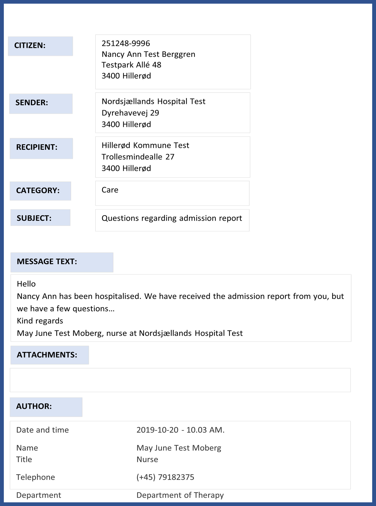

[Return](../../index.md)

# Non-Technical Guidelines

**Table of content**
* [1 Introduction](#1-introduction)
* [2 Purpose](#2-purpose)
* [3 Background](#3-background)
* [4 Illustration of FHIR CareCommunication Message](#4-illustration-of-fhir-carecommunication)
* [5 Requirements and recommendations for FHIR CareCommunication](#5-requirements-and-recommendations-for-fhir-carecommunication)
* [6 Category and Subject](#6-category-and-subject)
* [7 Priority-Limited use requirements](#7-priority-liited-use-requirements)
* [8 Attachments]( #8-attachments)
* [9 Mode of transfer](#9-mode-of-transfer)
* [10 Use Cases](#10-use-cases)
* [11 Transition period with simultaneous operation of CareCommunication DIS91/XDIS91 and FHIR-CareCommunication](#11-transition-period-with-simultaneous-operation-of-carecommunication-dis91xdis91-og-fhir-carecommunication)

&nbsp;

## 1 Introduction
This is the textual part of the documentation for MedCom's FHIR standard for care communication, henceforward referred to as FHIR-CC. It contains purpose, background, an illustration of FHIR-CC, and requirements and recommendations for FHIR-CC, including functionalities, as well as information about a transition period with simultaneous operation of the care communication standards <a href="https://svn.medcom.dk/svn/releases/Standarder/Den%20gode%20korrespondance/EDI/Dokumentation/" target="_blank">DIS91</a> og <a href="https://svn.medcom.dk/svn/releases/Standarder/Den%20gode%20korrespondance/XML/Dokumentation/" target="_blank">XDIS91</a> and FHIR-CC. 
The target group for this text is IT system vendors and persons responsible for implementation, who support FHIR-CC sending and receiving.
Requirements and recommendations for content, including functionalities, have been completed in collaboration with  <a href="https://www.medcom.dk/opslag/navne-og-adresser?gruppe=Arb.grp.%20FHIR-Korrespondancemeddelelse" target="_blank"> a national working group </a> with representatives from regions, municipalities, and general practitioners (GPs). In addition, material describing the content and functionality of FHIR-CC has been sent for consultation to relevant MedCom groups and has been widely available for comments via publication on MedCom's website.
The technical specifications (the profile) for the FHIR-CC standard can be found via <a href="https://simplifier.net/medcom-fhir-messaging " target="_blank">Simplifier</a>. In the profile, the technical specifications, the Danish language takes precedence over English.
FHIR-CC will in the long term replace the MedCom standard CareCommunication <a href="https://svn.medcom.dk/svn/releases/Standarder/Den%20gode%20korrespondance/EDI/Dokumentation/" target="_blank">DIS91</a> og <a href="https://svn.medcom.dk/svn/releases/Standarder/Den%20gode%20korrespondance/XML/Dokumentation/" target="_blank">XDIS91</a> (also previously referred to as ClinicalEmail), as it will be gradually phased out.

## 2 Purpose
On March 3, 2019, MedCom's steering committee approved that MedCom prepares a new improved standard for CareCommunication (FHIR-CC).
The purpose of FHIR-CC is to:
* Support digital communication between healthcare professionals
* Strengthen the start-up of digital communication between the social care, psychiatric, and somatic sectors
* Provide the opportunity to attach and exchange digital documents between different actors
* Support automatic sorting at time of receipt using common national categories (= main headings)
* Respect regional co-operation agreements by retaining the possibility of specifying regionally agreed keywords (= supplementary headings)

&nbsp;

## 3 Background
The CareCommunication standard <a href="https://svn.medcom.dk/svn/releases/Standarder/Den%20gode%20korrespondance/EDI/Dokumentation/" target="_blank">DIS91</a> og <a href="https://svn.medcom.dk/svn/releases/Standarder/Den%20gode%20korrespondance/XML/Dokumentation/" target="_blank">XDIS91</a> is used by many healthcare professionals. The standard is implemented in more than 70 IT systems, and every year approximately 5 million CareCommunications are exchanged. Today, most CareCommunications are mainly exchanged between the GPs and home care in the municipalities.
As the Shared Medication Record is being implemented within the social care sector and the substance abuse services, an increased use of CareCommunication is foreseen. At the same time, digital communi-cation between the social care and the healthcare sector is under its way and here, the CareCommunica-tion already plays a significant role, as it is typically implemented first

For several years, requests have been received for improvements and changes in the CareCommunication <a href="https://svn.medcom.dk/svn/releases/Standarder/Den%20gode%20korrespondance/EDI/Dokumentation/" target="_blank">DIS91</a> og <a href="https://svn.medcom.dk/svn/releases/Standarder/Den%20gode%20korrespondance/XML/Dokumentation/" target="_blank">XDIS91</a> standard from several different professional groups.
The following has, among other things, been requested:
* that technical improvements are implemented in the form of an independent space for head-ing/categorisation
* that it will be possible to embed documents in the communication between e.g. municipalities, hos-pitals, and GPs
* that unique IDs are used in the message so that it can technically be linked to other messages in a thread, thereby increasing the reading overview for the clinical professionals
* that the use of “priority” is considered, including common rules for the use of priority

&nbsp;

In 2018, MedCom set up an <a href="https://www.medcom.dk/projekter/psykiatri-og-socialomraadet/operationel-styregruppe-for-social-og-sundhedsomraadet" target="_blank"> operational steering committee for the social care and healthcare sector</a> with the purpose to follow and support developments in the social care and healthcare sector. The operational steering committee requested the opportunity to exchange documents digitally, including, among other things: coordination plans/focus plans, treatment plans and clinical documents, or schedules for team meetings.
Based on the above needs, FHIR-CC was developed.

## 4 Illustration of FHIR CareCommunication 
Below is an illustration of content in FHIR-CC. The illustration is an example and does not contain all the data that is in the standard and does not reflect the individual system's user interface.

<figure>

<figcaption text-align = "center"><b>Figure 1: </b></figcaption>
</figure>

&nbsp;

## 5 Requirements and recommendations for FHIR CareCommunication
FHIR-CC <b>must</b> contain information about:
* Citizen/patient to whom the request relates
* Sender
* Recipient
* Category (explains at a general level what the content of FHIR-CC is about)
    *	The category must always be visible, both to the sender and to the recipient
* Message text
* Author (including date and time, sender’s name, title, and overall telephone number)
* Technical data on the message (including ID among others)

&nbsp;

FHIR-CC <b>may</b> (= voluntarily) contain:
* Subject (supplements the selected category with additional keywords, which in further details ex-plains what the content of FHIR-CC is about)
* Attachments 

&nbsp;

## 6 Category and Subject
Category consists of a nationally determined list of agreed categories, from which the recipient selects the category. The list enables the recipient to distribute (automatically) received FHIR-CC, e.g. to the relevant municipal area. It is a requirement that the category is shown to the user, but the possibility to distribute by national categories in FHIR-CC is not a part of MedCom’s test and certification. 
The following national categories have been agreed:
* Ambulatory
* Other 
* Death
* Care coordination
* Assistive technology
* Medicine
* Psychiatry, social, disability
* Alcohol and drug treatment
* Health care
* Care*
* Telemedicine
* Training**
* Hospital discharge
* Regarding referral
* Home care assessment
* Examination result

>Note: *The term includes healthcare, homecare, hospital care, eldercare etc. 
>Note: **The term includes general/common training, rehabilitation, maintenance training etc. 

&nbsp;

In the subject field, one has the option of supplementing the selected category with additional subject headings. The subject field is filled in either with the regionally agreed subject headings or self-written nar-rative text. It has been chosen to maintain the subject field to be able to support the existing cooperation agreements with the regionally agreed subject headings. There is no requirement or expectation that the systems can distribute by subject headings.

To support the user as much as possible, <b> the following is recommended</b>:
* Regionally agreed subject headings are mapped up to the nationally agreed categories, where the relevant subject headings are related to the relevant categories.
* In the usage situations, where there are regionally agreed subject headings:
    * The user is introduced to the regionally agreed subject headings that they know, and when se-lecting subject headings, the system automatically applies the relevant category (which is se-lected by preceding mapping between category and subject headings). The user thus avoids having to decide on a category.
    * The category must always be visible, both to sender and recipient - even if one has regionally agreed subject headings. However, to support the user, the category can be made less visible in the user interface, for example by 'fading it out' if there are regionally agreed subject headings.
* 	In the use situations where there are no regionally agreed subject headings:
    * The user selects a category and then has the option of supplementing with self-written subject headings as narrative text in the subject field.

&nbsp;

MedCom provides a classification server that exhibits the national categories and permitted types of at-tachments/types of files. Governance, including access and updating, of the classification server as well as maintenance of the list of the nationally agreed categories will be determined under the auspices of MedCom during 2021.

## 7 Priority-Liited use requirements 
It will, moreover, be possible to mark a FHIR-CC with priority. All systems are tested so they can receive and display priority. In relation to the use and sending of priority, all systems are tested so that priority is only visible and possible to use when choosing the national category “Regarding referral". The requirement appears from the use case and associated test protocol because the need to use priority has been raised under the auspices of the project regarding improving referrals, including revising the referral flow. The use of priority must be adapted on an ongoing basis in relation to developments in collective agreements and on the basis of national requirements from the Ministry of Health, the Danish Health Authority, and the Danish Health Data Authority. 

## 8 Attachments
It is possible to attach attachments/files, which are embedded in FHIR-CC. There is a list of attachments of permitted types of attachments on the classification server. The list of types of attachments is placed on the classification server. The following types of files are allowed and can be included with FHIR-CC: PDF, PNG, JPEG, and GIF. 
It has been decided that video cannot be included in FHIR-CC due to size. It is recommended that videos are shared via a national document sharing service.
There will be no limit on how many attachments can be included in FHIR-CC. Instead, there will be a limit on the size of the entire FHIR-CC, including attachments. 50 MB is the maximum size of the entire FHIR-CC, which is sent via the Value Added Network Service (VANS) communication network. There will be ID on attachments.
As part of testing and certification, MedCom checks that attachments are securely received and stored at a technical level, while requirements for support of workflows and user-friendliness must be handled locally in collaboration between customer and IT vendor.
The sender who chooses to create, send, answer, or forward a CareCommunication, is responsible for the content of the communication, including the attachments. The author of the attachments is the profes-sional who originally have completed the attachments and is therefore responsible for the professional content. However, when the sender chooses to enclose an attachment, he/she is also responsible for en-suring that the content of the attachment is relevant to the current course of treatment. 

## 9 Mode of transfer
FHIR-CC uses Unique IDs so that it can technically be linked to and refer to other communications. 
It is possible to both answer and forward a received FHIR-CC. In both answering and forwarding, the user is responsible for selecting which parts of the received communication thread to include. This means that the user must actively choose which parts of the message text, as well as which attachments, are to be included in the answering/forwarding. 
Both when answering and forwarding a FHIR-CC, the same category and the same subject are inserted automatically. The user then has the option to change it to a different category and a different subject. 

<b>When answering</b>
When answering, the address from the received FHIR-CC must be included as the recipient of the mes-sage.
It is possible to answer to a previously received MedCom message with a FHIR-CC. Here, too, the address from the received MedCom message must be included as the recipient of the message. Transaction ID and reference to the received MedCom standard (location and EAN number) can be used to link the mes-sages.

<b>When forwarding</b>
It is up to the users when they consider it relevant to forward a received FHIR-CC. The users are therefore responsible for the forwarding and the relevance in relation to the current course of treatment.
It is possible to add a reason for the forwarding. The reason can (optionally) be stated in a separate space when one chooses to forward a FHIR-CC.
If one chooses to answer a forwarded FHIR-CC, one chooses who to answer, e.g., the original sender or other prior parties in the communication thread.

## 10 Use Cases
For use in the technical implementation of FHIR-CC, there are use case descriptions of selected use cas-es, which focus on the digital communication between municipality, region, and GP, as well as across re-gions. Use cases are available via <a href="https://simplifier.net/medcom-fhir-messaging " target="_blank">Simplifier</a>.
The CareCommunication is used by many different parties and professional groups in the healthcare sys-tem, and for various purposes such as ad hoc communication. As a result, it is not possible to make use cases that illustrate all possible scenarios. The selected use cases have been chosen to demonstrate the content and functionality of the FHIR-CC.

## 11 Transition period with simultaneous operation of CareCommunication DIS91/XDIS91 og FHIR-CareCommunication 
FHIR-CC will eventually replace the MedCom standard CareCommunication <a href="https://svn.medcom.dk/svn/releases/Standarder/Den%20gode%20korrespondance/EDI/Dokumentation/" target="_blank">DIS91</a> og <a href="https://svn.medcom.dk/svn/releases/Standarder/Den%20gode%20korrespondance/XML/Dokumentation/" target="_blank">XDIS91</a>, which will be phased out.

<i>A gradual implementation of FHIR-CC is expected, as it will be complex to change simultaneously in the ap-proximately 70 IT systems that are currently using <a href="https://svn.medcom.dk/svn/releases/Standarder/Den%20gode%20korrespondance/EDI/Dokumentation/" target="_blank">DIS91</a> og <a href="https://svn.medcom.dk/svn/releases/Standarder/Den%20gode%20korrespondance/XML/Dokumentation/" target="_blank">XDIS91</a>. The aim is, however, that the transition period should be as short as possible, and for the major operators and users of the CareCommunication, such as regions, municipalities and GP practices, work is being done towards a common date/period for the transition to FHIR-CC. Possible services, such as portal solution or central conversion, for the smaller sys-tems/professional groups are investigated.</i>
(Presentations will be processed in MedCom's steering committee)

It will be the parties who need the new functions, such as attachments and structured use of category, that drive the implementation and distribution of FHIR-CC.
Health and collaboration agreements must be entered into using FHIR-CC. Likewise, this new type of communication must also be updated in the Organisation Registry of Danish Healthcare (SOR) for the indi-vidual actor, thus there is valid data on who has implemented and is using FHIR-CC - and thereby who can receive and send FHIR-CC. The prerequisite for the use of the SOR data to function in practice as an auxil-iary tool for correct addressing is shared agreements for updating and use.

