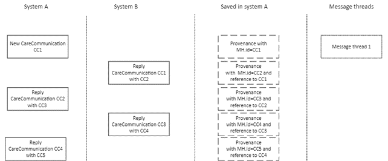
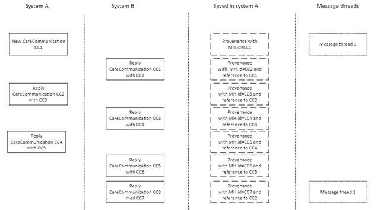
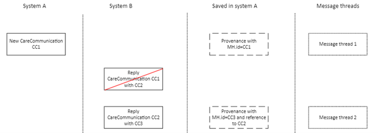
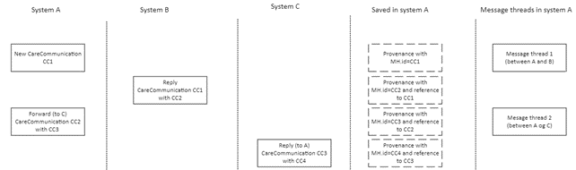
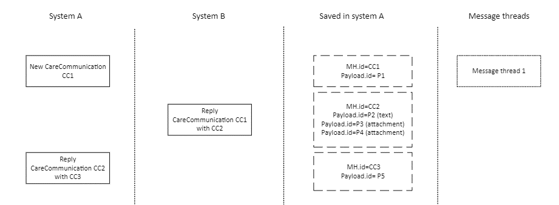

# Implementation recommendations
A CareCommunication can be send as a new message from a sender to a receiver. When a new message is sent, a message thread is started. A new message can be replied to, forwarded, corrected, or cancelled. Depending on the type of response or actions from the user, a new message thread may be started. When a CareCommunication is sent as a new message, reply, correction, or cancellation it will in general remain in the same message thread, whereas a forwarded CareCommunication will start a new message thread, since one of the sender and receiver is new to the communication. There are special cases of these general flows, and some of them are presented below.  

These recommendations for implementation are developed based on questions from vendors implementing CareCommunication.  They do not stand alone but can be seen as a help during implementation and as an extension of the existing requirements. 

[Click here to see the relevant content for the CareCommunication standard](../../index.md).

## Coupling of messages 
Vendors implementing MedCom FHIR messages, e.g. CareCommunication, are recommended to maintain "household" of the Provenance instance of outgoing and incoming messages. The purpose is to connect the incoming messages correctly to a previous message thread.  

A Provenance instance describes the activity of the message, e.g. is it a new message or a reply. In case the message is a reply, forwarding, correction or cancellation, it will reference the MessageHeader.id it is responding to. An incoming (or outgoing) reply will point to a previous MessageHeader.id, which can be identified from the saved Provenance instances. 

Creation of a new message thread depends on the type of message, e.g. is the message at hand a reply or forward, and the references to previous messages, e.g. are all the previous messages known or has the referenced message previously been replied to. Message threads may have pointers to (references) MessageHeader ids of messages and don’t necessarily hold copies of the messages in the threads. The same goes for the household of Provenances related to a MessageHeader.id. 

### Reply with known references 
If a reply references a known message and includes Provenance instances for all other messages in a thread which has not previously been replied to, a new message thread MUST NOT be created. This also account for corrections and cancellations.  

*Example:*  
On <a href="#Fig1">Figure 1</a> the user in system A initiates a correspondence with user in system B. They communicate back and forth.  

<figure>

<figcaption text-align="center"><b>Figure 1: Shows the user in system A initiates a correspondence with user in system B. They communicate back and forth.</b> </figcaption>
</figure>

### Reply which has previously been replied 
A new message thread MUST be created when the reply is to a previously replied CareCommunication. In this case, the Provenance-stack of the message at hand does not include all the messages in a thread, as stated in the [governance for CareCommunication](https://medcomdk.github.io/MedCom-FHIR-Communication/assets/documents/governance-for-careCommunication.html). 

*Example:*  
On <a href="#Fig2">Figure 2</a> the user of system A initiates a correspondence with user of system B. They communicate back and forth. At one point user of system B decides to reply to a previously received message. Both system A and B must now have two message threads. Message thread 1 includes CC1, CC2, CC3, CC4, CC5, and CC6 and message thread 2 includes CC1, CC2 and CC7.
In message thread 1 and 2 some of the messages are identical, whereas others are unique to the specific message thread. If the user of system A decides to reply to CC7, this reply must only be shown in message thread 2. If the user of system A decides to reply to CC6, this reply must only be shown in message thread 1.

<figure>

<figcaption text-align="center"><b>Figure 2: Shows the user in system A initiates a correspondence with user in system B. They communicate back and forth. At one point user of system B decides to reply to a previously received message. Both system A and B must now have two message threads.</b> </figcaption>
</figure>

### Reply arrives in unexpected order
When a message disappears or doesn’t arrive in correct order a new message thread MUST be created. A message is assumed to be disappeared when an expected Acknowledgement has not been received by the original sender. [More information about reliable messaging can be found here](https://medcomdk.github.io/MedCom-FHIR-Communication/assets/documents/040_Governance4FHIR-Messaging.html). This is assumed to be a corner case and may be due to delays in the sending system or the network in general. Since the message includes references to an unknown message, a new message thread is created.

*Example:*  
On <a href="#Fig3">Figure 3</a> the user of system A initiates a correspondence with user of system B. User of system B replies, but the message disappears during transfer (CC2). User of system B replies to the previously sent reply (CC3), which now includes references system A does not know of. Therefore, two message threads now exists in A. Message thread 1 includes CC1 and message thread 2 includes CC1 and CC3.

If the message CC2 appears in system A, it should be included in message thread 1. 

<figure>

<figcaption text-align="center"><b>Figure 3: Shows the user of system A initiates a correspondence with user of system B. User of system B replies, but the message disappears during transfer.</b> </figcaption>
</figure>

### Forwarded messages
When the latest message is forwarded, a new message thread MUST be created, since sender and receiver of the message are different from the ones in the original message thread. 

*Example:*  
On <a href="#Fig4">Figure 4</a> the ser of system A initiates a correspondence with user of system B. User of system B replies to the new message. User of system A forward message CC3 to system C, followed by a reply to system A. Message thread 1 includes CC1, and CC2, and message thread 2 includes CC1, CC2, CC3, and CC4.

If user of system A decided only to forward CC1, CC2 would not be included and message thread 2 would contain CC1, CC3 and CC4. 

<figure>

<figcaption text-align="center"><b>Figure 4: Shows the user of system A initiates a correspondence with user of system B. One of the messages is at one point forwarded to system C.</b> </figcaption>
</figure>

## Coupling of payloads and messages
Each message text and attachment, referred to as payload, will have a unique id at Communication.payload.id. To identify one or more new payloads, it is important to know which payloads previously have been exchanged. Further, Provenance includes information about the activity of the messages, e.g. is it a new message or correction, and not information about the content of the message. Therefore, it does not include links to Communication.payload.id. Systems are recommended to run a household over the received and sent Communication.payload.id and its relation to a MessageHeader.id.

*Example:*  
On <a href="#Fig5">Figure 5</a> the user in system A initiates a correspondence with user in system B, who includes more than one Communication.payload. System A identifies the three new payloads and saves the ids with a relation to the MessageHeader.id for the given message. 
<figure>

<figcaption text-align="center"><b>Figure 5: Shows the user of system A initiates a correspondence with user of system B, who includes more than one Communication.payload. System A identifies the three new payloads and saves the ids with a relation to the MessageHeader.id for the given message</b> </figcaption>
</figure>

