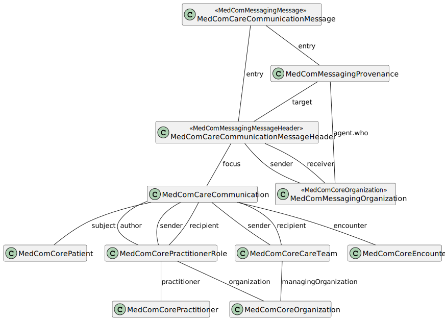
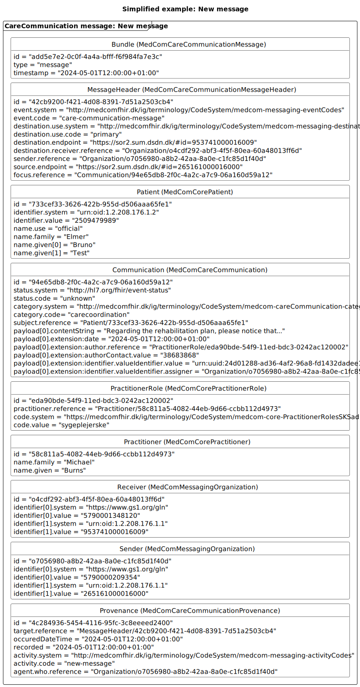
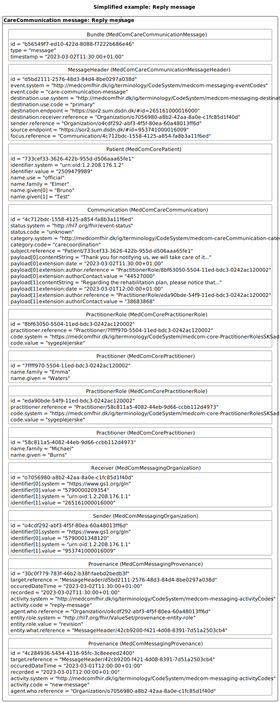
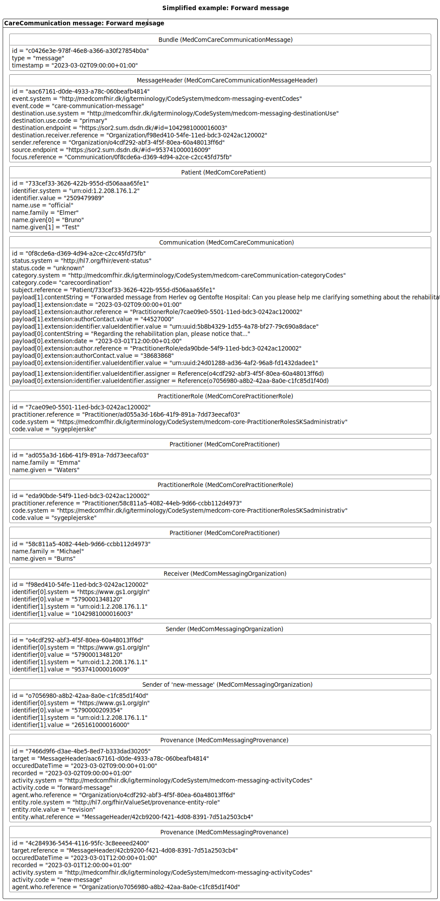
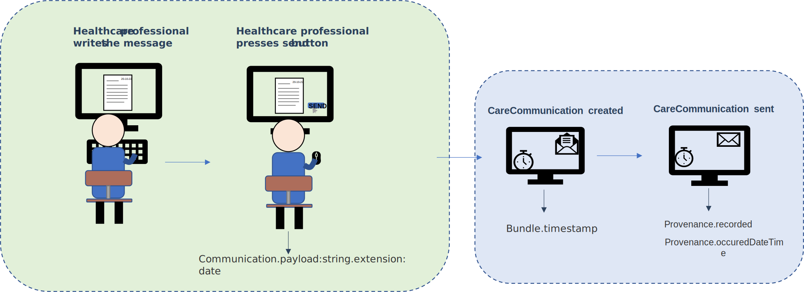

# Introduction to the technical specification

**Table of contents**
* [1 Profiles in the CareCommunication Standard](#1-profiles-in-the-carecommunication-standard)
  * [1.1 Sender and recipient](#11-sender-and-recipient)
  * [1.2 Categories and the use of priority](#12-categories-and-the-use-of-priority)
  * [1.3 Encounter and EpisodeOfCare-identifier](#13-encounter-and-episodeofcare-identifier)
* [2 Internal references in a CareCommunication](#2-internal-references-in-a-carecommunication)
* [3 Examples of a CareCommunication](#3-examples-of-a-carecommunication)
<!-- * [4 Timestamps in the CareCommunication standard](#4-timestamps-in-the-carecommunication)
  * [4.1 Scenario 1-CareCommunication only text](#41-scenario-1---carecommunication-only-text)
  * [4.2 Scenario 1-CareCommunication text and attachment](#42-scenario-2---carecommunication-text-and-attachment) -->

## 1 Profiles in the CareCommunication Standard 
> In case of any discrepancies between the <a href="https://medcomfhir.dk/ig/carecommunication/" target="_blank">MedCom CareCommunication IG</a> and this page, the IG page should be followed. Please contact <fhir@medcom.dk> if you find any discrepancies.

> There is a difference between the required elements and MustSupport elements, as the required element always shall be included in a message. MustSupport elements must be included if they are present in the sender's system, and the receiver must be able to handle the information if it is included in a message.

<table class="tg">
<caption style="color:#2c415c; font-weight:bold; text-align:center"> Table 1: Overview of the profiles in the CareCommunication standard</caption>
<thead>
  <tr>
    <th class="tg-lc33">Profile</th>
    <th class="tg-lc33">Resource</th>
    <th class="tg-lc33">Description</th>
    <th class="tg-lc33">MustSupport elements</th>
    <th class="tg-lc33">Implementation Guide Origin</th>
  </tr>
</thead>
<tbody>
  <tr>
    <td class="tg-0pky"><a href="https://medcomfhir.dk/ig/carecommunication/StructureDefinition-medcom-careCommunication-message.html" target="_blank">MedComCareCommunicationMessage</a></td>
    <td class="tg-0pky">Bundle</td>
    <td class="tg-0pky">Acts as a container for the content of the message Inherited from the MedComMessagingMessage</td>
    <td class="tg-0pky">Id Type Timestamp Entry </td>
    <td class="tg-0pky">CareCommunication</td>
  </tr>
  <tr>
    <td class="tg-0pky"><a href="https://medcomfhir.dk/ig/carecommunication/StructureDefinition-medcom-careCommunication-messageHeader.html" target="_blank">MedComCareCommunicationMessageHeader</a></td>
    <td class="tg-0pky">MessageHeader</td>
    <td class="tg-0pky">The header of a MedComCareCommunication message, which must always be the first referenced profile, when the type of the bundle is 'message'.This profile holds references to the fundamental information in a message, such as sender, receiver, and the content of the message in terms of the CareCommunication profile. Inherited from MedComMessagingMessageHeader</td>
    <td class="tg-0pky">Id Text Event[x]:eventCoding Destination:primary  Destination:primary.use  Destination:primary.endpoint  Destination:primary.receiver   Sender Source Source.endpoint Focus</td>
    <td class="tg-0pky">CareCommunication</td>
  </tr>
  <tr>
    <td class="tg-0pky"><a href="https://medcomfhir.dk/ig/carecommunication/StructureDefinition-medcom-careCommunication-communication.html" target="_blank">MedComCareCommunication</a></td>
    <td class="tg-0pky">Communication</td>
    <td class="tg-0pky">The MedComCareCommunication profile contains the main content of the message in form of a message segment. A message segment consists of the textual part (payload:string.content[x]) and a signature which includes an author (payload:string.extension.author), a timestamp (payload:string.extension:date) and a relevant telephone number (payload:string.extension.authorContact), or an attachment (payload:attachment.content[x]). The message must include a category code (category) and it may include a topic (topic) that supports and elaborates the category.   Further, it is possible to include an episodeOfCare-identifier, by referencing an Encounter resource (encounter).  A more specific sender and recipient of the message may be referenced from the elements recipient and extension.sender.</td>
    <td class="tg-0pky">Status Category Priority Subject Topic Encounter Sent (dateTime) Recipient Extension.sender Slices for payload  payload:string.content[x]  payload:string.extension:author  payload:string.extension:authorContact payload:string.extension:date payload:string.identifier  payload:attachment.content[x]  payload:attachment.identifier </td>
    <td class="tg-0pky">CareCommunication</td>
  </tr>
  <tr>
    <td class="tg-0pky"><a href="https://medcomfhir.dk/ig/core/StructureDefinition-medcom-core-patient.html" target="_blank">MedComCorePatient</a></td>
    <td class="tg-0pky">Patient</td>
    <td class="tg-0pky">Describes a citizen or patient in which the communication concerns when exchanging a CareCommunication.</td>
    <td class="tg-0pky">Id Identifier(CPR-number) Name Address Telecom Deceased[x]</td>
    <td class="tg-0pky">Core</td>
  </tr>
  <tr>
    <td class="tg-0pky"><a href="https://medcomfhir.dk/ig/core/StructureDefinition-medcom-core-practitioner.html" target="_blank">MedComCorePractitioner</a></td>
    <td class="tg-0pky">Practitioner</td>
    <td class="tg-0pky">Describes a healthcare professional or another actor involved in citizen or patient care. This profile is used to describe the author and sender or recipient.  MedComCorePractitioner is inherited from the DkCorePractitioner, and must include a name of the practitioner if available.  </td>
    <td class="tg-0pky">Name </td>
    <td class="tg-0pky">Core</td>
  </tr>
  <tr>
    <td class="tg-0pky"><a href="https://medcomfhir.dk/ig/core/StructureDefinition-medcom-core-practitionerrole.html" target="_blank">MedComCorePractitionerRole</a></td>
    <td class="tg-0pky">PractitionerRole</td>
    <td class="tg-0pky">Describes the role of a healthcare professional or another actor involved in citizen or patient care. This profile is used to describe the author role and sender or recipient.</td>
    <td class="tg-0pky">Practitioner  Organization</td>
    <td class="tg-0pky">Core</td>
  </tr>
  <tr>
    <td class="tg-0pky"><a href="https://medcomfhir.dk/ig/core/StructureDefinition-medcom-core-encounter.html" target="_blank">MedComCoreEncounter</a></td>
    <td class="tg-0pky">Encounter</td>
    <td class="tg-0pky">Describes the interaction between a patient and one or more healthcare providers. The Encounter holds the episodeOfCare-identifier.</td>
    <td class="tg-0pky">Status Class Subject episodeOfCare-identifier</td>
    <td class="tg-0pky">Core</td>
  </tr>
  <tr>
    <td class="tg-0pky"><a href="https://medcomfhir.dk/ig/core/StructureDefinition-medcom-core-encounter.html" target="_blank">MedComCoreCareTeam</a></td>
    <td class="tg-0pky">CareTeam</td>
    <td class="tg-0pky">Describes one or more professionals who plan to participate in the coordination and delivery of care for a patient or citizen. It may be used as the sender or recipient from the MedComCareCommunication profile</td>
    <td class="tg-0pky">Name ManagingOrganization</td>
    <td class="tg-0pky">Core</td>
  </tr>
  <tr>
    <td class="tg-0pky"><a href="https://medcomfhir.dk/ig/messaging/StructureDefinition-medcom-messaging-organization.html" target="_blank">MedComMessagingOrganization</a></td>
    <td class="tg-0pky">Organisation</td>
    <td class="tg-0pky">Contains information which is useful to identify a sender or receiver organisation. It is primarily used for transportation matters, why it must contain a SOR and EAN identifier. This profile inherits from MedComCoreOrganization.</td>
    <td class="tg-0pky">Id Identifier(SOR-id) Identifier(EAN-id) Name</td>
    <td class="tg-0pky">Messaging</td>
  </tr>
  <tr>
    <td class="tg-0pky"><a href="https://medcomfhir.dk/ig/messaging/StructureDefinition-medcom-messaging-provenance.html" target="_blank">MedComMessagingProvenance</a></td>
    <td class="tg-0pky">Provenance</td>
    <td class="tg-0pky">Describes the activity of a message, e.g. if the message is a new message or a modified message. In case of a previously sent message, the Provenance resource holds a reference to this message. Therefore, it is possible to get an overview of the communication about a patient.</td>
    <td class="tg-0pky">Id Target OccurredDateTime Timestamps Activity Agent Entity (reference to the previous message)</td>
    <td class="tg-0pky">Messaging</td>
  </tr>
   <tr>
    <td class="tg-0pky"><a href="https://build.fhir.org/ig/medcomdk/dk-medcom-core/StructureDefinition-medcom-core-organization.html" target="_blank">MedComCoreOrganization</a></td>
    <td class="tg-0pky">Organization</td>
    <td class="tg-0pky">Contains information about an organization. The Organization is referenced from Practitioner or CareTeam.</td>
    <td class="tg-0pky">Id Identifier(SOR-id) Name</td>
    <td class="tg-0pky">Core</td>
  </tr>
</tbody>
</table>

### 1.1 Sender and recipient
In a CareCommunication, it is required to include information about a sender and receiver in terms of a reference to a MedComMessagingOrganization. This information is primarily used for transportation matters and will always include an EAN and SOR identifier.

When sending a CareCommunication, it is possible to add a more specific receiver of the message, called a recipient, and a more specific sender. This may be used to include a more specific group of people or a person related to the care, and wellbeing of the patient or citizen can be referenced. An example could be to address a specific general practitioner by name, a specific care team in a municpality or eventually a specific social unit within the social care sector in a municipality.

### 1.2 Categories and the use of priority
There is a nationally agreed list of categories that must be used when sending a CareCommunication.  <a href="https://medcomfhir.dk/ig/terminology/CodeSystem-medcom-careCommunication-categoryCodes.html" target="_blank">The list of categories can be seen here</a>.  
When a category is of the type 'regarding-referral' it is allowed to add a priority, which can be 'asap' or 'routine'. When the category 'other' is chosen, a topic must be included, as this is used to specify the topic of the CareCommunication.

### 1.3 Encounter and episodeOfCare-identifier
When receiving a message, either CareCommunication or EDIFACT/OIOXML message, there will in many cases be an episodeOfCare-identifier, as it describes the id of the contact. If this is the case, it shall always be included in the response. An Encounter profile contains the possibility to include an episodeOfCare-identifier, that contains this id.

## 2 Internal references in a CareCommunication 
The CareCommunication follows [MedCom’s generic messaging model](https://medcomdk.github.io/dk-medcom-messaging/assets/documents/Intro-Technical-Spec-ENG.html). 
The references between the profiles are shown in  <a href="#Fig1"> Figure 1</a> below. The MedComCareCommunicationMessage profile acts as the container which includes the other profiles. From the MedComCareCommunicationMessageHeader the sender and receiver organisations are referenced as the MedComMessagingOrganization together with the focus of the message, which is the MedComCareCommunication profile. This profile must always reference a subject of the type MedComCorePatient.  
MedComMessagingProvenance is used to keep track of the messaging history and define the activity of the communication. The Provenance references the MedComMessagingMessageHeader as the target and the actor in terms of a MedComMessagingOrganization. 

 <!-- Additionally, contain the message text and attachment if they are included -->
<figure>

<figcaption text-align="center"><b>Figure 1: Structure of the CareCommunication.</b> </figcaption>
</figure>
  

## 3 Examples of a CareCommunication 
In this section, simplified examples of CareCommunication are presented, which includes: 
* <a href="#Fig2">new message</a>
* <a href="#Fig4">reply message</a>
* <a href="#Fig5">forward message</a>

All types of simplified examples are created as XML or JSON examples in the CareCommunication IG. <a href="https://medcomfhir.dk/ig/carecommunication/StructureDefinition-medcom-careCommunication-message-examples.html" target="_blank">Click here to see the full examples of a CareCommunication.</a> All systems must be able to receive and display a forwarded message, but it is optional to support sending a forward message.
 
  > Note: IT vendors cannot assume any specific order of the resources in a message. 

<a href="#Fig2">Figure 2 </a>is a simplified example of a new message. The MessageHeader references the sender and receiver organisations, both can be found at the bottom of the message. From the last element in the MessageHeader is the focus of the message referenced. This is a reference to the Communication instance, which holds information about the message segment. Information about the author of the message segment is represented in the PractitionerRole and Practitioner instances, which includes the author role and name, respectively. The type of message can be seen in the bottom, where the Provenance.activity.code is 'new-message'. 
<figure>

<figcaption text-align = "center"><b>Figure 2: Simplified example: New message </b></figcaption>
</figure>

<a href="#Fig4">Figure 4</a> is a simplified example of a reply message. This message represents a reply to the message on <a href="#Fig2">Figure 2</a>. When replying to a message, a new message segment shall be added to the Communication instance. The reply can be seen in the payload[1], where the new message can be seen in the payload[0]. The author information for both message segments shall also be included in the message. The sender and receiver information has switched place. The message contains two Provenance instance, one from the previous message and one from the reply message, which holds a reference to the previous message.  
<figure>

<figcaption text-align = "center"><b>Figure 4: Simplified example: Reply message </b></figcaption>
</figure>
  

<a href="#Fig5">Figure 5</a> is a simplified example of a forward message. This message represents a forwarding of the message on <a href="#Fig2">Figure 2</a>. When forwarding shall the user decide which message segment or segments that shall be forwarded, in this case is only one segment selected. The forward message can be seen in the payload[1], where the new message can be seen in the payload[0]. For this reason, does the Communication instance contain two message segment and associated authors. Further shall the message contain two Provenance instance, one from the previous message and one from the forward message, which holds a reference to the previous message.  
<figure>

<figcaption text-align = "center"><b>Figure 5: Simplified example: Forward message </b></figcaption>
</figure>
  

<!-- ## 4 Timestamps in the CareCommunication 

The CareCommunication contains six important timestamps:
* Bundle.timestamp
* Provenance.recorded
* Provenance.occuredDateTime[x]
* Communication.payload:attachment.extension:date
* Communication.payload:attachment.creation
* Communication.payload:string.extension:date
 
The six timestamps are registered at different times when the CareCommunication is generated. 
 

### 4.1 Scenario 1 - CareCommunication only text 

If the CareCommunication only contains a message text, the timestamps must be registered as follows: 
* The healthcare professional writes the message text and presses the "send" button.  This is when the first timestamp, Communication.payload:string.extension:date, is being registered. 
* Immediately after,the CareCommunication message is generated, and Bundle.timestamp is registered.
* When the CareCommunication message has been sent, the Provenance.occuredDateTime[x] and Provenance.recorded timestamp are registered. 
>Note: that the Provenance.occuredDateTime[x] is human readable, where Provenance.recorded is system readable.

<figure>

<figcaption text-align = "center"><b>Figure 8: Simplified example: CareCommunication text only </b></figcaption>
</figure>

### 4.2 Scenario 2 - CareCommunication text and attachment 

If the CareCommunication contains a message text and one or more attachments, the timestamps must be registered as follows: 
* The healthcare professional creates the attachement and the first timestamp Communication.payload:attachment.creation is registered. 
* The healthcare professional then writes the message and presses the "send" button.Communication.payload:string.extension:date and Communication.payload:attachment.extension:date is then registered. 
* Immediately after,the CareCommunication message has been generated, the Bundle.timestamp is registered. 
* When the CareCommunication message has been sent, the Provenance.occuredDateTime[x] and Provenance.recorded timestamp are registered. 
>Note that the Provenance.occuredDateTime[x] is human readable, where Provenance.recorded is system readable.

<figure>

<figcaption text-align = "center"><b>Figure 9: Simplified example: CareCommunication text and attachment </b></figcaption>
</figure> -->
