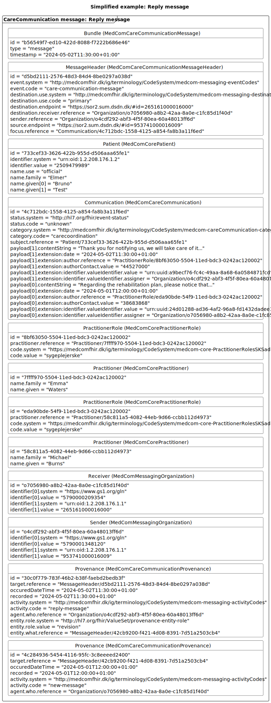

# Introduction to the technical specification

**Table of contents**
* [1 Profiles in the CareCommunication Standard](#1-profiles-in-the-carecommunication-standard)
  * [1.1 Sender and recipient](#11-sender-and-recipient)
  * [1.2 Priority and the category 'other'](#12-priority-and-the-category-other)
  * [1.3 Encounter](#13-encounter)
  * [1.4 Payloads](#14-payloads)
* [2 Internal references in a CareCommunication message](#2-internal-references-in-a-carecommunication-message)
* [3 Examples of a CareCommunication Message](#3-examples-of-a-carecommunication-message)
* [4 TimeStamps in the CareCommunication standard](#4-timestamps-in-the-carecommunication-standard)
  * [4.1 Scenario 1-CareCommunication only text](#41-scenario-1--carecommunication-only-text)
  * [4.2 Scenario 1-CareCommunication text and attachment](#42-scenario-2--carecommunication-text-and-attachment)

## 1 Profiles in the CareCommunication Standard 

> In case of discrepancies between the <a href="https://medcomfhir.dk/ig/medcomdk/dk-medcom-hospitalnotification/" target="_blank">MedCom CareCommunication IG</a> and this page, it is the IG which should be followed. Please contact <fhir@medcom.dk> if you find discrepancies.

<b>Please be aware that this site is under development and as soon as the side is ready the information will be presented below! </b>

<table class="tg" id="tab1">
<caption style="color:#2c415c; font-weight:bold; text-align:center"> Table 1: Overview of the profiles in CareCommunication standard </caption>
<thead>
  <tr>
    <th class="tg-p3tq">Profile</th>
    <th class="tg-p3tq">Resource</th>
    <th class="tg-p3tq">Description</th>
    <th class="tg-p3tq">MustSupport elements</th>
    <th class="tg-p3tq">Implementation Guide Origin</th>
  </tr>
</thead>
<tbody>
  <tr>
    <td class="tg-i91a">MedComCareCommunicationMessage</td>
    <td class="tg-i91a">Bundle</td>
    <td class="tg-i91a">Acts as a container for the content of the message    Inherited form the  MedComMessagingMessage</td>
    <td class="tg-i91a">Id Type Timestamp Entry </td>
    <td class="tg-i91a">CareCommunication</td>
  </tr>
  <tr>
    <td class="tg-i91a">MedComCareCommunicationMessageHeader</td>
    <td class="tg-i91a">MessageHeader</td>
    <td class="tg-i91a">The header of a MedComCareCommunication message, which shall always be the first referenced profile,  when the type of the Bundle is 'message'. This profile holds references to the fundamental information     in a message such as sender, receiver, the content of the message in terms of the CareCommunication profile.  Inherited form the MedComMessagingMessageHeader</td>
    <td class="tg-i91a">Id Text  Event[x]:eventCoding  Sender Source (Receiver) Focus</td>
    <td class="tg-i91a">CareCommunication</td>
  </tr>
    <tr>
    <td class="tg-i91a">MedComCareCommunication</td>
    <td class="tg-i91a">Communication</td>
    <td class="tg-i91a">MedComCareCommunication profile contains the main content of the message and it shall include a category code and it may include a topic that supports and elaborates the category. The payload of the message shall include a message text and it may include one or more attachments.</td>
    <td class="tg-i91a">Status  Category  Priority Subject  Topic Encounter  Sent (dateTime) Recipient Sender Payload:string.date Payload:string.author Payload:string.authorRole Payload:string.contact Payload:string.content[x]  Payload:attachment.date  Payload:attachment.author Payload:attachment.authorRole Payload:attachment.contact Payload:attachment.identifier Slices for content[x]</td>
    <td class="tg-i91a">CareCommunication</td>
  </tr>
  <tr>
    <td class="tg-0pky">MedComCorePatient</td>
    <td class="tg-0pky">Patient</td>
    <td class="tg-0pky">Describes a citizen or patient which the communication concerns, when exchanging a CareCommunication message.</td>
    <td class="tg-0pky">Id Identifier(CPR-number) Name Address Telecom Deceased[x]</td>
    <td class="tg-0pky">Core</td>
  </tr>
    <tr>
    <td class="tg-0pky">MedComCoreEncounter</td>
    <td class="tg-0pky">Encounter</td>
    <td class="tg-0pky">Describes the interaction between a patient and one or more healthcare provideres.</td>
    <td class="tg-0pky">Status Class Subject episodeOfCare-identifier</td>
    <td class="tg-0pky">Core</td>
  </tr>
  <tr>
    <td class="tg-0pky">MedComMessagingOrganization</td>
    <td class="tg-0pky">Organisation</td>
    <td class="tg-0pky">Contains information which is useful in order to identify a sender or receiver organisation. It is primarily used for transportation matters, why it shall contain a SOR- and EAN-identifier. This profile inherits from MedComCoreOrganization.</td>
    <td class="tg-0pky">Id Identifier(SOR-id) Identifier(EAN-id) Name</td>
    <td class="tg-0pky">Core</td>
  </tr>
  <tr>
    <td class="tg-0pky">MedComMessagingProvenance</td>
    <td class="tg-0pky">Provenance</td>
    <td class="tg-0pky">Describes the activity of a message, e.g. if the message is a new message or modified message  In cases of a previously send message the Provenance resource holds a reference to the this message.  Thereby it is possible to get an overview of communication about a patient.</td>
    <td class="tg-0pky">Id Target  OccurredDateTime  Timestamps Activity Agent Entity (reference to the previous message)</td>
    <td class="tg-0pky">Messaging</td>
  </tr>
</tbody>
</table>

### 1.1 Sender and recipient
In a CareCommunication message it is required to include information about a sender and receiver in terms of a reference to a MedComMessagingOrganization. This information are primarily used for transportation matters and will always include an EAN- and SOR-identifier.

When sending a CareCommunication message it is possible to add a more specific receiver of the message, called a recipient, and a more specific sender. This may be used to include a more specific organisation or person related to the care and wellbeing of the patient or citizen can be referenced. An example could be to address a specific general practitioner by name, a specific hospital department or eventually a specific social unit within the social care sector in a municipality.

### 1.2 Priority and the category 'other'
These is a nationally agreed list of categories that shall be used when sending a CareCommunication message. [The list of categories can be seen here](https://build.fhir.org/ig/medcomdk/dk-medcom-terminology/CodeSystem-medcom-careCommunication-categoryCodes.html). When a category is of the type 'regarding-referral' it is allowed to add a priority, which can be 'asap' or 'routine'. When the category 'other' is choosen a topic shall be included, as this is used to specify the topic of the CareCommunication message.

### 1.3 Encounter
An encounter describes the meeting between a patient and one or more healthcare providers or actors involved in the patient care. An example where this is relevant could be when the communication concerns a hospitalisation of a patient, where an episodeOfCare-identifier is used to connect the communication and hospitalisation. In this case, should a reference to the MedComCoreEncounter and episodeOfCare-identifier be included.

### 1.4 Payloads
As mentioned in the clinical guidelines for application both message text and attachments shall include:
* An author (Danish: forfatter) and role (Danish: stillingsbetegnelse)
* A relevant telephone
* A timestamp
* An identifier (only relevant for attachments (Danish: Bilag))

The message text and attachments of a CareCommunication message will both be included in the element Communication.payload, however they shall be included in different slices. At least one payload which includes the message text shall be included when sending a CareCommunication message, but zero or more attachments may be included.

## 2 Internal references in a CareCommunication message
The HospitalNotification message follows [MedCom’s generic messaging model](https://medcomdk.github.io/dk-medcom-messaging/assets/documents/Intro-Technical-Spec-ENG.html).
The references between the profiles are shown in  <a href="#Fig1" rel="noopener noreferrer"> Figure 1 </a> below. The MedComCareCommunicationMessage profile acts as the container which includes the other profiles. From the MedComCareCommunicationMessageHeader are the sender, and receiver organisations referenced as the MedComMessagingOrganization together with the focus of the message, which is the MedComCareCommunication profile. This profile must always reference a subject of the type MedComCorePatient. Additionally, contain the message text and attachment is they are included.  
MedComMessagingProvenance is used to keep track of the messaging history and define the activity of the communication. The provenance both references the MedComMessagingMessageHeader as the target and the actor in terms of a MedComMessagingOrganisation. 

<figure>

<figcaption text-align="center"><b>Figure 1: Structure of the CareCommunication message </b> </figcaption>
</figure>
  

## 3 Examples of a CareCommunication Message

<a href="#Fig2" rel="noopener noreferrer"> Figure 2 </a> is a simplified example of a new message, where <a href="#Fig3" rel="noopener noreferrer"> Figure 3 </a> is a simplifies example of a CareCommunication message which includes an attachment, recipient and sender as well as a reference to an encounter, and finally is <a href="#Fig4" rel="noopener noreferrer"> Figure 4 </a> a simplified example of a reply to the new message.

<a href="#Fig2" rel="noopener noreferrer"> Figure 2 </a> and <a href="#Fig4" rel="noopener noreferrer"> Figure 4 </a> both includes the required content, where <a href="#Fig3" rel="noopener noreferrer"> Figure 3 </a> also includes some MustSupport elements that are not required. There is a difference between the required elements and MustSupport elements, as the required element always shall be included in a message. MustSupport elements must be included if they are present in the sender's system and the receiver must be able to handle the information if it is included. Thus, there is a discrepancy between the elements mentioned in the table above and the figures. 
More examples for CareCommunication in both XML and JSON format can be found on  MedComCareCommunicationMessage profile. 
<a href="https://build.fhir.org/ig/medcomdk/dk-medcom-carecommunication/StructureDefinition-medcom-careCommunication-message-examples.html" target="_blank">Click here to see examples for MedComCareCommunicationMessage.</a>
 
  > Note: IT vendors cannot assume any specific order of the resources in a message. 

<figure>

<figcaption text-align = "center"><b>Figure 2: Simplified example: New message </b></figcaption>
</figure>

<figure>

<figcaption text-align = "center"><b>Figure 3: Simplified example: New message with attachment </b></figcaption>
</figure>
  

<figure>

<figcaption text-align = "center"><b>Figure 4: Simplified example: Reply message </b></figcaption>
</figure>
  

## 4 TimeStamps in the CareCommunication Message

The CareCommunication message contains six important time stamps:
	· Communication.sent
	· Bundle.timestamp
	· Provenance.recorded
	· Provenance.occuredDateTime[x]
	· Communication.payload:attachment.extension:date
	· Communication.payload:string.extension:date
 
The six time stamps are registered at different times when the CareCommunication is generated. 
 

### 4.1 Scenario 1- CareCommunication only text 

If the CareCommunication only contains a message text, shall the timestamps be registered as follow: 
The healthcare professional writes the message text, and the text is saved. This is when the first time stamp, Communication.payload:string.extension:date is registered. The healthcare professional then presses "send" button and the Communication.sent time stamp is registered. 
 
Immediately after is the CareCommunication message generated and Bundle.timestamp is registered. When CareCommunication message is sent the Provenance.occuredDateTime[x] and Provenance.recorded time stamp are registered. Note that the Provenance.occuredDateTime[x] is a human readable, where Provenance.recorded is a system readable.

<figure>

<figcaption text-align = "center"><b>Figure 1: Simplified example:CareCommunication text only </b></figcaption>
</figure>

### 4.2 Scenario 2- CareCommunication text and attachment 

If the CareCommunication contains a message text and one or more attachments, the timestamps shallbe registered as follow: 
The healthcare professional writes the message text, and the text is saved. This is when the first time stamp, Communication.payload:string.extension:date is registered. 
Either before or after writing the message text will the healthcare professional establish the attachment. It is recommended that the timestamp for when the attachment is completed is registered as Communication.payload:attachment.extension:date. But in case this timestamp is not available, shall the timestamp for when the healthcare professional attached the attachment be registered as Communication.payload:attachment.extension:date.
 
The healthcare professional then presses "send" button and the Communication.sent time stamp is registered. 
 
Immediately after is the CareCommunication message generated and Bundle.timestamp is registered. When CareCommunication message is sent the Provenance.occuredDateTime[x] and Provenance.recorded time stamp are registered. Note that the Provenance.occuredDateTime[x] is a human readable, where Provenance.recorded is a system readable.

<figure>

<figcaption text-align = "center"><b>Figure 2: Simplified example:CareCommunication text and Attachment </b></figcaption>
</figure>
