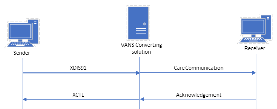

# MedCom CareCommunication

**Table of contents**
* [1 Standard documentation](#1-standard-documentation)
  * [1.1 Clinical guidelines for application](#11-clinical-guidelines-for-application)
  * [1.2 Use cases](#12-use-cases)
  * [1.3 Technical specification](#13-technical-specification)
  * [1.4 Governance for CareCommunication](#14-governance-for-carecommunication)
* [2 Test and certification](#2-test-and-certification)
* [3 Conversion service](#3-conversion-service)
  * [3.1 Use cases and rules](#31-use-cases-and-rules)
  * [3.2 Mapping of messages](#32-mapping-of-messages)
  * [3.3 Examples](#33-examples)

> Note: Clinical guidelines for application and use cases are available in both Danish and English. The remaining documentation will solely be in English.

This page presents MedCom's CareCommunication standard (Danish: Korrespondancemeddelelse). In time, this standard will replace the existing standards <a href="https://svn.medcom.dk/svn/releases/Standarder/Den%20gode%20korrespondance/EDI/Dokumentation/" target="_blank">DIS91</a> and <a href="https://svn.medcom.dk/svn/releases/Standarder/Den%20gode%20korrespondance/XML/Dokumentation/" target="_blank">XDIS91</a>. The purpose of the standard is to support secure digital communication between social care, the psychiatric area and the somatic sector. CareCommunication standard enable communication of personally identifiable information and is typically used for ad hoc communication. However, the CareCommunication must only be used in areas where no other MedCom standard is available, and it must not be used for cases with an acute nature.

<!-- In a CareCommunication it is possible to attach a file, to include a category code which enables automatic sorting of the messages, and it is further possible to include a topic that supports the category.  -->

## 1 Standard documentation 
The standard documentation below provides the necessary content to understand the needs for CareCommunication, the role of the CareCommunication, what to implement and how to get a MedCom Certificate. The standard documentation for CareCommunication includes:
  * Clinical guidelines for application
  * Use cases
  * Technical Specifications in terms of the relevant IG's and clinical introduction to the content of the IG
  * Governance for CareCommunication
  * <a href="https://chat.fhir.org/#narrow/channel/495699-denmark.2Fmedcom.2Fprofile.2FCareCommunication/" target="_blank">Zulip FHIR channel</a>: This space is for developers working with CareCommunication. Use this forum to ask questions, share insights, discuss implementation challenges, and help each other. Both MedCom and other developers can answer questions. Remember to create an account.

&nbsp;

### 1.1 Clinical guidelines for application 
The clinical guidelines for application are the foundation for the CareCommunication standard. It describes the clinical needs for the CareCommunication, the requirements for the content of the standard and how the standard supports the business requirements. It is the primary textual part of the documentation for CareCommunication. It is important for both implementers and business specialists to understand the clinical guidelines for application to ensure that the implemented standard supports the requirements.

Below, the clinical guidelines for application can be found (the information is in Danish):  
[Danish: Sundhedsfaglige retningslinjer for anvendelse](assets/documents/Clinical-guidelines-DA.md)   
 
 >Note: Clinical guidelines for application in English are in preparation. As soon as they are ready, they will be published. 

<!-- [English: Clinical guidelines for application](assets/documents/Clinical-guidelines-ENG.md)  -->

### 1.2 Use cases
Use cases describe the different scenarios in which a standard support. For a certain real-world scenario, it describes the requirements for the content of a message. The purpose of the use cases is to ensure a coherent implementation and use of CareCommunication. The descriptions are targeted IT system vendors and the people responsible for the implementation in regions and municipalities.

<!-- The use cases for CareCommunication are qualified in collaboration with EPR and vendors catering to the municipalities. -->

[Danish: Use cases (pdf)](assets/CareCommunication_use_cases_v4.0.0.pdf) 

 >Note: Use cases for CareCommunication in English, are currently in preparation. As soon as they are, ready they will be published. 

<!-- Below can the use cases in Danish and English be found:  

[Danish: Use cases](assets/documents/UseCases-DA.md)   
[English: Use cases](assets/documents/UseCases-ENG.md)  -->

### 1.3 Technical specification

The technical specifications for the <a href="https://medcomfhir.dk/ig/carecommunication/" target="_blank">MedCom CareCommunication</a> is composed by profiles from two basis IG's and from one terminology IG. Links to the IG’s are listed below:
* <a href="https://medcomfhir.dk/ig/carecommunication/" target="_blank">MedCom CareCommunication IG</a>
  *	<a href="https://medcomfhir.dk/ig/core/index.html" target="_blank">MedCom Core IG</a>
  *	<a href="https://medcomfhir.dk/ig/messaging/" target="_blank">MedCom Messaging IG</a>
  *	<a href="https://medcomfhir.dk/ig/terminology/" target="_blank">MedCom Terminology IG</a>

&nbsp;

<!-- The profiles that are part of the technical specification for <a href="https://medcomfhir.dk/ig/carecommunication/" target="_blank">MedCom CareCommunication IG</a> are:  
*	<a href="https://medcomfhir.dk/ig/carecommunication/StructureDefinition-medcom-careCommunication-communication.html" target="_blank">MedComCareCommunication</a>
*	<a href="https://medcomfhir.dk/ig/carecommunication/StructureDefinition-medcom-careCommunication-message.html" target="_blank">MedComCareCommunicationMessage</a>
*	<a href="https://medcomfhir.dk/ig/carecommunication/StructureDefinition-medcom-careCommunication-messageHeader.html" target="_blank">MedComCareCommunicationMessageHeader </a>

&nbsp;
 -->

The link below gives an overview of the included profiles, what their purpose is, and which elements the system should support.
Furthermore, the structure of the standard is described and supported with examples in different degrees of technical skills.

[Click here to read an introduction to the technical specifications.](assets/documents/Intro-Technical-Spec-ENG.md)

### 1.4 Governance for CareCommunication
Governance describes the general rules which FHIR messages must obey to. The [general governance for FHIR messaging can be found here](https://medcomdk.github.io/MedCom-FHIR-Communication), whereas [governance for the use of CareCommunication can be found here](https://medcomdk.github.io/MedCom-FHIR-Communication/assets/documents/governance-for-careCommunication.html). 

Further, some recommendations for implementing the CareCommunication standard has been developed. The page recommends how to run a household on the send and received CareCommunications. These are not required to follow, only for recommendation and inspiration.  
[Click here to read an introduction to the technical specifications.](assets/documents/Intro-Technical-Spec-ENG.md)

## 2 Test and certification
Certification of a system implies both an approved test protocol and a run trough of TouchStone test scripts. TouchStone describes an infrastructure that allows automated test and validation against the IG's developed by MedCom. 

<a href="https://medcomdk.github.io/MedComLandingPage/#3-test-and-certification" target="_blank">Click here to read the general description of MedCom's test and certification process.</a>  

**Test examples for sending and receiving a CareCommunication**

* [Test examples for CareCommunication](assets/4.1.0_TestExamples.zip).

 **Sending a CareCommunication**
  * [Test protocol in English (docx)](assets/CareCommunication_Testprotocol_Send.docx)
  <!--  * <a href="https://medcomfhir.dk/ig/carecommunicationtestscripts/testexamples.html">Test examples</a>-->
  *  <a href="https://touchstone.aegis.net/touchstone/conformance/current?suite=FHIR4-0-1-CareCommunication-send-Client">TouchStone test suite for test of sending CareCommuncations</a>
    
  * <a href="https://medcomfhir.dk/ig/carecommunicationtestscripts/testscripts.html">IG including test scripts and a description of the purpose. The test script IG inlcudes obsolete test examples for an old test protocol. Do not use these. </a>

**Receiving a CareCommunication**
  * [Test protocol in English (docx)](assets/CareCommunication_Testprotocol_Receive.docx)

## 3 Conversion service 
In the period of transition from EDIFACT and OIOXML (DIS91/XDIS91) to FHIR (CareCommunication), a conversion service (Danish: Konverteringsløsning) will be made available by the VANS vendors. Documentation about the service and the preconditions can be found in this section. Figure 1 illustrates the flow of the communication messages when a XDIS91 is sent by the sender. The service will support conversion of a CareCommunication message including attachments, where the attachment is sent in a XBIN01. 

<figure>

<figcaption text-align="center"><b>Figure 1 illustrates the flow of conversion of communication messages</b></figcaption>
</figure>

The service concerns only conversion between OIOXML and FHIR. For this reason, messages sent in EDIFACT must be converted to OIOXML before conversion to FHIR. Conversion will only be performed when the sender and receiver doesn’t support the same standard format.

The service is intended to be available from spring 2025 to the end of 2026. The requirements for the service are made in collaboration the national working group, it-vendors and VANS vendors.

### 3.1 Use cases and rules
The following document includes preconditions for the conversion, use cases describing the flow of events, rules concerning to mapping. 

[Use cases and rules in Danish (pdf)](assets/UseCases-ConversionService_april2025.pdf) (Note: The UseCase document has been revised to clarify the time limit related to Acknowledgements.)

### 3.2 Mapping of messages
The follow documents describe mapping of the communication messages and receipts. For the communication messages mapping to/from XDIS91 and XBIN01 and to/from CareCommunication is described. For the receipts mapping to/from XCTL (01, 02, 03) to/from Acknowledgement is described. Both mandatory and optional elements in the standards are included and if relevant, a comment is added. 

Update of mapping table for XDIS91/CareCommunication: Changes of 2025-03-28, 2025-04-01 and 2025-04-03 are marked with red.

[Mapping of communication messages (XDIS91/CareCommunication) (xlsx)](assets/Mapning-XDIS91-CareCommunication.xlsx)  
[Mapping of acknowledgement messages (XCTL/Acknowledgement) (xlsx)](assets/Mapning-XCTL-Acknowledgement.xlsx)

### 3.3 Examples
The table below includes examples of the mapping illustrating four different flows for CareCommunication version 4.0. Flow 1 and flow 3 CareCommunication files have been updated due to errors 2025-03-28.

<table class="tg">
<thead>
  <tr>
    <th class="tg-fymr">Flow</th>
    <th class="tg-7btt">From sender to VANS</th>
    <th class="tg-fymr">From VANS to receiver</th>
  </tr>
</thead>
<tbody>
  <tr>
    <td class="tg-c3ow">1</td>
    <td class="tg-c3ow"><a href="https://medcomdk.github.io/dk-medcom-carecommunication/assets/examples/Flow1-XDIS91_Ex_to_FHIR.xml" target="_blank">XDIS91</a>   <a href="https://medcomdk.github.io/dk-medcom-carecommunication/assets/examples/Flow1-XBIN01_Ex_to_FHIR.xml" target="_blank">XBIN01</a></td>
    <td class="tg-c3ow"><a href="https://medcomdk.github.io/dk-medcom-carecommunication/assets/examples/Flow1-CareCommunication_Ex_from_OIOXML.xml" target="_blank">CareCommunication</a></td>
  </tr>
  <tr>
    <td class="tg-c3ow">2</td>
    <td class="tg-c3ow"><a href="https://medcomdk.github.io/dk-medcom-carecommunication/assets/examples/Flow2-XCTL03_Ex_from_FHIR_XDIS91.xml" target="_blank">XCTL03 for XDIS91</a>   <a href="https://medcomdk.github.io/dk-medcom-carecommunication/assets/examples/Flow2-XCTL03_Ex_from_FHIR_XBIN01.xml" target="_blank">XCTL03 for XBIN01</a></td>
    <td class="tg-c3ow"><a href="https://medcomdk.github.io/dk-medcom-carecommunication/assets/examples/Flow2-Acknowledgement_Ex_to_OIOXML.xml" target="_blank">Acknowledgement</a></td>
  </tr>
  <tr>
    <td class="tg-c3ow">3</td>
    <td class="tg-c3ow"><a href="https://medcomdk.github.io/dk-medcom-carecommunication/assets/examples/Flow3-CareCommunication_Ex_to_OIOXML.xml" target="_blank">CareCommunication</a></td>
    <td class="tg-c3ow"><a href="https://medcomdk.github.io/dk-medcom-carecommunication/assets/examples/Flow3-XDIS91_Ex_from_FHIR.xml" target="_blank">XDIS91</a> <a href="https://medcomdk.github.io/dk-medcom-carecommunication/assets/examples/Flow3-XBIN01_Ex_from_FHIR.xml" target="_blank">XBIN01</a></td>
  </tr>
  <tr>
    <td class="tg-c3ow">4</td>
    <td class="tg-c3ow"><a href="https://medcomdk.github.io/dk-medcom-carecommunication/assets/examples/Flow4-Acknowledgement_Ex_from_OIOXML.xml" target="_blank">Acknowledgement</a></td>
    <td class="tg-c3ow"><a href="https://medcomdk.github.io/dk-medcom-carecommunication/assets/examples/Flow4-XCTL03_Ex_to_FHIR_XDIS91.xml" target="_blank">XCTL03 for XDIS91</a>   <a href="https://medcomdk.github.io/dk-medcom-carecommunication/assets/examples/Flow4-XCTL03_Ex_to_FHIR_XBIN01.xml" target="_blank">XCTL03 for XBIN01</a></td>
  </tr>
</tbody>
</table>

### 3.4 Test protocol
Test of the conversion service includes going through the testprotocol. In the test protocol the use cases and rules in the use case document are adressed, and it will be ensured that the mapping is performed correctly. 
  * [Test protocol in English (docx)](assets/ConversionService_Testprotocol.docx)
    * [Test examples for the test protocol (zip)](assets/ConversionService_TestExamples_2025_04_10.zip). Test examples are updated 2025-04-10.
    * [Test examples without VANSenvelope (zip)](assets/ConvertionService_examples_without_VANSenvelope.zip). (Note: Not for use in test protocol, and not updated after 2025-01-30)